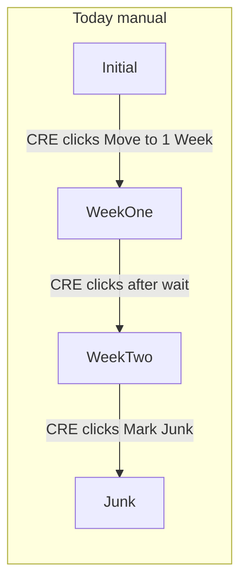
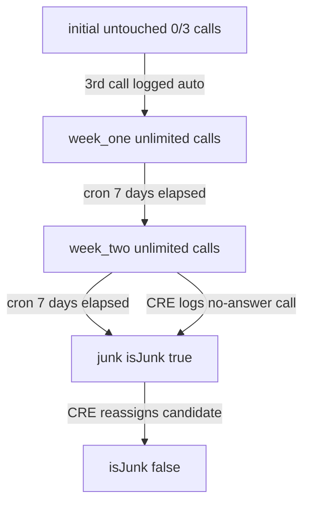

# CRE Automated Follow-up (3/3 → Week1 → Week2 → Junk)

## Current state (gaps)

Today the funnel is **fully manual** in [`backend/src/candidates/candidates.service.ts`](backend/src/candidates/candidates.service.ts):

- `logOperationsCall` only works in `initial` stage and stops at 3 calls — does **not** auto-advance
- `moveOperationsToWeekOne` / `moveOperationsToWeekTwo` / `markOperationsJunk` require CRE button clicks
- Wait times are **2 minutes** (test) in [`backend/src/common/constants/candidate-constants.ts`](backend/src/common/constants/candidate-constants.ts) — not 7 days
- **No cron** advances week stages
- **No `Candidate.isJunk`** field (junk = `operationsFollowUpStage === 'junk'` on assignment only)
- Reassign in `transferCREConvertedToRecruiter` does not touch any junk flag



## Target flow (per your answers)



| Stage | Call logging | Auto-advance |
|-------|--------------|--------------|
| `initial` | Max 3 calls (0/3 → 3/3) | **Auto → week_one** on 3rd log |
| `week_one` | Unlimited; count + date tracked | **Cron → week_two** after 7 days from `operationsStageEnteredAt` |
| `week_two` | Unlimited; any log = no-answer | **Immediate junk** on log; **cron junk** if 7 days pass with no conversion |
| `junk` | No logging | Terminal until reassigned |

---

## 1. Database: `Candidate.isJunk`

**Migration** — add to [`backend/prisma/schema.prisma`](backend/prisma/schema.prisma) `Candidate` model:

```prisma
isJunk Boolean @default(false) @map("is_junk")
@@index([isJunk])
```

Optional but recommended on [`OperationsCallLog`](backend/prisma/schema.prisma):

```prisma
followUpStage String  // initial | week_one | week_two — audit which stage call was logged in
```

---

## 2. Production 7-day timers (env-controlled)

Update [`backend/src/common/constants/candidate-constants.ts`](backend/src/common/constants/candidate-constants.ts) and FE mirror [`web/src/features/candidates/utils/operations-follow-up.util.ts`](web/src/features/candidates/utils/operations-follow-up.util.ts):

```ts
const SEVEN_DAYS_MS = 7 * 24 * 60 * 60 * 1000;
const TEST_TWO_MIN_MS = 2 * 60 * 1000;

// BE: process.env.OPERATIONS_FOLLOW_UP_TEST_TIMERS === 'true'
// FE: import.meta.env.VITE_OPERATIONS_FOLLOW_UP_TEST_TIMERS === 'true'
export const OPERATIONS_WEEK_ONE_WAIT_MS = useTestTimers ? TEST_TWO_MIN_MS : SEVEN_DAYS_MS;
export const OPERATIONS_WEEK_TWO_WAIT_MS  = useTestTimers ? TEST_TWO_MIN_MS : SEVEN_DAYS_MS;
```

Keep 2-minute timers in dev/CI when env flag is set; production uses 7 days.

---

## 3. Refactor stage transitions (shared private methods)

Extract in [`candidates.service.ts`](backend/src/candidates/candidates.service.ts) so cron, call-log, and existing endpoints share logic:

| Method | Sets |
|--------|------|
| `private advanceToWeekOne(tx, assignment)` | `operationsFollowUpStage=week_one`, `operationsCallAttempts=0`, `operationsStageEnteredAt=now` |
| `private advanceToWeekTwo(tx, assignment)` | `operationsFollowUpStage=week_two`, `operationsStageEnteredAt=now` |
| `private markAsJunk(tx, assignment, candidateId, source)` | `operationsFollowUpStage=junk`, `operationsStageEnteredAt=now`, **`candidate.isJunk=true`** |

`source` enum for audit: `auto_after_3_calls` | `cron_week_one` | `cron_week_two` | `call_log_week_two` | `manual`.

Keep existing controller endpoints as **manual overrides** (admin/CRE fallback) but UI will de-emphasize them.

---

## 4. Update `logOperationsCall` (core logic)

File: [`backend/src/candidates/candidates.service.ts`](backend/src/candidates/candidates.service.ts) ~L1955

**`initial` stage** (unchanged cap, add auto-advance):
- Validate attempts `< 3`, phone/WhatsApp flags
- Transaction: create `OperationsCallLog` (with `followUpStage: initial`), increment attempts
- **If `nextAttempt === 3`**: call `advanceToWeekOne` in same transaction

**`week_one` stage** (new — unlimited):
- Remove 3-call cap check
- Transaction: create log (`followUpStage: week_one`), increment `operationsCallAttempts`, set `operationsLastCallAt`
- No stage change on log (cron handles week_two)

**`week_two` stage** (new — log triggers junk):
- Transaction: create log (`followUpStage: week_two`), then `markAsJunk(..., source: call_log_week_two)`
- CRE cannot log again after junk

**`junk` stage**: reject with `BadRequestException`

---

## 5. Cron sweeper (new service)

New files (follow [`callback-reminder-sweeper.service.ts`](backend/src/callback-reminders/callback-reminder-sweeper.service.ts) pattern):

- [`backend/src/candidates/services/operations-follow-up-sweeper.service.ts`](backend/src/candidates/services/operations-follow-up-sweeper.service.ts)
- Register in [`backend/src/candidates/candidates.module.ts`](backend/src/candidates/candidates.module.ts) (ScheduleModule already in [`app.module.ts`](backend/src/app.module.ts))

```ts
@Cron(CronExpression.EVERY_HOUR)  // or EVERY_DAY_AT_MIDNIGHT for prod
async sweepOperationsFollowUp()
```

**Query 1 — week_one → week_two:**
```sql
WHERE isActive = true
  AND assignmentType IN ('cre_auto','cre_manual')
  AND operationsFollowUpStage = 'week_one'
  AND operationsStageEnteredAt <= now() - OPERATIONS_WEEK_ONE_WAIT_MS
```

**Query 2 — week_two → junk (timeout):**
```sql
WHERE ... operationsFollowUpStage = 'week_two'
  AND operationsStageEnteredAt <= now() - OPERATIONS_WEEK_TWO_WAIT_MS
```

For each match: run in `$transaction`, call `advanceToWeekTwo` or `markAsJunk(cron_week_two)`, bump `candidate.updatedAt`, optionally publish outbox notification to assigned CRE.

Add Jest tests with mocked Prisma (same style as [`operations-follow-up.service.spec.ts`](backend/src/candidates/__tests__/operations-follow-up.service.spec.ts)).

---

## 6. `isJunk` sync on reassign

In [`transferCREConvertedToRecruiter`](backend/src/candidates/candidates.service.ts) ~L2314, when handing candidate back to recruiter:

```ts
await tx.candidate.update({
  where: { id: candidateId },
  data: { isJunk: false, updatedAt: now },
});
```

Also set `isJunk: false` if CRE **converts** candidate (`markAsConvertedResponse`) — candidate is no longer junk-tracked.

---

## 7. Listing / summary updates

[`getCREAssignedCandidates`](backend/src/candidates/candidates.service.ts):
- `junk` tile filter: match `operationsFollowUpStage = junk` **OR** `candidate.isJunk = true` (keep in sync)
- Expose `isJunk` on candidate in API response

[`getCREAssignedSummary`](backend/src/candidates/candidates.service.ts):
- Junk count uses same dual check

Call-count filter (`operationsCallAttempts`) stays **initial-stage only** (0/3 labels).

---

## 8. Frontend updates

### Utils — [`operations-follow-up.util.ts`](web/src/features/candidates/utils/operations-follow-up.util.ts)

```ts
canLogOperationsCall(stage) =>
  stage === INITIAL && attempts < 3
  || stage === WEEK_ONE
  || stage === WEEK_TWO;

getDisplayedOperationsCallAttempts(attempts, stage) =>
  stage === INITIAL ? Math.min(attempts, 3) : attempts;  // week stages: "5 calls" not "5/3"
```

Remove or gate `canMoveToWeekOne` / `canMoveToWeekTwo` / `canMarkOperationsJunk` for normal CRE UI (auto flow replaces them).

### Dashboard — [`OperationsDashboardPage.tsx`](web/src/pages/OperationsDashboardPage.tsx)

- **Remove** "Move to 1 Week" button (auto on 3rd log)
- **Remove** "Move to 2nd Week" / "Mark as Junk" buttons for normal flow
- **Show** "Log Call" on `week_one` and `week_two` tiles
- Status column: initial = `X/3 calls`; week stages = `X calls` + countdown ("Auto 2nd Week in …" / "Auto Junk in …")
- Toast on 3rd call: "Moved to 1 Week follow-up automatically"
- Junk tile subtitle: reflects `isJunk` flag

### Modal — [`LogOperationsCallModal.tsx`](web/src/features/candidates/components/LogOperationsCallModal.tsx)

- Pass `followUpStage` prop to show context ("Logging call in 1 Week stage")
- Week_two: description warns "Logging a no-answer call will mark candidate as junk"

### Hook/pages using modal

- [`useOperationsCallModal.ts`](web/src/features/candidates/hooks/useOperationsCallModal.ts)
- [`CandidatesPage.tsx`](web/src/features/candidates/views/CandidatesPage.tsx)
- [`CandidateOverviewPage.tsx`](web/src/features/candidates/views/CandidateOverviewPage.tsx)

Pass stage into modal; update handlers for new API behavior.

### API types — [`web/src/services/candidatesApi.ts`](web/src/services/candidatesApi.ts)

- Add `followUpStage` to call history response type if added to schema

---

## 9. Tests (DOD)

| Area | File |
|------|------|
| Auto week_one on 3rd call | `operations-follow-up.service.spec.ts` |
| Week_one/week_two unlimited logging | same |
| Week_two log → junk + isJunk | same |
| Cron sweeper week_one → week_two | new `operations-follow-up-sweeper.service.spec.ts` |
| Cron sweeper week_two → junk | same |
| Reassign clears isJunk | service spec |
| FE util `canLogOperationsCall` | `operations-follow-up.util.test.ts` |
| Dashboard renders week-stage Log Call | `OperationsDashboardPage.follow-up.test.tsx` |

---

## 10. Rollout order

1. Migration (`isJunk`, optional `followUpStage` on call logs)
2. Constants (7-day env toggle)
3. Private transition helpers + `logOperationsCall` refactor
4. Cron sweeper + module registration
5. `isJunk` on junk paths + reassign clear
6. FE utils → dashboard → modal → tests
7. Run `prisma migrate deploy` + `prisma generate` on all environments

---

## Out of scope (unless you want later)

- Changing `candidate.currentStatusId` on junk (today junk is CRE-assignment scoped only)
- Hiding `isJunk` candidates from recruiter global lists (can add filter in a follow-up)
- System-config admin UI for 7-day duration (env flag is sufficient for v1)
