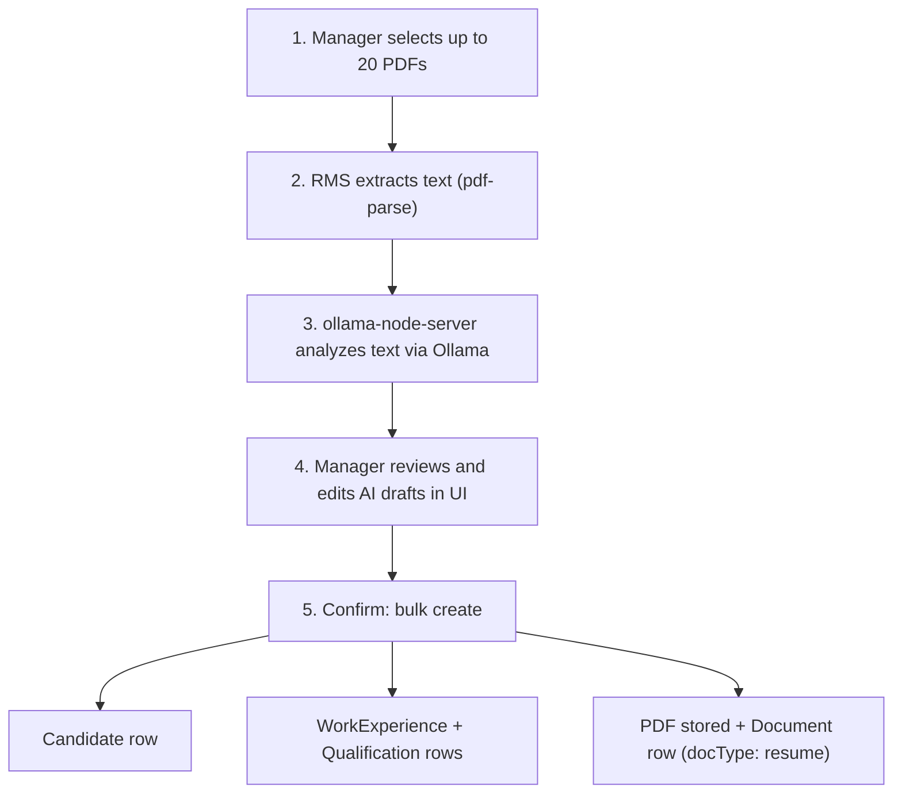

# Bulk Resume Upload — AI-Assisted Candidate Creation

Manager-only feature: upload up to **20 PDF resumes** at once, let AI extract candidate details, review the drafts, and create **Candidates + Work Experiences + Qualifications + Documents** in one flow.

---

## 1. Overview

### Who can use it

Only users with the **`bulk_create:candidates`** permission. Manager, CEO, and Director receive it automatically (they have `*` permissions). Recruiters, Recruiter Managers, and Processing Managers do **not** get it.

### The two servers involved

| Server | Role |
|--------|------|
| **RMS backend** (NestJS + Prisma) | Receives PDFs, extracts text with `pdf-parse`, orchestrates candidate creation, stores files and DB rows |
| **ollama-node-server** (Express) | Text-only AI service. Receives extracted resume text, calls Ollama (gemma3), returns structured JSON. **Never sees PDF files.** |

### The golden rule

> PDFs stay inside RMS. Only extracted **text** travels to the AI server.

---

## 2. End-to-end flow (beginner friendly)



**Step by step:**

1. **Upload** — Manager opens `/candidates`, clicks **Bulk Resume Upload**, drops up to 20 PDFs.
2. **Analyze** — Frontend calls `POST /resume-analysis/bulk-analyze`. RMS parses each PDF to text, sends the text to `POST /api/resume/analyze` on ollama-node-server, and returns AI drafts to the browser.
3. **Review** — Manager sees one editable card per resume. The AI pre-fills name, email, phone, skills, experience. The manager must confirm required fields the AI cannot know:
   - **Profession type** (required by the `Candidate` table)
   - **Qualification** (must map to catalog `qualificationId`)
   - **Phone** (`countryCode` + `mobileNumber`, unique in the DB)
4. **Confirm** — Frontend calls `POST /resume-analysis/bulk-create` with the PDF files and the reviewed payloads. For each resume, RMS:
   - Creates the **Candidate** (with nested work experiences and qualifications, one transaction)
   - Uploads the PDF to storage
   - Creates a **Document** row: `docType: 'resume'`, linked by `candidateId`, `uploadedBy` = manager's user id
5. **Result** — Per-resume success/error. One failure (e.g. duplicate phone) never aborts the rest of the batch.

---

## 3. API contracts

### 3.1 ollama-node-server — `POST /api/resume/analyze`

Text-only. No multer, no `pdf-parse`.

Request:

```json
{
  "resumes": [
    { "filename": "a.pdf", "text": "extracted resume text..." }
  ]
}
```

Rules: max 20 items, non-empty `text`, processed sequentially (protects local Ollama).

Response:

```json
{
  "success": true,
  "count": 2,
  "results": [
    { "success": true, "filename": "a.pdf", "analysis": { "Candidate": { "Name": "..." } } },
    { "success": false, "filename": "b.pdf", "error": "..." }
  ]
}
```

### 3.2 RMS — `POST /resume-analysis/bulk-analyze`

- Permission: `bulk_create:candidates`
- Multipart, field `resume`, up to 20 PDFs (5MB each)
- Returns AI drafts mapped to the create-candidate form shape

### 3.3 RMS — `POST /resume-analysis/bulk-create`

- Permission: `bulk_create:candidates`
- Multipart: `resume` files (order-aligned) + JSON field `candidates` (reviewed payloads)
- Each item reuses `CandidatesService.create` then `UploadService.uploadResume`

Response:

```json
{
  "success": true,
  "count": 3,
  "results": [
    { "success": true, "filename": "a.pdf", "candidateId": "cuid..." },
    { "success": false, "filename": "b.pdf", "error": "Candidate with contact +919876543210 already exists" }
  ]
}
```

---

## 4. AI analysis → candidate field mapping

| AI analysis field | Candidate draft field | Notes |
|-------------------|-----------------------|-------|
| `Candidate.Name` | `firstName`, `lastName` | Split on first space |
| `Candidate.Email` | `email` | |
| `Candidate.Phone` | `countryCode`, `mobileNumber` | Parsed; manager verifies |
| `Skills.Technical + Soft` | `skills` (JSON array) | De-duplicated |
| `Experience[]` | `workExperiences[]` | `companyName`, `jobTitle`, `startDate`/`endDate`/`isCurrent` parsed from `Years` |
| `Education[]` | qualification **hints** | Manager picks real `qualificationId` from catalog |
| `Summary` | shown as read-only context | Not stored on Candidate |
| — | `professionTypeId` | **Manager selects** (batch default + per-row override) |
| — | `source` | Fixed: `resume_bulk_upload` |

---

## 5. UI specification (advanced, user-friendly)

Entry point: **`/candidates`** page — a **Bulk Resume Upload** button (with sparkles/AI icon) next to "Add Candidate", visible only via `useCan("bulk_create:candidates")`. Opens a full-screen wizard route: **`/candidates/bulk-resume`**.

### Wizard shell

- Sticky header with 4-step progress indicator: **Upload → Analyze → Review → Done**
- Animated step transitions (framer-motion, consistent with CandidatesPage)
- Exit guard: confirm dialog if leaving with unsaved work

### Step 1 — Upload

- Large **drag-and-drop zone** (dashed border, hover highlight, drop animation)
- Click-to-browse fallback; PDF-only; max 20 files, 5MB each
- File list as cards: filename, size, PDF icon, remove (X) button
- Live counter chip: `12 / 20 resumes`
- Inline validation: non-PDF and oversized files rejected with toast + shake animation
- Primary CTA: **Analyze Resumes** (disabled until ≥1 valid file)

### Step 2 — Analyze (progress)

- Full-width progress panel: overall progress bar + per-file status list
  - States: `Queued` → `Extracting text` → `AI analyzing` → `Done` / `Failed`
- Skeleton shimmer on pending rows; green check / red cross on completion
- Cancel button (aborts request, returns to Step 1)

### Step 3 — Review (the core screen)

Layout: **left sidebar + main panel**

- **Left sidebar** — resume list with per-item status badge:
  - Green "Ready" (all required fields valid)
  - Amber "Needs attention" (missing profession/phone/qualification)
  - Red "Failed analysis" (AI could not parse; manual entry allowed)
  - Batch summary at top: `8 ready · 3 need attention · 1 failed`
- **Batch toolbar** — set **Profession Type** and default **Qualification** for all rows at once (most bulk uploads are one profession, e.g. Nurses)
- **Main panel** — editable form for the selected resume:
  - Identity: first/last name, email, phone (country-code select + number input, duplicate check indicator)
  - Profession type select (required, highlighted red until chosen)
  - Skills as removable chips with add-input
  - Work experience: editable rows (company, job title, start/end date pickers, current toggle); add/remove rows
  - Qualifications: catalog searchable select + university/year/GPA; AI's education text shown as a hint alongside
  - Collapsible "AI raw summary" section for reference
- Per-row **exclude toggle** — skip a resume without removing it from the batch
- Validation runs live; the **Create N Candidates** CTA shows the exact count of includable, valid rows

### Step 4 — Confirm & results

- Confirmation dialog: "Create 11 candidates with resumes attached?"
- Progress while creating; then a **results table**: filename → candidate name → status (Created ✓ link to profile / Failed ✗ with reason)
- Failed rows offer **Retry** (after edit) without re-running AI analysis
- Finish: navigate back to `/candidates` with list refreshed and success toast

### Design system

Use existing components: `Button`, `Sheet`/`Dialog`, `Select`, `Input`, `Badge`, `Table`, `DropdownMenu`, tile accents, and framer-motion patterns already used in `CandidatesPage.tsx`. No new UI library.

---

## 6. Permission setup

- Add `bulk_create:candidates` to `allPermissions` in `backend/prisma/seed.ts`
- Description in `permission-catalog-descriptions.ts`: "Bulk create candidates from resume upload"
- `*` roles (CEO, Director, Manager) inherit automatically; not added to any explicit role list
- Frontend gate: `useCan("bulk_create:candidates")`
- Backend gate: `@Permissions('bulk_create:candidates')` on both endpoints

---

## 7. Error handling summary

| Failure | Behavior |
|---------|----------|
| Non-PDF / oversized file | Rejected client-side before upload |
| PDF text extraction fails | Row marked "Failed analysis"; manual entry still possible |
| Ollama down / timeout | Batch analyze returns error; UI offers retry |
| Duplicate phone (DB or within batch) | Only that row fails at create; error shown inline |
| Document upload fails after candidate created | Row reported failed with reason; candidate creation and document upload are per-row, other rows unaffected |

---

## 8. Environment

| Variable | Where | Value |
|----------|-------|-------|
| `OLLAMA_NODE_URL` | `rms/backend/.env` | `http://localhost:8001` |
| `PORT` | `ollama-node-server/.env` | `8001` |
| `OLLAMA_BASEURL` | `ollama-node-server/.env` | `http://localhost:11434` |
| `OLLAMA_MODEL` | `ollama-node-server/.env` | `gemma3:latest` |
