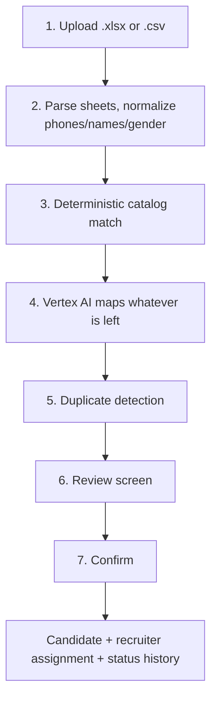
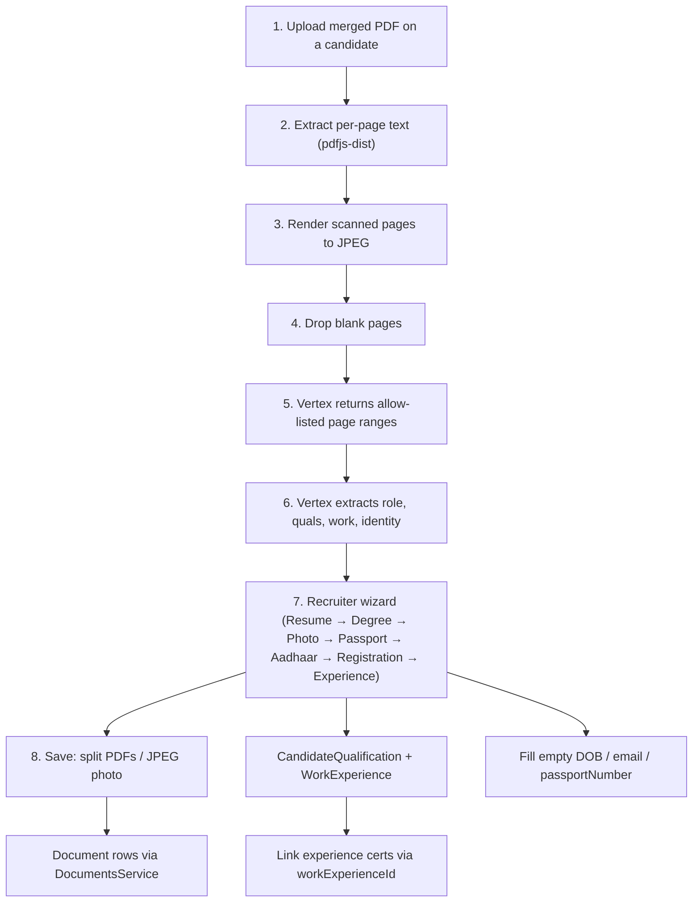

# Candidate Excel Import & Merged Document Upload — AI-Assisted Migration

Two connected features for moving recruiters off spreadsheets and into the CRM:

1. **Excel import** — upload a recruiter workbook, let AI map messy qualification and department values onto the real catalogs, review, then create candidates.
2. **Merged PDF upload** — upload one PDF holding a candidate's whole paperwork bundle, let AI split it into individual documents, review, then save them.

---

## 1. Overview

### Who can use it

| Permission | Grants | Held by |
|---|---|---|
| `import:candidates` | Upload and import recruiter sheets | CEO, Director, Manager, **Recruiter** |
| `ai_classify:candidate_documents` | Upload merged PDFs and split them | CEO, Director, Manager |

Recruiters can import their own sheet because it only ever creates their own candidates. Splitting a merged PDF writes documents onto a profile, so it stays with managers.

To grant these on an existing database without re-seeding:

```bash
cd backend && npx ts-node scripts/add-candidate-import-permissions.ts
```

### The golden rule

> AI only ever **suggests**. Candidates, catalog rows and documents are created only after a human confirms.

Nothing is written to the database until the reviewer presses Confirm. A row that fails never aborts the rest of the batch.

---

## 2. Excel import, end to end



### Step 1 — Upload

`POST /candidate-import/batches` (multipart). Creates a `CandidateImportBatch` with status `analyzing` and queues a BullMQ job. Returns immediately; the UI polls.

A recruiter uploading their own file passes `defaultRecruiterId`, and every row is theirs. A manager uploading the full workbook gets a per-tab recruiter picker in review instead.

### Step 2 — Parsing

`utils/excel-parser.util.ts` handles the shape of the real workbooks:

- **Header aliases** cover the actual typos in the sheets: `SL NO\`, `CATAGORY`, `COUNTRY PREFENCE`.
- **Scientific-notation phone repair.** Excel stores long numbers as `7.893578949E9`; these round-trip back to `7893578949` rather than being stripped to nonsense.
- **Tab colours** encode recruiter status. Red tabs are live recruiters, blue tabs are skipped.
- **Lead source is forced to `meta`** for every row, because recruiter sheets are entirely Meta leads and the cells contain `METAA` typos. The original cell is kept in `rawLeadSource` for audit.

### Step 3–4 — Catalog mapping

`services/catalog-mapping.service.ts` runs deterministic matching first, and only asks Vertex about what is left over.

Deterministic matching normalizes away case and punctuation, so `I.C.U`, `icu` and `I C U` all resolve identically. It checks exact names, short names, then existing `QualificationAlias` rows.

Vertex is asked to map onto a **shortlist of real catalog rows**, never to invent freely, and results are memoized per distinct value — a 2000-row workbook with 40 distinct qualifications costs 40 lookups, not 2000.

Anything below **0.85 confidence** stays in review even when the model picked a match.

**The duplicate guardrail.** The prompt explicitly distinguishes abbreviation variants from genuinely different things:

- `I.C.U` and `ICU` are the same thing, and collapse.
- `Neuro ICU`, `Medical ICU` and `Paediatric ICU` are **not** plain `ICU`. If the catalog holds only the general one, the model returns low confidence and explains, rather than silently merging them.

If Vertex is unconfigured or fails, the batch still completes — those values simply land in manual review.

### The department mapping is the subtle one

`Candidate` has no department field. A department is expressed through `CandidateRolePreference.roleCatalogId` → `RoleCatalog.roleDepartmentId`. So a row needs **CATEGORY plus DEPARTMENT** to resolve one role:

| CATEGORY | DEPARTMENT | Resolves to |
|---|---|---|
| `NURSE` | `ICU` | ICU staff-nurse `RoleCatalog` row |
| `DOCTOR` | `ICU` | ICU physician `RoleCatalog` row |

Each seeded department carries three roles (nurse / doctor / technician), and `icu`, `emergency`, `dialysis` and `nicu` already exist, so most rows resolve without touching Vertex.

### Step 5 — Duplicate detection

Conservative and identifier-only, in this order: passport, then `countryCode + mobileNumber`, then email. **Names never auto-match**, because these sheets are full of common names and a false merge costs far more than a duplicate a reviewer can spot.

Repeats *within* the upload are flagged too. The first occurrence stays importable; later ones point back at it.

### Step 6 — Review

The wizard shows every row with its issues, its catalog mapping (with the AI's confidence and reasoning), and dropdowns of real catalog ids so a correction can never invent a value.

Approving a genuinely new catalog value is a separate, explicit action reusing existing permissions: `manage:qualifications` for `Qualification` / `QualificationAlias`, `manage:system_config` for `RoleDepartment` / `RoleCatalog` / `ProfessionType`.

### Step 7 — Confirm

Creation goes through `CandidatesService.create`, not raw Prisma, so candidate codes, status history, profile completion, audit logging and outbox events all behave exactly as they do for a manually created candidate.

`REMARKS` has no field on `Candidate`; it is written to `CandidateStatusHistory.reason` alongside the initial status.

---

## 3. Merged PDF upload, end to end



### Reading the PDF

`utils/pdf-pages.util.ts` handles the mix these bundles actually contain — a born-digital resume next to photographed certificates:

- Pages with a usable text layer are read as text.
- Pages below the text threshold are treated as scans and **rendered to JPEG** so the model can read them. JPEG rather than PNG matters: on a real 14-page bundle this was ~530 KB of payload against ~4.4 MB for PNG at the same legibility.
- Rendered pages are measured for ink coverage. A page with effectively none is a separator or a blank reverse side, and is dropped before it can become a bogus segment.

### Classification

`services/merged-pdf-classifier.service.ts` offers Vertex **only the seven types that can be saved**:

1. Resume
2. Degree certificate (multiple allowed)
3. Passport photo
4. Passport copy
5. Aadhaar
6. Registration certificate
7. Experience certificate

Transcripts, police certificates, marriage certificates, **DataFlow / PSV reports**, and anything the model cannot identify are **dropped** — they never become segments and are never saved. DataFlow reports include an employment table, so they are labelled `dataflow_report` (or stripped by a page-text check) rather than saved as experience certificates.

Returned page ranges are then repaired rather than rejected — overlaps trimmed, reversed ranges flipped, out-of-range pages clamped — since a mostly-right segmentation a reviewer can nudge beats a hard failure.

### Profile extraction

After segments exist, `services/merged-pdf-profile-extractor.service.ts` runs a second Vertex pass on resume, degree, passport, Aadhaar and experience-letter pages and stores `profileSuggestions` JSON on the bundle:

- **Resume role:** department + job title (catalog ids when matched, otherwise proposed names). Missing catalog values are created on save.
- **Qualifications:** take every Education line on the resume (degree **and** school certificates). Match the catalog when the same credential already exists (`Bachelor of Science in Nursing` → BSc Nursing, `Higher Secondary Certificate` → HSC, `Secondary School Leaving Certificate` → SSLC). Seed includes **Higher Secondary** (HSC) and **SSLC**. Matching ignores punctuation and the short name in parentheses.
- **Work experiences:** department and job title required (match or propose); organization optional; start date required; end date required unless “current position”; optional links to experience-certificate segments.
- **Identity:** date of birth, email, passport number and passport expiry when printed. If the scanned bio page has no text layer, the number is copied from the resume or DataFlow report onto the passport step.

### Recruiter wizard

After analysis the modal is a stepper. Missing types are omitted. Each step shows **only that document’s pages** (not the full merged PDF), type-specific fields, **Skip** (rejects that document) and **Next** (confirms and advances). Two viewer buttons sit under the preview: **this document** (eye) and **merged PDF** (files).

| Step | Recruiter confirms |
|---|---|
| Resume | Document type `resume`, optional name, **Department** + **Role** (required). Qualifications can be edited here. |
| Degree certificate(s) | Type + name; extra qualification rows from that certificate. |
| Passport photo | Raster preview. Saved as JPEG (never PDF), compressed to **≤ 1 MB**. Helper: `Allowed: JPG, JPEG, PNG · Max 1 MB (larger images compressed on save)`. |
| Passport copy | Passport **number** is required. Expiry is optional so a missing date does not block saving the scan. Empty fields are filled from the identity extract (resume / DataFlow / bio page) when those values are printed. |
| Aadhaar | PDF, optional document number. |
| Registration certificate | PDF, optional document number. |
| Experience certificate(s) | One card per job (organization optional, department + title required, start date required, end date or current). Attach the matching letter. |

A compact **profile preview** (identity, qualifications, work history) stays visible. Final action is **Save to profile**.

Identity mismatches are **Candidate mismatch** errors; Next is disabled and the recruiter should Skip.

### Apply

**Save to profile** confirms every step the recruiter did not Skip (including ones they jumped past), then writes allow-listed files. Suggested rows are included so degree / photo / passport still save if a confirm request lagged. Skipped (`rejected`) and already-applied rows are not rewritten.

1. Match or **auto-create** missing `Qualification` / `RoleDepartment` / `RoleCatalog`.
2. Create `CandidateQualification` and `WorkExperience` rows.
3. Attach experience-certificate documents with `workExperienceId` when the reviewer linked them.
4. Resume: require department + role, set `roleCatalogId` on the document, and create `CandidateRolePreference` if missing.
5. Degree certificate, passport copy, and other PDFs: split the page range with pdf-lib and create a `Document` row.
6. Passport photo: rasterize the page to JPEG and compress to ≤ 1 MB (`image/jpeg`).
7. Passport copy: copy number / expiry from identity when the segment extract is empty. Drop past or invalid expiry so the file still saves.
8. Candidate profile: fill `dateOfBirth`, `email`, `passportNumber` when extracted and currently empty. Reviewer edits overwrite existing values.

> `UploadService.uploadFile()` only pushes bytes to Spaces and returns a URL. Apply calls `DocumentsService` explicitly for every segment.

---

## 4. Data model

Four new tables, one migration, nothing existing altered.

| Model | Holds |
|---|---|
| `CandidateImportBatch` | One uploaded workbook: file, status, row counters, resolved sheet owners |
| `CandidateImportRow` | One worksheet row: raw cells, normalized values, catalog mapping, issues, resulting candidate |
| `CandidateDocumentBundle` | One merged PDF: file, page count, status, `profileSuggestions` JSON |
| `CandidateDocumentBundleSegment` | One detected document: page range, doc type, extracted fields, warnings |

`CandidateImportRow` keeps `rawData` verbatim alongside `normalized`, so review is always reversible and you can always see what the sheet actually said.

`MergedDocument` is deliberately **not** reused: it is project-scoped via `@@unique([candidateId, projectId, roleCatalogId])` and imported candidates have no project yet.

---

## 5. Configuration

Vertex AI uses the same GCP project as RAIMS resume analysis. Local Docker mounts host Application Default Credentials (`gcloud auth application-default login`). A dedicated service-account PEM is optional and takes precedence when both are set.

```dotenv
VERTEX_PROJECT_ID=resume-analyst-ai-504411
VERTEX_LOCATION=global
VERTEX_MODEL=gemini-3.1-flash-lite
VERTEX_TIMEOUT_MS=120000
# Optional — skip these locally; ADC is enough
# VERTEX_SA_EMAIL=
# VERTEX_PRIVATE_KEY=
# GOOGLE_APPLICATION_CREDENTIALS=/gcp/adc.json
```

Without these the import wizard still runs end to end — every unmatched qualification or department simply falls through to manual review instead of being suggested. Credentials are never exposed to the web app.

---

## 6. API

| Endpoint | Permission | Purpose |
|---|---|---|
| `POST /candidate-import/batches` | `import:candidates` | Upload workbook, queue parse + map |
| `GET /candidate-import/batches/:id` | `import:candidates` | Status, rows, mappings, issues |
| `GET /candidate-import/recruiters` | `import:candidates` | Recruiters for the owner picker |
| `PATCH /candidate-import/batches/:id/rows/:rowId` | `import:candidates` | Reviewer corrections |
| `PATCH /candidate-import/batches/:id/sheet-owners` | `import:candidates` | Assign a recruiter per tab |
| `POST /candidate-import/batches/:id/catalog-values` | `manage:qualifications` / `manage:system_config` | Approve a new catalog row or alias |
| `POST /candidate-import/batches/:id/confirm` | `import:candidates` | Create candidates, return per-row results |
| `POST /candidates/:id/document-bundles` | `ai_classify:candidate_documents` | Upload merged PDF, queue classification |
| `GET /candidate-document-bundles/:id` | `ai_classify:candidate_documents` | Status, segments, profile suggestions |
| `GET /candidate-document-bundles/:id/preview` | `ai_classify:candidate_documents` | Split PDF for `startPage`–`endPage` (inline preview) |
| `PATCH /candidate-document-bundles/:id/segments/:segmentId` | `ai_classify:candidate_documents` | Correct, confirm or skip a segment |
| `PATCH /candidate-document-bundles/:id/profile-suggestions` | `ai_classify:candidate_documents` | Edit quals, work, resume role, identity |
| `POST /candidate-document-bundles/:id/apply` | `ai_classify:candidate_documents` | Save allow-listed docs + profile rows |

Multer limits are per-module in this codebase; this module sets its own to the 50 MB `original_documents_bundle` ceiling.

---

## 7. Where the code lives

**Backend** — `backend/src/candidate-import/`

```
utils/excel-parser.util.ts          Header aliasing, normalizers, tab colours
utils/row-validation.util.ts        Row-level validation shared with the CLI script
utils/pdf-pages.util.ts             Per-page text, scan rendering, blank detection
services/catalog-mapping.service.ts Deterministic + AI catalog resolution
services/catalog-approval.service.ts Creates catalog rows after human approval
services/duplicate-detection.service.ts
services/recruiter-resolution.service.ts
services/candidate-import.service.ts Batch orchestration and confirm
services/merged-pdf-classifier.service.ts
services/merged-pdf-profile-extractor.service.ts
services/document-bundle.service.ts  Bundle lifecycle, profile apply, docs
jobs/                                BullMQ processors
```

`backend/src/vertex-ai/` holds the shared Vertex client (service-account JWT, structured-JSON `generateContent` with a `responseSchema`, retries and timeouts).

**Frontend** — `web/src/features/candidate-import/`

The import wizard lives at `/candidates/import`, entered from the permission-gated **Import Sheet** button on the Candidates page. The merged-PDF modal opens from the **Upload merged PDF** button in a candidate's Documents tab.

### Relationship to `scripts/import-gcc-candidates.ts`

The CLI script came first and proved the parsing. Its pure functions were promoted into `excel-parser.util.ts`, and the script now imports from there, so there is **one parser, not two**. Gaps the script had, which this feature closes: qualifications and departments were validated but never persisted, `mapPreferredCountries` was never called, profession type ids were hardcoded, and it wrote raw Prisma — skipping profile completion, audit logging and outbox events.

---

## 8. Testing

```bash
cd backend && npx jest src/candidate-import    # 96 tests
cd web && npx vitest run src/features/candidate-import   # 46 tests
```

Backend coverage includes the scientific-notation phone repair, the real header typos, the `METAA` forcing, ICU-vs-Neuro-ICU not auto-merging, `BMLT` resolving to `BSc MLT` as an alias suggestion rather than a new row, the `TABASUM` / `SUVARNA` alias cases and ambiguous-tab rejection, duplicate precedence, and segment page-range repair.

### Manual verification

1. Import the `GCC_LIVE DATA.xlsx` FERNANDEZ sheet end to end.
2. Upload a merged bundle on one created candidate. Walk the wizard (Resume → Degree → Photo → Passport → Aadhaar → Registration → Experience). Confirm only allow-listed types are saved, the photo is a JPEG ≤ 1 MB, experience letters attach to work rows, and empty DOB / email / passport number are filled.
