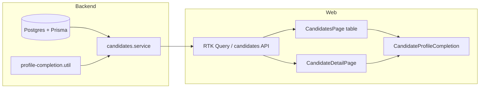

# Candidate profile: end-to-end idea and implementation map

This document describes the **profile completeness** concept for candidates: what it means for the business, how it flows from database to API to UI, and where the main screens live. The app uses **TypeScript and `.tsx` files** (e.g. `CandidateDetailPage.tsx`); there is no `CandidateDetailPage.jsx` in this monorepo.

---

## 1. Product idea (beginning)

**Goal:** Recruiters and operations can see at a glance whether a candidate’s record is **ready for downstream steps** (screening, client submission, compliance). A **profile score** answers: *“What is still missing?”* without opening every section.

**What “profile” means here (v1):**

| Layer | What counts |
|--------|----------------|
| **Personal** | Email, mobile number, date of birth (3 required fields). |
| **Documents** | Mandatory document types (resume, degree, photo, passport, Aadhaar, registration certificate, etc.). The exact list is **single-sourced** on the web in `web/src/features/candidates/profileCompletion.ts` and **mirrored** on the server in `backend/src/candidates/utils/profile-completion.util.ts`. |

**Completion %** = (completed items ÷ required items) × 100, where *required* = 3 personal checks + N mandatory document types.

**User journeys:**

1. **List view** — Sort/filter candidates; see a compact completion indicator per row to prioritize follow-up.
2. **Detail view** — See a larger completion control in the header; drill into **Overview** for personal data, **Documents** for uploads, and use modals to fix gaps.
3. **Ops / compliance** — Same rules everywhere so the number does not “change” when navigating pages (server payload + client rules stay aligned).

---

## 2. Architecture (middle)

### 2.1 Backend

- **Computation:** `computeCandidateProfileCompletion()` in  
  `backend/src/candidates/utils/profile-completion.util.ts`  
  Takes email, mobile, DOB, and the candidate’s documents (types only). Returns `percent`, `requiredCount`, `completedCount`, `missing[]`, and `breakdown` (personal vs documents).

- **Attached to responses:** `candidates.service.ts` merges `profileCompletion` onto candidate payloads where candidates are loaded with documents (e.g. by-id and list paths — see usages of `computeCandidateProfileCompletion` in that service).

- **Contract:** `CandidateProfileCompletionPayload` matches the FE type under `Candidate.profileCompletion` in `web/src/features/candidates/api.ts`.

**Important:** Any change to mandatory docs or personal rules must update **both** `profileCompletion.ts` (web) and `profile-completion.util.ts` (backend). Comments in the backend file explicitly call this out.

### 2.2 Frontend data

- **RTK Query:** Candidate detail and lists use the candidates API slice (`useGetCandidateByIdQuery`, list endpoints on `CandidatesPage`, etc.). Profile completion travels with the candidate object when the backend includes it.

- **Local fallback:** `CandidateProfileCompletion` can compute a **local** completion from `documents` + `candidate` if `profileCompletion` is missing, so UIs stay usable during partial API rollouts.

### 2.3 Key files (quick reference)

| Area | File(s) |
|------|---------|
| Required doc list + client helper | `web/src/features/candidates/profileCompletion.ts` |
| Server parity | `backend/src/candidates/utils/profile-completion.util.ts` |
| Types | `web/src/features/candidates/api.ts` (`profileCompletion?`) |
| Detail header widget | `web/src/features/candidates/components/CandidateProfileCompletion.tsx` |
| Detail page layout | `web/src/features/candidates/views/CandidateDetailPage.tsx` |
| List / table cell | `CandidateProfileCompletionCell` in same component file; used in `CandidatesPage.tsx` (and `CandidateOverviewPage.tsx`) |
| Overview tab (full profile sections) | `web/src/features/candidates/components/tabs/CandidateOverview.tsx` |
| Documents + local completion hints | `CandidateDocuments.tsx`, `DocumentUploadSection.tsx` |

---

## 3. UI: Candidate detail page (idea + what exists)

**Route pattern:** Candidate detail is loaded by id (see router config under `web/src`); the page file is:

`web/src/features/candidates/views/CandidateDetailPage.tsx`

### 3.1 Header: photo, name, status, **profile completion**

- **Left:** `ImageViewer` for `profileImage`, name, current role, created date, created-by chip.
- **Status:** Clickable area opens `StatusUpdateModal` (on hold / future / default layouts).
- **Right cluster:** `CandidateProfileCompletion` with `variant="circular"` and label “Profile Completion”, using `candidate.profileCompletion` from the API when present.

This is the **primary “profile health”** affordance on the detail screen: one control ties to the same rules as the list.

### 3.2 Stat cards

Four cards (Overview, Projects, Documents, History) switch the main `Tabs` via `activeTab` and deep-linking via `?tab=overview|projects|documents|history|metrics`.

### 3.3 Tabs (profile content)

| Tab | Role in “profile” story |
|-----|-------------------------|
| **Overview** | `CandidateOverview` — personal info, job preferences, physical, licensing, qualifications, work experience; edit modals (`UpdatePersonalInfoModal`, etc.). This is where most **non-document** gaps are fixed. |
| **Documents** | Uploads; completion by document type is reflected in the global score. |
| **Projects / History / Metrics** | Context for assignment and pipeline; not part of the v1 completion % but part of the “full candidate” story. |

### 3.4 Below tabs: status pipeline

`CandidatePipeline` card — progression vs the **completeness** card (different concept: status workflow vs data completeness).

### 3.5 Optional UX enhancements (your idea layer)

- Clicking the **circular completion** could scroll to Overview or open a small **“Missing items”** popover (tooltips already support missing labels in `CandidateProfileCompletion`).
- Add a dedicated **“Profile”** sub-section or tab that only lists **missing** items with deep links (purely presentational; data already in `profileCompletion.missing`).

---

## 4. UI: Table / list “profiling” (what exists)

**Primary table:** `web/src/features/candidates/views/CandidatesPage.tsx`

- A **Profile Completion** column renders `CandidateProfileCompletionCell` with `candidateId` and `candidate`.
- The cell reuses the same `CandidateProfileCompletion` component (compact / table-friendly props) so the **percentage matches** the detail page for the same candidate.

**Other list:** `CandidateOverviewPage.tsx` also uses `CandidateProfileCompletionCell` for a similar table experience.

**Design notes (align with `docs/FE_GUIDELINES.md`):**

- Use **Tailwind design tokens** only; no inline hex in new work.
- Keep **accessible** names: the circular variant uses `aria-label` / tooltips for screen readers.
- **RTK Query** for data; avoid ad-hoc `fetch` in new table code.

---

## 5. End-to-end flow (summary diagram)

1. Documents and personal fields live in the DB.  
2. On read, the service builds `profileCompletion` via `computeCandidateProfileCompletion`.  
3. FE displays it in the **table cell** and **detail header**; users fix gaps via Overview + Documents.  
4. After mutations, cache invalidation refetches candidate(s) and the **% updates**.

---

## 6. Extending the “profile” (end state / future you)

- **New mandatory field:** Add to personal checks in both util files; extend `api.ts` types if the shape of `missing` changes; add form in the appropriate modal and Overview section.
- **New document type:** Add to `CANDIDATE_PROFILE_REQUIRED_DOCUMENTS` and `PROFILE_REQUIRED_DOCS` together; ensure document upload uses the same `DOCUMENT_TYPE` constants.
- **Weighted score:** If product wants “resume matters more than photo,” adjust the util to use weights (requires BE + FE + tests).
- **Tests:** Follow `docs/DOD.md` — add Vitest for new components; Jest for util changes on the backend.

---

## 7. Definition of done checklist (profile-related changes)

- [ ] Backend and web **required lists** stay in sync.  
- [ ] List and detail show **consistent** completion for the same candidate.  
- [ ] No hardcoded colors; use Tailwind tokens.  
- [ ] RTK Query for server data; Zod for new forms.  
- [ ] Tests updated for changed completion logic or UI.

This document is the **concept + map** for the current codebase. When behavior changes, update this file per project DOD.
