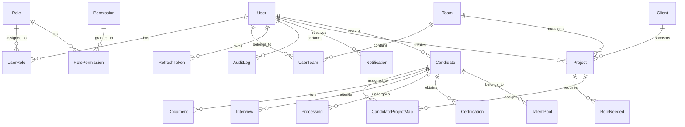

# 🗄️ **Affiniks RMS - Database Schema Documentation**

> **Last Updated**: October 5, 2025  
> **Version**: 2.0.1  
> **Database**: PostgreSQL  
> **ORM**: Prisma

---

## 📋 **Document Purpose**

This document provides a comprehensive overview of the Affiniks RMS database schema, including all models, relationships, enums, indexes, and database structure. This document is updated whenever changes are made to the database schema.

---

## 🏗️ **Database Overview**

**Technology Stack:**

- **Database**: PostgreSQL
- **ORM**: Prisma
- **Migration Tool**: Prisma Migrate
- **Schema Location**: `backend/prisma/schema.prisma`

**Key Features:**

- **Normalized Design**: Proper 3NF normalization
- **Referential Integrity**: Foreign key constraints with cascade deletes
- **Performance Optimization**: Strategic indexing
- **Audit Trail**: Comprehensive audit logging
- **RBAC Support**: Role-based access control
- **Multi-tenant Ready**: Team-based scoping

---

## 📊 **Database Models**

### **🔐 1. Authentication & Authorization Models**

#### **1.1 User Model**

```sql
Table: users
```

**Fields:**
| Field | Type | Constraints | Description |
|-------|------|-------------|-------------|
| `id` | String | Primary Key, CUID | Unique user identifier |
| `email` | String | Unique, Indexed | User email address |
| `name` | String | Required | Full name of user |
| `password` | String | Required | Hashed password |
| `dateOfBirth` | DateTime | Optional | User's date of birth |
| `phone` | String | Required, Unique, Indexed | Contact phone number (authentication identifier) |
| `createdAt` | DateTime | Auto-generated | Record creation timestamp |
| `updatedAt` | DateTime | Auto-updated | Record modification timestamp |

**Relationships:**

- `userRoles` → `UserRole[]` (One-to-Many)
- `userTeams` → `UserTeam[]` (One-to-Many)
- `refreshTokens` → `RefreshToken[]` (One-to-Many)
- `createdProjects` → `Project[]` (One-to-Many)
- `assignedCandidates` → `Candidate[]` (One-to-Many)
- `notifications` → `Notification[]` (One-to-Many)
- `auditLogs` → `AuditLog[]` (One-to-Many)

**Indexes:**

- `email` (Unique, for lookups)
- `phone` (Unique, for authentication queries)
- `createdAt` (For user listing and analytics)

**Authentication:**

- Users authenticate using `phone` (not email)
- Phone numbers must be unique and include country code (E.164 format)
- Example: `+919876543210`

---

#### **1.2 Role Model**

```sql
Table: roles
```

**Fields:**
| Field | Type | Constraints | Description |
|-------|------|-------------|-------------|
| `id` | String | Primary Key, CUID | Unique role identifier |
| `name` | String | Unique | Role name (e.g., "Manager", "Recruiter") |
| `description` | String | Optional | Role description |
| `createdAt` | DateTime | Auto-generated | Record creation timestamp |
| `updatedAt` | DateTime | Auto-updated | Record modification timestamp |

**Relationships:**

- `userRoles` → `UserRole[]` (One-to-Many)
- `rolePermissions` → `RolePermission[]` (One-to-Many)

---

#### **1.3 Permission Model**

```sql
Table: permissions
```

**Fields:**
| Field | Type | Constraints | Description |
|-------|------|-------------|-------------|
| `id` | String | Primary Key, CUID | Unique permission identifier |
| `key` | String | Unique | Permission key (e.g., "read:projects") |
| `description` | String | Optional | Permission description |
| `createdAt` | DateTime | Auto-generated | Record creation timestamp |
| `updatedAt` | DateTime | Auto-updated | Record modification timestamp |

**Relationships:**

- `rolePermissions` → `RolePermission[]` (One-to-Many)

---

#### **1.4 RolePermission Model (Junction Table)**

```sql
Table: role_permissions
```

**Fields:**
| Field | Type | Constraints | Description |
|-------|------|-------------|-------------|
| `roleId` | String | Foreign Key | Reference to Role |
| `permissionId` | String | Foreign Key | Reference to Permission |

**Constraints:**

- Composite Primary Key: `[roleId, permissionId]`
- Foreign Key: `roleId` → `roles.id` (CASCADE DELETE)
- Foreign Key: `permissionId` → `permissions.id` (CASCADE DELETE)

**Indexes:**

- `roleId` (For role permission lookups)
- `permissionId` (For permission-based queries)

---

#### **1.5 UserRole Model (Junction Table)**

```sql
Table: user_roles
```

**Fields:**
| Field | Type | Constraints | Description |
|-------|------|-------------|-------------|
| `userId` | String | Foreign Key | Reference to User |
| `roleId` | String | Foreign Key | Reference to Role |

**Constraints:**

- Composite Primary Key: `[userId, roleId]`
- Foreign Key: `userId` → `users.id` (CASCADE DELETE)
- Foreign Key: `roleId` → `roles.id` (CASCADE DELETE)

**Indexes:**

- `userId` (For user role lookups)
- `roleId` (For role-based queries)

---

#### **1.6 RefreshToken Model**

```sql
Table: refresh_tokens
```

**Fields:**
| Field | Type | Constraints | Description |
|-------|------|-------------|-------------|
| `id` | String | Primary Key, CUID | Public token identifier (RFI) |
| `userId` | String | Foreign Key | Reference to User |
| `familyId` | String | Indexed | Token family identifier |
| `hash` | String | Required | Argon2 hash of secret value (RFT) |
| `expiresAt` | DateTime | Required | Token expiration timestamp |
| `revokedAt` | DateTime | Optional | Token revocation timestamp |
| `createdAt` | DateTime | Auto-generated | Record creation timestamp |

**Constraints:**

- Foreign Key: `userId` → `users.id`

**Indexes:**

- `userId` (For user token lookups)
- `familyId` (For token family management)
- `expiresAt` (For token cleanup)

---

### **🏢 2. Organizational Models**

#### **2.1 Team Model**

```sql
Table: teams
```

**Fields:**
| Field | Type | Constraints | Description |
|-------|------|-------------|-------------|
| `id` | String | Primary Key, CUID | Unique team identifier |
| `name` | String | Unique | Team name |
| `leadId` | String | Optional | Team lead user ID |
| `headId` | String | Optional | Team head user ID |
| `managerId` | String | Optional | Team manager user ID |
| `createdAt` | DateTime | Auto-generated | Record creation timestamp |
| `updatedAt` | DateTime | Auto-updated | Record modification timestamp |

**Relationships:**

- `userTeams` → `UserTeam[]` (One-to-Many)
- `projects` → `Project[]` (One-to-Many)
- `candidates` → `Candidate[]` (One-to-Many)

---

#### **2.2 UserTeam Model (Junction Table)**

```sql
Table: user_teams
```

**Fields:**
| Field | Type | Constraints | Description |
|-------|------|-------------|-------------|
| `userId` | String | Foreign Key | Reference to User |
| `teamId` | String | Foreign Key | Reference to Team |

**Constraints:**

- Composite Primary Key: `[userId, teamId]`
- Foreign Key: `userId` → `users.id` (CASCADE DELETE)
- Foreign Key: `teamId` → `teams.id` (CASCADE DELETE)

---

### **🏢 3. Client Management Models**

#### **3.1 Client Model**

```sql
Table: clients
```

**Fields:**
| Field | Type | Constraints | Description |
|-------|------|-------------|-------------|
| `id` | String | Primary Key, CUID | Unique client identifier |
| `name` | String | Required | Client name |
| `type` | ClientType | Required | Client type enum |
| `pointOfContact` | String | Optional | Primary contact person |
| `email` | String | Optional | Contact email |
| `phone` | String | Optional | Contact phone |
| `address` | String | Optional | Physical address |

**Individual Referrer Fields:**
| Field | Type | Description |
|-------|------|-------------|
| `profession` | String | Individual's profession |
| `organization` | String | Individual's organization |
| `relationship` | IndividualRelationship | Relationship type enum |

**Sub-Agency Fields:**
| Field | Type | Description |
|-------|------|-------------|
| `agencyType` | AgencyType | Agency type enum |
| `specialties` | Json | Array of specialties |

**Healthcare Organization Fields:**
| Field | Type | Description |
|-------|------|-------------|
| `facilityType` | FacilityType | Facility type enum |
| `facilitySize` | FacilitySize | Facility size enum |
| `locations` | Json | Array of locations |

**External Source Fields:**
| Field | Type | Description |
|-------|------|-------------|
| `sourceType` | ExternalSourceType | Source type enum |
| `sourceName` | String | Source name (e.g., "Indeed") |
| `acquisitionMethod` | AcquisitionMethod | Acquisition method enum |
| `sourceNotes` | String | Additional notes |

**Financial Fields (Optional):**
| Field | Type | Description |
|-------|------|-------------|
| `relationshipType` | RelationshipType | Relationship type enum |
| `commissionRate` | Float | Commission percentage |
| `paymentTerms` | String | Payment terms |
| `contractStartDate` | DateTime | Contract start date |
| `contractEndDate` | DateTime | Contract end date |
| `billingAddress` | String | Billing address |
| `taxId` | String | Tax identification number |

**Timestamps:**
| Field | Type | Description |
|-------|------|-------------|
| `createdAt` | DateTime | Auto-generated |
| `updatedAt` | DateTime | Auto-updated |

**Relationships:**

- `projects` → `Project[]` (One-to-Many)

---

### **📊 4. Project Management Models**

#### **4.1 Project Model**

```sql
Table: projects
```

**Fields:**
| Field | Type | Constraints | Description |
|-------|------|-------------|-------------|
| `id` | String | Primary Key, CUID | Unique project identifier |
| `clientId` | String | Foreign Key | Reference to Client |
| `title` | String | Required | Project title |
| `description` | String | Optional | Project description |
| `deadline` | DateTime | Optional | Project deadline |
| `status` | String | Default: "active" | Project status |
| `createdBy` | String | Foreign Key | Reference to User (creator) |
| `teamId` | String | Foreign Key, Optional | Reference to Team |
| `createdAt` | DateTime | Auto-generated | Record creation timestamp |
| `updatedAt` | DateTime | Auto-updated | Record modification timestamp |

**Constraints:**

- Foreign Key: `clientId` → `clients.id`
- Foreign Key: `createdBy` → `users.id`
- Foreign Key: `teamId` → `teams.id`

**Relationships:**

- `client` → `Client` (Many-to-One)
- `creator` → `User` (Many-to-One)
- `team` → `Team` (Many-to-One)
- `rolesNeeded` → `RoleNeeded[]` (One-to-Many)
- `candidateProjects` → `CandidateProjectMap[]` (One-to-Many)

---

#### **4.2 RoleNeeded Model**

```sql
Table: roles_needed
```

**Basic Information:**
| Field | Type | Constraints | Description |
|-------|------|-------------|-------------|
| `id` | String | Primary Key, CUID | Unique role need identifier |
| `projectId` | String | Foreign Key | Reference to Project |
| `designation` | String | Required | Job designation/title |
| `quantity` | Int | Required | Number of positions needed |
| `priority` | String | Default: "medium" | Priority level (low, medium, high, urgent) |

**Experience Requirements:**
| Field | Type | Description |
|-------|------|-------------|
| `minExperience` | Int | Optional | Minimum years of experience |
| `maxExperience` | Int | Optional | Maximum years of experience |
| `specificExperience` | Json | Optional | Specific experience areas (e.g., ["ICU", "ER", "Leadership"]) |

**Educational Requirements:**
| Field | Type | Description |
|-------|------|-------------|
| `educationRequirements` | Json | Optional | Required education (e.g., ["BSN", "MSN"]) |
| `requiredCertifications` | Json | Optional | Required certifications (e.g., ["RN", "BLS", "ACLS"]) |
| `institutionRequirements` | String | Optional | Institution requirements |

**Skills & Competencies:**
| Field | Type | Description |
|-------|------|-------------|
| `skills` | Json | Default: "[]" | General skills array |
| `technicalSkills` | Json | Optional | Technical skills (e.g., ["EPIC", "Ventilator Management"]) |
| `languageRequirements` | Json | Optional | Language requirements (e.g., ["English", "Spanish"]) |

**Licensing & Compliance:**
| Field | Type | Description |
|-------|------|-------------|
| `licenseRequirements` | Json | Optional | License requirements (e.g., ["State RN License"]) |
| `backgroundCheckRequired` | Boolean | Default: true | Background check requirement |
| `drugScreeningRequired` | Boolean | Default: true | Drug screening requirement |

**Work Conditions:**
| Field | Type | Description |
|-------|------|-------------|
| `shiftType` | String | Optional | Shift type (day, night, rotating, flexible) |
| `onCallRequired` | Boolean | Default: false | On-call requirement |
| `physicalDemands` | String | Optional | Physical demands description |

**Compensation:**
| Field | Type | Description |
|-------|------|-------------|
| `salaryRange` | Json | Optional | Salary range (e.g., {"min": 60000, "max": 80000, "currency": "USD"}) |
| `benefits` | String | Optional | Benefits package description |
| `relocationAssistance` | Boolean | Default: false | Relocation assistance availability |

**Additional Information:**
| Field | Type | Description |
|-------|------|-------------|
| `additionalRequirements` | String | Optional | Additional requirements |
| `notes` | String | Optional | Additional notes |
| `createdAt` | DateTime | Auto-generated | Record creation timestamp |
| `updatedAt` | DateTime | Auto-updated | Record modification timestamp |

**Constraints:**

- Foreign Key: `projectId` → `projects.id` (CASCADE DELETE)

**Relationships:**

- `project` → `Project` (Many-to-One)

---

### **👤 5. Candidate Management Models**

#### **5.1 Candidate Model**

```sql
Table: candidates
```

**Fields:**
| Field | Type | Constraints | Description |
|-------|------|-------------|-------------|
| `id` | String | Primary Key, CUID | Unique candidate identifier |
| `name` | String | Required | Candidate name |
| `contact` | String | Unique | Contact number |
| `email` | String | Optional | Email address |
| `source` | String | Default: "manual" | Source of candidate |
| `dateOfBirth` | DateTime | Optional | Date of birth |
| `currentStatus` | String | Default: "new" | Current status |
| `experience` | Int | Optional | Years of experience |
| `skills` | Json | Default: "[]" | Skills array |
| `currentEmployer` | String | Optional | Current employer |
| `expectedSalary` | Int | Optional | Expected salary |
| `assignedTo` | String | Foreign Key, Optional | Reference to User (recruiter) |
| `teamId` | String | Foreign Key, Optional | Reference to Team |
| `createdAt` | DateTime | Auto-generated | Record creation timestamp |
| `updatedAt` | DateTime | Auto-updated | Record modification timestamp |

**Constraints:**

- Foreign Key: `assignedTo` → `users.id`
- Foreign Key: `teamId` → `teams.id`

**Relationships:**

- `recruiter` → `User` (Many-to-One)
- `team` → `Team` (Many-to-One)
- `projects` → `CandidateProjectMap[]` (One-to-Many)
- `documents` → `Document[]` (One-to-Many)
- `interviews` → `Interview[]` (One-to-Many)
- `processing` → `Processing` (One-to-One)
- `certifications` → `Certification[]` (One-to-Many)
- `talentPool` → `TalentPool` (One-to-One)

---

#### **5.2 CandidateProjectMap Model (Junction Table) - UPDATED v2.0**

```sql
Table: candidate_project_map
```

**Purpose:** Tracks the complete lifecycle of a candidate's journey through a specific project nomination, from initial nomination through document verification, interviews, selection, processing, and final hiring.

**Fields:**
| Field | Type | Constraints | Description |
|-------|------|-------------|-------------|
| `id` | String | Primary Key, CUID | Unique mapping identifier |
| `candidateId` | String | Foreign Key | Reference to Candidate |
| `projectId` | String | Foreign Key | Reference to Project |
| **`status`** | **String** | **Default: "nominated"** | **Workflow status (see statuses below)** |
| **`nominatedDate`** | **DateTime** | **Auto-generated** | **Date candidate was nominated** |
| **`nominatedBy`** | **String** | **Required** | **User ID who nominated candidate** |
| **`documentsSubmittedDate`** | DateTime | Optional | Date all documents submitted |
| **`documentsVerifiedDate`** | DateTime | Optional | Date all documents verified |
| **`approvedBy`** | String | Optional | User ID who approved after verification |
| **`approvedDate`** | DateTime | Optional | Date candidate was approved |
| **`selectedDate`** | DateTime | Optional | Date candidate was selected by client |
| **`hiredDate`** | DateTime | Optional | Date candidate was hired |
| **`rejectedBy`** | String | Optional | User ID who rejected candidate |
| **`rejectedDate`** | DateTime | Optional | Date candidate was rejected |
| **`rejectionReason`** | String | Optional | Reason for rejection |
| `notes` | String | Optional | Additional notes |
| `createdAt` | DateTime | Auto-generated | Record creation timestamp |
| `updatedAt` | DateTime | Auto-updated | Record modification timestamp |

**Workflow Statuses:**

1. `nominated` - Initial state when candidate is nominated
2. `pending_documents` - Waiting for document submission
3. `documents_submitted` - All documents submitted
4. `verification_in_progress` - Documents being verified
5. `documents_verified` - All documents verified
6. `approved` - Candidate approved for project
7. `interview_scheduled` - Interview scheduled
8. `interview_completed` - Interview completed
9. `interview_passed` - Passed interview
10. `selected` - Client selected candidate
11. `processing` - In processing (QVP, Medical, Visa, Travel)
12. `hired` - Successfully hired
13. `rejected_documents` - Rejected due to documents
14. `rejected_interview` - Rejected at interview stage
15. `rejected_selection` - Not selected by client
16. `withdrawn` - Nomination withdrawn
17. `on_hold` - Temporarily on hold

**Constraints:**

- Unique Constraint: `[candidateId, projectId]`
- Foreign Key: `candidateId` → `candidates.id` (CASCADE DELETE)
- Foreign Key: `projectId` → `projects.id` (CASCADE DELETE)
- Index: `status` (for filtering by workflow stage)
- Index: `nominatedBy` (for tracking nominations by user)

**Relationships:**

- `candidate` → `Candidate` (Many-to-One)
- `project` → `Project` (Many-to-One)
- `interviews` → `Interview[]` (One-to-Many) - **NEW**
- `processing` → `Processing` (One-to-One) - **NEW**
- `documentVerifications` → `CandidateProjectDocumentVerification[]` (One-to-Many) - **NEW**

---

### **📄 6. Document Management Models**

#### **6.1 Document Model - UPDATED v2.0**

```sql
Table: documents
```

**Purpose:** Stores candidate documents (candidate-centric, reusable across multiple project nominations). Documents belong to candidates and can be verified for different projects through the junction table.

**Fields:**
| Field | Type | Constraints | Description |
|-------|------|-------------|-------------|
| `id` | String | Primary Key, CUID | Unique document identifier |
| `candidateId` | String | Foreign Key, Indexed | Reference to Candidate |
| `docType` | String | Required, Indexed | Document type (from DOCUMENT_TYPE constants) |
| `fileName` | String | Required | Original file name |
| `fileUrl` | String | Required | Digital Ocean Spaces URL |
| **`fileSize`** | **Int** | **Optional** | **File size in bytes** |
| **`mimeType`** | **String** | **Optional** | **File MIME type** |
| `status` | String | Default: "pending", Indexed | Document status (pending, verified, rejected, expired, resubmission_required) |
| `uploadedBy` | String | Required | User ID who uploaded |
| `verifiedBy` | String | Optional | User ID who verified (general) |
| **`verifiedAt`** | **DateTime** | **Optional** | **General verification timestamp** |
| **`rejectedBy`** | **String** | **Optional** | **User ID who rejected** |
| **`rejectedAt`** | **DateTime** | **Optional** | **Rejection timestamp** |
| **`expiryDate`** | **DateTime** | **Optional** | **Document expiry (for passports, licenses)** |
| **`documentNumber`** | **String** | **Optional** | **Document number (passport #, license #)** |
| `notes` | String | Optional | Additional notes |
| **`rejectionReason`** | **String** | **Optional** | **Reason for rejection** |
| `createdAt` | DateTime | Auto-generated | Record creation timestamp |
| `updatedAt` | DateTime | Auto-updated | Record modification timestamp |

**Document Types** (from constants):

- **Identity**: passport, aadhaar, pan_card, driving_license, voter_id
- **Professional**: professional_license, nursing_license, medical_license, registration_certificate
- **Educational**: degree, diploma, certificate, transcript, marksheet
- **Employment**: resume, cv, experience_letter, relieving_letter, salary_slip, appointment_letter
- **Verification**: background_check, police_clearance, reference_letter
- **Medical**: medical_certificate, medical_fitness, vaccination_certificate, covid_vaccination, medical_insurance
- **Other**: photo, bank_details, offer_letter, joining_letter, other

**Constraints:**

- Foreign Key: `candidateId` → `candidates.id` (CASCADE DELETE)
- Index: `candidateId` (for querying candidate documents)
- Index: `docType` (for filtering by document type)
- Index: `status` (for filtering by verification status)

**Relationships:**

- `candidate` → `Candidate` (Many-to-One)
- **`verifications` → `CandidateProjectDocumentVerification[]` (One-to-Many) - NEW**

---

#### **6.2 DocumentRequirement Model - NEW v2.0**

```sql
Table: document_requirements
```

**Purpose:** Defines which documents are mandatory for a specific project. Set by recruiter/manager when creating or updating a project.

**Fields:**
| Field | Type | Constraints | Description |
|-------|------|-------------|-------------|
| `id` | String | Primary Key, CUID | Unique requirement identifier |
| `projectId` | String | Foreign Key, Indexed | Reference to Project |
| `docType` | String | Required | Document type required (from DOCUMENT_TYPE constants) |
| `mandatory` | Boolean | Default: true | Whether document is mandatory |
| `description` | String | Optional | Additional requirement details |
| `createdAt` | DateTime | Auto-generated | Record creation timestamp |
| `updatedAt` | DateTime | Auto-updated | Record modification timestamp |

**Constraints:**

- Unique Constraint: `[projectId, docType]` (prevent duplicate requirements)
- Foreign Key: `projectId` → `projects.id` (CASCADE DELETE)
- Index: `projectId` (for querying project requirements)

**Relationships:**

- `project` → `Project` (Many-to-One)

---

#### **6.3 CandidateProjectDocumentVerification Model - NEW v2.0**

```sql
Table: candidate_project_document_verifications
```

**Purpose:** Junction table linking Documents to specific Project nominations. Tracks verification status of each document for each project. Allows the same document (e.g., passport) to be verified for multiple projects without duplication.

**Fields:**
| Field | Type | Constraints | Description |
|-------|------|-------------|-------------|
| `id` | String | Primary Key, CUID | Unique verification identifier |
| `candidateProjectMapId` | String | Foreign Key, Indexed | Reference to CandidateProjectMap |
| `documentId` | String | Foreign Key, Indexed | Reference to Document |
| `status` | String | Default: "pending", Indexed | Verification status (pending, verified, rejected) |
| `verifiedBy` | String | Optional | Document Verification Team user ID |
| `verifiedAt` | DateTime | Optional | Verification timestamp |
| `rejectedBy` | String | Optional | User ID who rejected |
| `rejectedAt` | DateTime | Optional | Rejection timestamp |
| `notes` | String | Optional | Verification notes |
| `rejectionReason` | String | Optional | Reason for rejection |
| `resubmissionRequested` | Boolean | Default: false | Whether resubmission was requested |
| `resubmissionRequestedAt` | DateTime | Optional | When resubmission was requested |
| `resubmissionRequestedBy` | String | Optional | User who requested resubmission |
| `createdAt` | DateTime | Auto-generated | Record creation timestamp |
| `updatedAt` | DateTime | Auto-updated | Record modification timestamp |

**Constraints:**

- Unique Constraint: `[candidateProjectMapId, documentId]` (one verification per document per project)
- Foreign Key: `candidateProjectMapId` → `candidate_project_map.id` (CASCADE DELETE)
- Foreign Key: `documentId` → `documents.id` (CASCADE DELETE)
- Index: `candidateProjectMapId` (for querying verifications by nomination)
- Index: `documentId` (for querying verifications by document)
- Index: `status` (for filtering by verification status)

**Relationships:**

- `candidateProjectMap` → `CandidateProjectMap` (Many-to-One)
- `document` → `Document` (Many-to-One)

**Key Design Decision:**
This model enables document reusability - a single passport can be verified for Project A and Project B without uploading twice. Each project maintains its own verification status.

---

### **🎯 7. Interview Management Models**

#### **7.1 Interview Model - UPDATED v2.0**

```sql
Table: interviews
```

**Purpose:** Tracks interviews for specific candidate-project nominations (project-specific, not candidate-generic).

**Fields:**
| Field | Type | Constraints | Description |
|-------|------|-------------|-------------|
| `id` | String | Primary Key, CUID | Unique interview identifier |
| **`candidateProjectMapId`** | **String** | **Foreign Key, Indexed** | **Reference to CandidateProjectMap (CHANGED)** |
| `scheduledTime` | DateTime | Required, Indexed | Interview schedule |
| `duration` | Int | Default: 60 | Duration in minutes |
| `type` | String | Default: "technical" | Interview type (technical, hr, final, panel) |
| **`mode`** | **String** | **Default: "video"** | **Interview mode (video, phone, in_person)** |
| `outcome` | String | Optional | Interview outcome (passed, failed, rescheduled, no_show, cancelled) |
| `notes` | String | Optional | Interview notes |
| `interviewer` | String | Optional | User ID or external interviewer name |
| **`interviewerEmail`** | **String** | **Optional** | **Interviewer email address** |
| **`meetingLink`** | **String** | **Optional** | **Video meeting link** |
| `createdAt` | DateTime | Auto-generated | Record creation timestamp |
| `updatedAt` | DateTime | Auto-updated | Record modification timestamp |

**Constraints:**

- Foreign Key: `candidateProjectMapId` → `candidate_project_map.id` (CASCADE DELETE)
- Index: `candidateProjectMapId` (for querying interviews by nomination)
- Index: `scheduledTime` (for calendar queries)

**Relationships:**

- **`candidateProjectMap` → `CandidateProjectMap` (Many-to-One) - CHANGED from Candidate**

**Key Change:** Interviews are now linked to specific project nominations (CandidateProjectMap) instead of just candidates. This allows tracking interview outcomes per project.

---

### **⚙️ 8. Processing Management Models**

#### **8.1 Processing Model - UPDATED v2.0**

```sql
Table: processing
```

**Purpose:** Tracks post-selection processing stages (QVP, Medical, Visa, Travel, Joining) for specific candidate-project nominations.

**Fields:**
| Field | Type | Constraints | Description |
|-------|------|-------------|-------------|
| `id` | String | Primary Key, CUID | Unique processing identifier |
| **`candidateProjectMapId`** | **String** | **Foreign Key, Unique, Indexed** | **Reference to CandidateProjectMap (CHANGED)** |
| **QVP Stage** | | | |
| `qvpStatus` | String | Default: "not_started" | QVP status (not_started, in_progress, completed, failed) |
| **`qvpStartDate`** | **DateTime** | **Optional** | **QVP start date** |
| **`qvpCompletionDate`** | **DateTime** | **Optional** | **QVP completion date** |
| **Medical Stage** | | | |
| `medicalStatus` | String | Default: "not_started" | Medical status (not_started, in_progress, completed, failed) |
| **`medicalClearance`** | **String** | **Optional** | **Medical clearance result (fit, unfit, conditional)** |
| **`medicalStartDate`** | **DateTime** | **Optional** | **Medical check start date** |
| **`medicalCompletionDate`** | **DateTime** | **Optional** | **Medical check completion date** |
| **`medicalNotes`** | **String** | **Optional** | **Medical stage notes** |
| **Visa Stage** | | | |
| `visaStatus` | String | Default: "not_started" | Visa status (not_started, in_progress, approved, rejected, on_hold) |
| **`visaType`** | **String** | **Optional** | **Type of visa applied** |
| **`visaApplicationDate`** | **DateTime** | **Optional** | **Visa application date** |
| **`visaApprovalDate`** | **DateTime** | **Optional** | **Visa approval date** |
| **`visaExpiryDate`** | **DateTime** | **Optional** | **Visa expiry date** |
| **`visaNotes`** | **String** | **Optional** | **Visa stage notes** |
| **Travel Stage** | | | |
| `travelStatus` | String | Default: "not_started" | Travel status (not_started, booking_in_progress, booked, completed) |
| **`flightBookedDate`** | **DateTime** | **Optional** | **Flight booking date** |
| **`departureDate`** | **DateTime** | **Optional** | **Departure date** |
| **`arrivalDate`** | **DateTime** | **Optional** | **Arrival date** |
| **`travelNotes`** | **String** | **Optional** | **Travel stage notes** |
| **Joining Stage** | | | |
| **`joiningStatus`** | **String** | **Default: "pending"** | **Joining status (pending, joined, no_show, delayed)** |
| **`expectedJoiningDate`** | **DateTime** | **Optional** | **Expected joining date** |
| **`actualJoiningDate`** | **DateTime** | **Optional** | **Actual joining date** |
| **`joiningNotes`** | **String** | **Optional** | **Joining stage notes** |
| `notes` | String | Optional | General processing notes |
| `createdAt` | DateTime | Auto-generated | Record creation timestamp |
| `updatedAt` | DateTime | Auto-updated | Record modification timestamp |

**Constraints:**

- Foreign Key: `candidateProjectMapId` → `candidate_project_map.id` (CASCADE DELETE)
- Unique Constraint: `candidateProjectMapId`
- Index: `candidateProjectMapId`

**Relationships:**

- **`candidateProjectMap` → `CandidateProjectMap` (One-to-One) - CHANGED from Candidate**

**Key Change:** Processing is now linked to specific project nominations (CandidateProjectMap) instead of just candidates, allowing candidates to be in processing for different projects simultaneously.

---

### **🔔 9. Notification Models**

#### **9.1 Notification Model**

```sql
Table: notifications
```

**Fields:**
| Field | Type | Constraints | Description |
|-------|------|-------------|-------------|
| `id` | String | Primary Key, CUID | Unique notification identifier |
| `userId` | String | Foreign Key | Reference to User |
| `type` | String | Required | Notification type |
| `title` | String | Required | Notification title |
| `message` | String | Required | Notification message |
| `seen` | Boolean | Default: false | Read status |
| `createdAt` | DateTime | Auto-generated | Record creation timestamp |

**Constraints:**

- Foreign Key: `userId` → `users.id` (CASCADE DELETE)

**Relationships:**

- `user` → `User` (Many-to-One)

---

### **🏆 10. Certification Models**

#### **10.1 Certification Model**

```sql
Table: certifications
```

**Fields:**
| Field | Type | Constraints | Description |
|-------|------|-------------|-------------|
| `id` | String | Primary Key, CUID | Unique certification identifier |
| `candidateId` | String | Foreign Key | Reference to Candidate |
| `certName` | String | Required | Certification name |
| `status` | String | Default: "pending" | Certification status |
| `examDate` | DateTime | Optional | Exam date |
| `validUntil` | DateTime | Optional | Validity period |
| `exportedToLearning` | Boolean | Default: false | Learning platform export status |
| `createdAt` | DateTime | Auto-generated | Record creation timestamp |
| `updatedAt` | DateTime | Auto-updated | Record modification timestamp |

**Constraints:**

- Foreign Key: `candidateId` → `candidates.id` (CASCADE DELETE)

**Relationships:**

- `candidate` → `Candidate` (Many-to-One)

---

### **🌟 11. Talent Pool Models**

#### **11.1 TalentPool Model**

```sql
Table: talent_pool
```

**Fields:**
| Field | Type | Constraints | Description |
|-------|------|-------------|-------------|
| `id` | String | Primary Key, CUID | Unique talent pool identifier |
| `candidateId` | String | Foreign Key, Unique | Reference to Candidate |
| `role` | String | Required | Preferred role |
| `yearsExperience` | Int | Required | Years of experience |
| `currentEmployer` | String | Optional | Current employer |
| `isAvailable` | Boolean | Default: true | Availability status |
| `rating` | Int | Optional | Performance rating (1-5) |
| `notes` | String | Optional | Additional notes |
| `sourceProjectId` | String | Optional | Source project identifier |
| `createdAt` | DateTime | Auto-generated | Record creation timestamp |
| `updatedAt` | DateTime | Auto-updated | Record modification timestamp |

**Constraints:**

- Foreign Key: `candidateId` → `candidates.id` (CASCADE DELETE)
- Unique Constraint: `candidateId`

**Relationships:**

- `candidate` → `Candidate` (One-to-One)

---

### **📋 12. Audit Models**

#### **12.1 AuditLog Model**

```sql
Table: audit_logs
```

**Fields:**
| Field | Type | Constraints | Description |
|-------|------|-------------|-------------|
| `id` | String | Primary Key, CUID | Unique audit log identifier |
| `actionType` | String | Required | Action type (create, update, delete) |
| `entityId` | String | Required | Affected entity ID |
| `entityType` | String | Required | Entity type (user, candidate, project) |
| `userId` | String | Foreign Key | User who performed action |
| `changes` | Json | Default: "{}" | Changes made |
| `timestamp` | DateTime | Auto-generated | Action timestamp |

**Constraints:**

- Foreign Key: `userId` → `users.id`

**Relationships:**

- `user` → `User` (Many-to-One)

---

## 🔤 **Enums**

### **ClientType Enum**

```typescript
enum ClientType {
  INDIVIDUAL              // Individual referrers
  SUB_AGENCY             // Sub-recruitment agencies
  HEALTHCARE_ORGANIZATION // Healthcare organizations
  EXTERNAL_SOURCE        // External sources
}
```

### **IndividualRelationship Enum**

```typescript
enum IndividualRelationship {
  CURRENT_EMPLOYEE   // Currently employed at organization
  FORMER_EMPLOYEE    // Previously employed at organization
  NETWORK_CONTACT    // Network contact
}
```

### **AgencyType Enum**

```typescript
enum AgencyType {
  LOCAL        // Local recruitment agency
  REGIONAL     // Regional recruitment agency
  SPECIALIZED  // Specialized recruitment agency
}
```

### **FacilityType Enum**

```typescript
enum FacilityType {
  HOSPITAL       // Hospital
  CLINIC         // Clinic
  NURSING_HOME   // Nursing home
  MEDICAL_CENTER // Medical center
}
```

### **FacilitySize Enum**

```typescript
enum FacilitySize {
  SMALL   // Small facility
  MEDIUM  // Medium facility
  LARGE   // Large facility
}
```

### **ExternalSourceType Enum**

```typescript
enum ExternalSourceType {
  JOB_BOARD         // Job board
  SOCIAL_MEDIA      // Social media
  REFERRAL_PLATFORM // Referral platform
  INDUSTRY_EVENT    // Industry event
  COLD_OUTREACH     // Cold outreach
  OTHER             // Other sources
}
```

### **AcquisitionMethod Enum**

```typescript
enum AcquisitionMethod {
  ORGANIC      // Organic acquisition
  PAID         // Paid acquisition
  PARTNERSHIP  // Partnership
  REFERRAL     // Referral
}
```

### **RelationshipType Enum**

```typescript
enum RelationshipType {
  REFERRAL        // Referral relationship
  PARTNERSHIP     // Partnership relationship
  DIRECT_CLIENT   // Direct client relationship
  EXTERNAL_SOURCE // External source relationship
}
```

---

## 🔗 **Entity Relationships**

### **Core Relationships**



### **Relationship Details**

| **From**   | **To**              | **Type**    | **Description**                                |
| ---------- | ------------------- | ----------- | ---------------------------------------------- |
| User       | UserRole            | One-to-Many | User can have multiple roles                   |
| Role       | UserRole            | One-to-Many | Role can be assigned to multiple users         |
| User       | UserTeam            | One-to-Many | User can belong to multiple teams              |
| Team       | UserTeam            | One-to-Many | Team can have multiple users                   |
| Role       | RolePermission      | One-to-Many | Role can have multiple permissions             |
| Permission | RolePermission      | One-to-Many | Permission can be granted to multiple roles    |
| User       | RefreshToken        | One-to-Many | User can have multiple refresh tokens          |
| User       | AuditLog            | One-to-Many | User can perform multiple audit actions        |
| User       | Notification        | One-to-Many | User can receive multiple notifications        |
| User       | Project             | One-to-Many | User can create multiple projects              |
| User       | Candidate           | One-to-Many | User can recruit multiple candidates           |
| Client     | Project             | One-to-Many | Client can sponsor multiple projects           |
| Team       | Project             | One-to-Many | Team can manage multiple projects              |
| Project    | RoleNeeded          | One-to-Many | Project can require multiple roles             |
| Project    | CandidateProjectMap | One-to-Many | Project can assign multiple candidates         |
| Candidate  | CandidateProjectMap | One-to-Many | Candidate can be assigned to multiple projects |
| Candidate  | Document            | One-to-Many | Candidate can have multiple documents          |
| Candidate  | Interview           | One-to-Many | Candidate can attend multiple interviews       |
| Candidate  | Processing          | One-to-One  | Candidate has one processing record            |
| Candidate  | Certification       | One-to-Many | Candidate can obtain multiple certifications   |
| Candidate  | TalentPool          | One-to-One  | Candidate has one talent pool record           |

---

## 📈 **Database Statistics**

| **Category**                 | **Tables** | **Records** | **Size**  |
| ---------------------------- | ---------- | ----------- | --------- |
| **Authentication**           | 6          | ~100        | ~50KB     |
| **Organizational**           | 2          | ~50         | ~25KB     |
| **Client Management**        | 1          | ~500        | ~250KB    |
| **Project Management**       | 2          | ~200        | ~100KB    |
| **Candidate Management**     | 1          | ~2000       | ~1MB      |
| **Document Management**      | 3          | ~5000       | ~5MB      |
| **Interview Management**     | 1          | ~1000       | ~500KB    |
| **Processing Management**    | 1          | ~500        | ~250KB    |
| **Notification Management**  | 1          | ~1000       | ~500KB    |
| **Certification Management** | 1          | ~500        | ~250KB    |
| **Talent Pool Management**   | 1          | ~200        | ~100KB    |
| **Audit Management**         | 1          | ~10000      | ~5MB      |
| **TOTAL**                    | **22**     | **~20,000** | **~13MB** |

---

## 🔧 **Database Maintenance**

### **Indexes**

- **Primary Keys**: All tables have CUID-based primary keys
- **Foreign Keys**: All relationships are properly indexed
- **Unique Constraints**: Email, contact numbers, composite keys
- **Performance Indexes**: Created/updated timestamps, status fields

### **Constraints**

- **Referential Integrity**: All foreign keys with cascade deletes
- **Data Validation**: Enum constraints, required fields
- **Unique Constraints**: Business logic uniqueness rules

### **Backup Strategy**

- **Daily Backups**: Automated PostgreSQL backups
- **Point-in-Time Recovery**: WAL archiving enabled
- **Disaster Recovery**: Cross-region backup replication

---

## 📝 **Migration History**

| **Migration**                                      | **Date**     | **Description**                     |
| -------------------------------------------------- | ------------ | ----------------------------------- |
| `20250817154040_init`                              | Aug 17, 2024 | Initial schema creation             |
| `20250824171648_rbac_normalized_models`            | Aug 24, 2024 | RBAC normalization                  |
| `20250824195033_add_refresh_tokens_and_indexes`    | Aug 24, 2024 | Refresh tokens and indexes          |
| `20250824200742_update_refresh_token_architecture` | Aug 24, 2024 | Refresh token architecture update   |
| `20250826142031_enhance_client_model`              | Aug 26, 2024 | Enhanced client model with types    |
| `20250826182009_enhance_role_needed_model`         | Aug 26, 2024 | Enhanced role needed model          |
| `20250827002717_add_project_priority`              | Aug 27, 2024 | Added project priority field        |
| `20250930063011_document_verification_workflow`    | Sep 30, 2024 | Document verification workflow v2.0 |

---

## 🔄 **Document Maintenance**

This document is updated whenever changes are made to the database schema:

1. **Schema Changes**: Update relevant model sections
2. **New Migrations**: Add to migration history
3. **Relationship Changes**: Update relationship diagrams
4. **Statistics Updates**: Update database statistics
5. **Version Control**: Update version and last modified date

---

## 📜 **Migration History**

### **Latest Migration: Document Verification Workflow (v2.0)**

**Migration**: `20250930063011_document_verification_workflow`  
**Date**: September 30, 2025  
**Status**: ✅ Applied Successfully

**Changes Made:**

**1. CandidateProjectMap Enhancements:**

- ✅ Added `status` field (replaces boolean flags: verified, shortlisted, selected)
- ✅ Added lifecycle date tracking (nominatedDate, documentsSubmittedDate, documentsVerifiedDate, approvedDate, selectedDate, hiredDate, rejectedDate)
- ✅ Added actor tracking (nominatedBy, approvedBy, rejectedBy)
- ✅ Added rejectionReason field
- ✅ Removed legacy fields (assignedDate, verified, shortlisted, selected)
- ✅ Added indexes on `status` and `nominatedBy`
- ✅ Added new relations: interviews, processing, documentVerifications

**2. Document Model Enhancements:**

- ✅ Added fileSize, mimeType fields
- ✅ Added verifiedAt, rejectedBy, rejectedAt timestamps
- ✅ Added expiryDate (for licenses, passports)
- ✅ Added documentNumber (passport #, license #)
- ✅ Added rejectionReason field
- ✅ Added indexes on `candidateId`, `docType`, `status`
- ✅ Added relation: verifications

**3. Interview Model Changes:**

- ✅ Changed from `candidateId` to `candidateProjectMapId` (project-specific interviews)
- ✅ Added mode field (video, phone, in_person)
- ✅ Added interviewerEmail and meetingLink fields
- ✅ Added indexes on `candidateProjectMapId` and `scheduledTime`

**4. Processing Model Changes:**

- ✅ Changed from `candidateId` to `candidateProjectMapId` (project-specific processing)
- ✅ Enhanced QVP stage tracking (start/completion dates)
- ✅ Enhanced Medical stage (clearance status, dates, notes)
- ✅ Enhanced Visa stage (type, application/approval/expiry dates, notes)
- ✅ Enhanced Travel stage (booking/departure/arrival dates, notes)
- ✅ Added Joining stage (status, expected/actual dates, notes)
- ✅ Changed default statuses from "pending" to "not_started"

**5. New Models Added:**

- ✅ **DocumentRequirement**: Defines required documents per project
- ✅ **CandidateProjectDocumentVerification**: Junction table for document-project verification tracking

**Impact:**

- ✅ Enables complete candidate lifecycle tracking per project
- ✅ Supports document reusability across projects
- ✅ Implements document verification workflow
- ✅ Tracks all stages from nomination to hiring
- ✅ No backward compatibility (development stage - clean slate)

---

### **Previous Migrations**

**Migration**: `20250827002717_add_project_priority`

- Added priority field to Project model

**Migration**: `20250826182009_enhance_role_needed_model`

- Enhanced RoleNeeded with detailed job requirements

**Migration**: `20250826142031_enhance_client_model`

- Enhanced Client model with type-specific fields

**Migration**: `20250824200742_update_refresh_token_architecture`

- Updated refresh token architecture

**Migration**: `20250824195033_add_refresh_tokens_and_indexes`

- Added refresh tokens and performance indexes

**Migration**: `20250824171648_rbac_normalized_models`

- Implemented RBAC with normalized models

**Migration**: `20250817154040_init`

- Initial database schema setup

---

## 📋 **Schema Validation**

### **Prisma Schema Validation**

```bash
# Validate schema
npx prisma validate

# Generate client
npx prisma generate

# Check for issues
npx prisma format
```

### **Database Consistency Checks**

```sql
-- Check foreign key constraints
SELECT
    tc.table_name,
    kcu.column_name,
    ccu.table_name AS foreign_table_name,
    ccu.column_name AS foreign_column_name
FROM
    information_schema.table_constraints AS tc
    JOIN information_schema.key_column_usage AS kcu
      ON tc.constraint_name = kcu.constraint_name
    JOIN information_schema.constraint_column_usage AS ccu
      ON ccu.constraint_name = tc.constraint_name
WHERE constraint_type = 'FOREIGN KEY';

-- Check indexes
SELECT
    schemaname,
    tablename,
    indexname,
    indexdef
FROM pg_indexes
WHERE schemaname = 'public'
ORDER BY tablename, indexname;
```

---

_This document serves as the comprehensive reference for the Affiniks RMS database schema and is maintained alongside the codebase._
