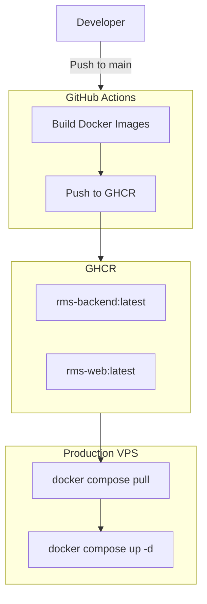

# Docker Setup Guide

A beginner-friendly guide to running Affiniks RMS with Docker — locally for development and on a server for production.

---

## What Docker Does for This Project

Docker runs the full RMS stack as **isolated containers** (mini virtual machines) that talk to each other over a private network:

| Service   | What it is                          |
|-----------|-------------------------------------|
| **postgres** | PostgreSQL database              |
| **redis**    | Cache and background job queue   |
| **backend**  | NestJS API (Node.js)             |
| **web**      | React frontend (Vite or nginx)   |

### Deployment Efficiency

| Feature | Old Deployment | New Deployment |
|:---|:---|:---|
| **Build Location** | VPS builds Docker images | GitHub Actions builds images |
| **Command** | VPS uses `docker compose build` | VPS uses `docker compose pull` |
| **Duration** | 6–8 minute deployment | ~1 minute deployment |
| **Server Impact** | High VPS CPU usage | Low VPS CPU usage |
| **Reliability** | Harder rollback | Easy rollback via tags |

---

## Prerequisites

1. **Docker Desktop** (Mac/Windows) or **Docker Engine + Compose** (Linux).
2. **Backend Environment**: `cp backend/.env.example backend/.env`.
3. **GitHub Container Registry (GHCR)**: Production images are pulled from GHCR.

---

## Deployment Architecture

> **Why GitHub Container Registry (GHCR)?**
> GitHub Container Registry (GHCR) stores pre-built Docker images. Instead of every server compiling the application from scratch, GitHub builds the image once and every environment (production, staging, etc.) downloads that exact image. This results in faster deployments, consistent builds, and easier rollbacks.

We use a **Build once, run anywhere** approach. Images are built in GitHub Actions and pushed to GHCR, then pulled by the production server.

### CI/CD Workflow (GitHub Actions)
1. **Developer** pushes code to `main`.
2. **GitHub Actions** triggers:
   - Sets up build environment.
   - Builds `backend` and `web` production images.
   - Bakes `VITE_API_URL` and `VITE_WS_URL` secrets into the `web` image.
   - Pushes images to `ghcr.io` with tags `latest` and `SHA`.
3. **SSH Deployment**:
   - Connects to VPS.
   - Pulls images: `docker compose pull`.
   - Restarts containers: `docker compose up -d`.



### How an update reaches production

1. **Change**: Developer pushes code to the `main` branch.
2. **Build**: GitHub Actions builds fresh Docker images.
3. **Store**: Images are pushed to the GitHub Container Registry (GHCR).
4. **Deploy**: GitHub Actions SSHs into the VPS and runs `deploy-docker.sh`.
5. **Update**:
   - VPS pulls the new images (`docker compose pull`).
   - Old containers are stopped and replaced (`docker compose up -d`).
6. **Verify**: The script waits for the `/health` endpoint to return `200 OK`.

---

## Production Deployment

### 1. One-time VPS Registry Login
If the repository is private, you must log in to GHCR on your server once:
```bash
echo "YOUR_GITHUB_PAT" | docker login ghcr.io -u YOUR_GITHUB_USERNAME --password-stdin
```

### 2. Required GitHub Secrets
Ensure the following are set in **Settings > Secrets and variables > Actions**:
- `VM_SSH_KEY`: Private key for VPS access.
- `KNOWN_HOSTS`: SSH known hosts for your VPS.
- `VM_USER`: SSH username (e.g., `root`).
- `VM_IP`: Public IP of your VPS.
- `VITE_API_URL`: Production API URL (e.g., `https://api.example.com`).
- `VITE_WS_URL`: Production WebSocket URL (e.g., `wss://api.example.com`).

### 3. Manual Rollback
To roll back to a specific version, find the short commit SHA in GitHub (e.g., `a1b2c3d`) and run the deployment script with the `--tag` flag:

```bash
./deploy-docker.sh --tag=a1b2c3d
```

This will pull the specific images tagged with that SHA from GHCR and restart the services. By default, the script pulls `:latest`.

To update the local configuration files without fetching the latest from `main`, use:
```bash
./deploy-docker.sh --skip-git --tag=a1b2c3d
```

---

## Local Development Setup

### 1. Create your backend environment file
```bash
cp backend/.env.example backend/.env
```

### 2. Start the stack
```bash
docker compose up -d --build
```
- **Backend API**: http://localhost:3000
- **Frontend App**: http://localhost:5173
- **Postgres**: localhost:5433 (user/pass in `.env`)
- **Redis**: localhost:6380 (password in `.env`)

---

## Troubleshooting

### Disk Space
Production images can consume disk space over time. The `deploy-docker.sh` script automatically runs `docker image prune -f` after deployment. To manually clean up:
```bash
docker system prune -a --volumes
```

### Logs
```bash
docker compose -f docker-compose.prod.yml --env-file backend/.env logs -f backend
```


This uses the root `docker-compose.yml`, which includes `docker-compose.dev.yml`.

**Equivalent explicit command:**

```bash
docker compose -f docker-compose.dev.yml up -d --build
```

> **Common mistake:** The `-f` flag must come **before** the subcommand (`up`), not after it.
>
> ```bash
> # Wrong — will error: "unknown shorthand flag: 'f' in -f"
> docker compose up -f docker-compose.dev.yml -d --build
>
> # Correct
> docker compose -f docker-compose.dev.yml up -d --build
> ```

### 4. Wait for containers to become healthy

Startup order:

1. **postgres** → Healthy (~2s)
2. **redis** → Healthy (~2s)
3. **backend** → Healthy (~15–60s — runs migrations first)
4. **web** → Started (no healthcheck in dev)

Check status:

```bash
docker compose ps
```

You should see `Healthy` for postgres, redis, and backend.

### 5. Open the app

| What | URL |
|------|-----|
| Frontend | http://localhost:5173 |
| Backend health | http://localhost:3000/health |
| API base | http://localhost:3000/api/v1 |

**Connect a DB client** (TablePlus, DBeaver, VS Code extension):

| Setting | Value |
|---------|-------|
| Host | `127.0.0.1` |
| Port | `5433` |
| User | `postgres` (or your `POSTGRES_USER`) |
| Password | `postgres` (or your `POSTGRES_PASSWORD`) |
| Database | `affiniks_rms` |

Port **5433** on your Mac maps to port **5432** inside the Postgres container. This avoids conflicting with a local Postgres install on 5432.

### 6. Hot reload

Edit files in `backend/` or `web/` on your machine. The containers watch those folders via bind mounts:

- Backend: NestJS watch mode restarts on file changes
- Frontend: Vite hot module replacement updates the browser

You do **not** need to rebuild images after code changes in dev.

### 7. Useful dev commands

```bash
# Stream logs from all services
docker compose logs -f

# Logs for one service
docker compose logs -f backend

# Stop containers (keeps data)
docker compose down

# Stop and DELETE database volume (fresh start — destroys all DB data)
docker compose down -v

# Rebuild after Dockerfile or package.json changes
docker compose up -d --build
```

---

## How Dev Dockerfiles Work

### Backend (`backend/Dockerfile`)

The backend Dockerfile has three stages:

| Stage | Used by | What it does |
|-------|---------|--------------|
| `dev` | Dev compose | Installs deps, generates Prisma client, runs entrypoint → `npm run start:dev` |
| `builder` | Prod build only | Compiles TypeScript to `dist/` |
| `prod` | Prod compose | Copies only `dist/` + production deps — smaller, faster image |

**Bind mount pattern in dev:**

```yaml
volumes:
  - ./backend:/app                        # Your source code on the host
  - backend_node_modules:/app/node_modules  # Container's node_modules (not overwritten)
```

Your local `./backend` folder is mounted into the container, but `node_modules` lives in a named Docker volume so host and container don't fight over dependencies.

### Web (`web/Dockerfile`)

| Stage | Used by | What it does |
|-------|---------|--------------|
| `dev` | Dev compose | Runs Vite with `--host 0.0.0.0` so your browser on the host can reach it |
| `builder` | Prod build only | Runs `npm run build` to produce static assets |
| `prod` | Prod compose | nginx serves the built files from `/usr/share/nginx/html` |

Same bind-mount pattern as backend for dev (`./web` + `web_node_modules` volume).

### Backend entrypoint (`backend/docker-entrypoint.sh`)

Every time the backend container starts, the entrypoint:

1. Waits until PostgreSQL is reachable
2. Runs `npx prisma migrate deploy` (applies pending migrations)
3. Runs `npx prisma generate` (regenerates the Prisma client)
4. Starts the app (`npm run start:dev` in dev, `node dist/main` in prod)

This is why the backend takes longer to become Healthy than postgres or redis.

---

## Production Setup (Step by Step)

### 1. Prepare the server

- Install Docker and Docker Compose
- Clone the repository
- Create `backend/.env` with **production** values:

```bash
cp backend/.env.example backend/.env
# Edit with strong secrets and real URLs
```

**Critical production variables:**

| Variable | Example | Notes |
|----------|---------|-------|
| `POSTGRES_USER` | `rms_prod` | Required — no default in prod compose |
| `POSTGRES_PASSWORD` | strong random password | Required |
| `POSTGRES_DB` | `affiniks_rms` | Optional, defaults to `affiniks_rms` |
| `REDIS_PASSWORD` | strong random password | Required in prod — Redis runs with `requirepass`; generate with `openssl rand -base64 32 \| tr -d '/+='` |
| `REDIS_URL` | `redis://:PASSWORD@redis:6379` | Must match `REDIS_PASSWORD`; compose also overrides this at runtime |
| `JWT_SECRET` | long random string | Must differ from dev |
| `JWT_REFRESH_SECRET` | long random string | Must differ from dev |
| `CORS_ORIGIN` | `https://rms.affiniks.com` | Your public frontend URL |
| `VITE_API_URL` | `https://api.affiniks.com/api/v1` | Baked into frontend at build time |
| `VITE_WS_URL` | `https://api.affiniks.com` | Baked into frontend at build time |

Also configure DigitalOcean Spaces, Meta/WhatsApp, and other integrations as needed (see `backend/.env.example`).

### 2. Deploy manually

From the repo root on the server:

```bash
# Pull the latest images from GHCR
docker compose -f docker-compose.prod.yml --env-file backend/.env pull

# Start the stack
docker compose -f docker-compose.prod.yml --env-file backend/.env up -d
```

### 3. Deploy with the script

The repo includes [`deploy-docker.sh`](../deploy-docker.sh) for automated server deployment:

```bash
./deploy-docker.sh              # git pull + pull images + start + health wait + cleanup
./deploy-docker.sh --dry-run    # print commands without running them
```

The script:

1. Verifies Docker and `backend/.env` exist
2. Fetches latest code from `origin/main`
3. Pulls production images from GHCR
4. Starts the stack
5. Waits up to 120 seconds for `http://localhost:3000/health`

### 4. Verify production

```bash
curl http://localhost:3000/health
docker compose -f docker-compose.prod.yml --env-file backend/.env ps
```

| What | URL |
|------|-----|
| Frontend (public) | Your public frontend URL via host Nginx → `127.0.0.1:8080` |
| Backend API (public) | `https://api-rms.nuamenterprises.com/api/v1` (via host Nginx → `127.0.0.1:3000`) |
| Backend health (on server only) | `http://127.0.0.1:3000/health` |

The backend is **not** exposed on the server's public IP. Port `3000` is bound to `127.0.0.1` only in [`docker-compose.prod.yml`](../docker-compose.prod.yml), so direct access via `http://SERVER_IP:3000` is blocked. All external API traffic must go through host Nginx on HTTPS.

### 5. How prod images are built

Images are built automatically in **GitHub Actions** when you push to `main`.

**Backend:**
- Uses a multi-stage build: `base → builder (npm run build) → prod (copy dist/ + prod deps only)`.

**Web:**
- Uses a multi-stage build: `builder (npm run build with VITE_* args) → prod (nginx serves dist/)`.

**Important:** Vite environment variables (`VITE_API_URL`, `VITE_WS_URL`) are baked into the frontend at **build time** (in GitHub). If you change these in GitHub Secrets, you must push a commit or manually trigger the GitHub Action to build and push new images.

---

## Environment Variables Explained

There are two layers of configuration:

### Layer 1: `backend/.env` (secrets and app config)

Loaded via `env_file: backend/.env` in both dev and prod compose files. Contains JWT secrets, Spaces credentials, WhatsApp tokens, etc.

### Layer 2: Compose `environment:` block (Docker networking overrides)

Compose **overrides** connection strings so containers talk to each other by service name:

| In `backend/.env` (native dev) | In Docker compose (runtime override) |
|--------------------------------|--------------------------------------|
| `localhost:5433` | `postgres:5432` |
| `localhost:6379` | `redis:6379` |

When running **inside** Docker, always use the compose overrides. When connecting **from your Mac** (DB client, curl), use the published host ports (5433, 6380, 3000, 5173).

### Dev web variables

In dev, Vite vars are set directly in `docker-compose.dev.yml`:

```yaml
VITE_API_URL: http://localhost:3000/api/v1
VITE_WS_URL: http://localhost:3000
VITE_INTRO_VIDEO_DIRECT_UPLOAD: "false"
```

No `web/.env` is needed for Docker dev.

---

## Health Checks and Startup Order

Each service has a healthcheck (except web in dev):

| Service | Health check | Interval |
|---------|--------------|----------|
| postgres | `pg_isready` | 5s |
| redis | `redis-cli ping` | 5s |
| backend | `curl http://localhost:3000/health` | 10s |

**Dependency chain:**

```
postgres (healthy) ──┐
                     ├──► backend (healthy) ──► web (started)
redis (healthy) ─────┘
```

The backend has a `start_period` grace window (60s dev, 90s prod) before failed health checks count against it. This accounts for npm install, Prisma migrations, and NestJS boot time.

---

## Memory and Performance

| Observation | Explanation |
|-------------|-------------|
| Dev backend uses ~2–3 GB RAM | Normal — NestJS watch mode, TypeScript compilation, and Prisma keep memory high |
| `NODE_OPTIONS: --max-old-space-size=4096` in dev | Allows Node up to 4 GB heap; prevents OOM during heavy dev workloads |
| Prod backend is much leaner | No watch mode, no bind mounts, pre-compiled JavaScript |
| postgres ~50 MB, redis ~12 MB | Expected baseline |

If dev backend memory keeps climbing above ~3.5 GB over a long session, restart it:

```bash
docker compose restart backend
```

---

## Troubleshooting

### Container not becoming Healthy

```bash
docker compose logs backend --tail 100
docker compose logs postgres --tail 50
```

Common causes: migration failure, missing env var, port conflict.

### Port already in use

| Port | Service | Fix |
|------|---------|-----|
| 5433 | Postgres | Stop local Postgres or change the host port in `docker-compose.dev.yml` |
| 6380 | Redis | Stop local Redis or change the host port |
| 3000 | Backend | Stop any native `npm run start:dev` process |
| 5173 | Web | Stop any native `npm run dev` process |

Find what's using a port on Mac:

```bash
lsof -i :3000
```

### Wrong compose flag order

```bash
# Wrong
docker compose up -f docker-compose.dev.yml -d

# Correct — -f comes BEFORE the subcommand
docker compose -f docker-compose.dev.yml up -d
```

### Database connection confusion

| Connecting from | Host | Port |
|-----------------|------|------|
| Your Mac (DB client) | `127.0.0.1` | `5433` |
| Backend container | `postgres` | `5432` |
| `backend/.env` for native npm dev | `localhost` | `5433` |

These are all the same database — just different network paths.

### Fresh start (wipes all data)

```bash
docker compose down -v
docker compose up -d --build
```

The `-v` flag removes named volumes including `postgres_data`. All database data will be lost and migrations will re-run from scratch.

### Running dev and prod simultaneously

Dev (`rms-dev`) and prod (`rms-prod`) are separate Docker Compose projects with separate networks and volumes. They can run on the same machine, but watch for port conflicts (both use 3000 by default).

### Rebuild after dependency changes

If you change `package.json` or `package-lock.json`:

```bash
docker compose up -d --build
```

For a completely clean node_modules volume:

```bash
docker compose down
docker volume rm rms-dev_backend_node_modules rms-dev_web_node_modules
docker compose up -d --build
```

---

## Quick Reference Cheat Sheet

### Development

```bash
# Start (from repo root)
docker compose up -d --build

# Status
docker compose ps

# Logs
docker compose logs -f
docker compose logs -f backend

# Stop
docker compose down

# Nuclear reset (destroys DB)
docker compose down -v && docker compose up -d --build

# Restart one service
docker compose restart backend
```

### Production

```bash
# Manual deploy (pulls from GHCR)
docker compose -f docker-compose.prod.yml --env-file backend/.env pull
docker compose -f docker-compose.prod.yml --env-file backend/.env up -d

# Deploy script (recommended)
./deploy-docker.sh

# Status
docker compose -f docker-compose.prod.yml --env-file backend/.env ps

# Logs
docker compose -f docker-compose.prod.yml --env-file backend/.env logs -f backend

# Rollback to a specific commit SHA
./deploy-docker.sh --tag=a1b2c3d
```

### URLs

| Environment | Frontend | Backend health | DB (from host) |
|-------------|----------|----------------|----------------|
| Dev | http://localhost:5173 | http://localhost:3000/health | 127.0.0.1:5433 |
| Prod (public) | Your public frontend URL | https://api-rms.nuamenterprises.com/health | Not exposed |
| Prod (on server) | http://127.0.0.1:8080 | http://127.0.0.1:3000/health | Not exposed |

---

## Related Documentation

- [`backend/.env.example`](../backend/.env.example) — all backend environment variables
- [`docs/BE_GUIDELINES.md`](BE_GUIDELINES.md) — backend standards including deployment notes
- [`docs/DOD.md`](DOD.md) — definition of done for features
