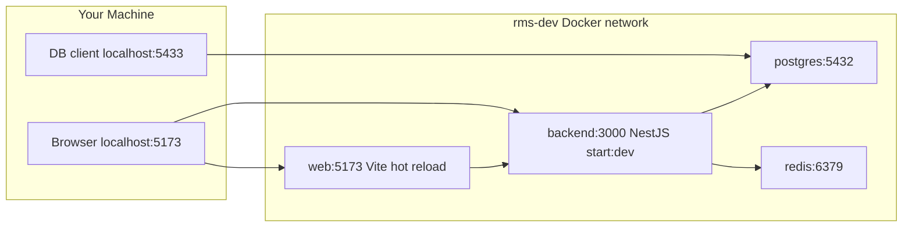
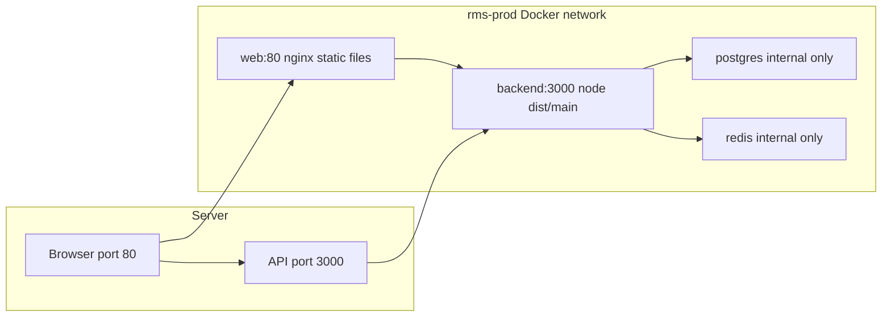

# Docker Setup Guide

A beginner-friendly guide to running Affiniks RMS with Docker — locally for development and on a server for production.

---

## What Docker Does for This Project

Docker runs the full RMS stack as **isolated containers** (mini virtual machines) that talk to each other over a private network:

| Service   | What it is                          |
|-----------|-------------------------------------|
| **postgres** | PostgreSQL database              |
| **redis**    | Cache and background job queue   |
| **backend**  | NestJS API (Node.js)             |
| **web**      | React frontend (Vite or nginx)   |

Instead of installing Postgres, Redis, and Node on your Mac manually, you run one command and Docker handles the rest. The same container definitions work on your laptop and on a production server, so "it works on my machine" problems are reduced.

---

## Prerequisites

1. **Docker Desktop** (Mac/Windows) or **Docker Engine + Compose** (Linux)
   - Download: https://www.docker.com/products/docker-desktop/
   - After install, open Docker Desktop and confirm the engine shows **Running**.

2. **Environment file for the backend**
   ```bash
   cp backend/.env.example backend/.env
   ```
   Edit `backend/.env` if you need custom secrets. This file is used by both dev and prod Docker stacks.

3. **`web/.env` is optional for Docker dev**
   - Docker dev sets Vite variables directly in `docker-compose.dev.yml`.
   - You only need `web/.env` if you run the frontend **outside** Docker with `npm run dev`.

---

## File Map

| File | Purpose |
|------|---------|
| [`docker-compose.yml`](../docker-compose.yml) | Default entry point — includes the dev stack |
| [`docker-compose.dev.yml`](../docker-compose.dev.yml) | Local dev: hot reload, bind mounts, published DB/Redis ports |
| [`docker-compose.prod.yml`](../docker-compose.prod.yml) | Production: compiled images, nginx, no bind mounts |
| [`backend/Dockerfile`](../backend/Dockerfile) | Multi-stage build: `dev`, `builder`, `prod` targets |
| [`web/Dockerfile`](../web/Dockerfile) | Multi-stage build: `dev` (Vite), `builder`, `prod` (nginx) |
| [`backend/docker-entrypoint.sh`](../backend/docker-entrypoint.sh) | Waits for Postgres, runs migrations, starts the app |
| [`deploy-docker.sh`](../deploy-docker.sh) | Server deploy script (git pull + prod compose + health wait) |
| [`web/nginx.conf`](../web/nginx.conf) | SPA routing for the production frontend |

---

## Architecture

### Development stack

In dev, your code lives on your machine and is **mounted into** the containers. Changes you save are picked up automatically (hot reload).



### Production stack

In prod, code is **compiled inside the image** at build time. No bind mounts. The frontend is static files served by nginx.



---

## Dev vs Prod — Quick Comparison

| Topic | Development | Production |
|-------|-------------|------------|
| **Compose file** | `docker compose up -d` (default) or `-f docker-compose.dev.yml` | `-f docker-compose.prod.yml --env-file backend/.env` |
| **Project name** | `rms-dev` | `rms-prod` |
| **Backend** | `npm run start:dev`, source mounted from `./backend` | Pre-built `node dist/main`, no bind mounts |
| **Frontend** | Vite dev server on port **5173** | nginx serving static files on port **80** |
| **Postgres (host)** | Port **5433** (avoids Mac Postgres on 5432) | Not exposed — internal only |
| **Redis (host)** | Port **6380** (avoids other Redis on 6379) | Not exposed — internal only |
| **DB/Redis URLs** | Overridden in compose to `postgres:5432` / `redis:6379` | Same internal hostnames |
| **Migrations** | Auto via entrypoint on every backend start | Same |
| **Health checks** | postgres, redis, backend | Same pattern, longer backend `start_period` (90s) |

---

## Development Setup (Step by Step)

### 1. Install and start Docker

Open Docker Desktop and wait until the engine status is **Running**.

### 2. Create your backend environment file

From the repo root:

```bash
cp backend/.env.example backend/.env
```

The defaults work for local Docker dev. You can leave JWT secrets as-is locally, but never use example secrets in production.

### 3. Start the stack

From the repo root:

```bash
docker compose up -d --build
```

This uses the root `docker-compose.yml`, which includes `docker-compose.dev.yml`.

**Equivalent explicit command:**

```bash
docker compose -f docker-compose.dev.yml up -d --build
```

> **Common mistake:** The `-f` flag must come **before** the subcommand (`up`), not after it.
>
> ```bash
> # Wrong — will error: "unknown shorthand flag: 'f' in -f"
> docker compose up -f docker-compose.dev.yml -d --build
>
> # Correct
> docker compose -f docker-compose.dev.yml up -d --build
> ```

### 4. Wait for containers to become healthy

Startup order:

1. **postgres** → Healthy (~2s)
2. **redis** → Healthy (~2s)
3. **backend** → Healthy (~15–60s — runs migrations first)
4. **web** → Started (no healthcheck in dev)

Check status:

```bash
docker compose ps
```

You should see `Healthy` for postgres, redis, and backend.

### 5. Open the app

| What | URL |
|------|-----|
| Frontend | http://localhost:5173 |
| Backend health | http://localhost:3000/health |
| API base | http://localhost:3000/api/v1 |

**Connect a DB client** (TablePlus, DBeaver, VS Code extension):

| Setting | Value |
|---------|-------|
| Host | `127.0.0.1` |
| Port | `5433` |
| User | `postgres` (or your `POSTGRES_USER`) |
| Password | `postgres` (or your `POSTGRES_PASSWORD`) |
| Database | `affiniks_rms` |

Port **5433** on your Mac maps to port **5432** inside the Postgres container. This avoids conflicting with a local Postgres install on 5432.

### 6. Hot reload

Edit files in `backend/` or `web/` on your machine. The containers watch those folders via bind mounts:

- Backend: NestJS watch mode restarts on file changes
- Frontend: Vite hot module replacement updates the browser

You do **not** need to rebuild images after code changes in dev.

### 7. Useful dev commands

```bash
# Stream logs from all services
docker compose logs -f

# Logs for one service
docker compose logs -f backend

# Stop containers (keeps data)
docker compose down

# Stop and DELETE database volume (fresh start — destroys all DB data)
docker compose down -v

# Rebuild after Dockerfile or package.json changes
docker compose up -d --build
```

---

## How Dev Dockerfiles Work

### Backend (`backend/Dockerfile`)

The backend Dockerfile has three stages:

| Stage | Used by | What it does |
|-------|---------|--------------|
| `dev` | Dev compose | Installs deps, generates Prisma client, runs entrypoint → `npm run start:dev` |
| `builder` | Prod build only | Compiles TypeScript to `dist/` |
| `prod` | Prod compose | Copies only `dist/` + production deps — smaller, faster image |

**Bind mount pattern in dev:**

```yaml
volumes:
  - ./backend:/app                        # Your source code on the host
  - backend_node_modules:/app/node_modules  # Container's node_modules (not overwritten)
```

Your local `./backend` folder is mounted into the container, but `node_modules` lives in a named Docker volume so host and container don't fight over dependencies.

### Web (`web/Dockerfile`)

| Stage | Used by | What it does |
|-------|---------|--------------|
| `dev` | Dev compose | Runs Vite with `--host 0.0.0.0` so your browser on the host can reach it |
| `builder` | Prod build only | Runs `npm run build` to produce static assets |
| `prod` | Prod compose | nginx serves the built files from `/usr/share/nginx/html` |

Same bind-mount pattern as backend for dev (`./web` + `web_node_modules` volume).

### Backend entrypoint (`backend/docker-entrypoint.sh`)

Every time the backend container starts, the entrypoint:

1. Waits until PostgreSQL is reachable
2. Runs `npx prisma migrate deploy` (applies pending migrations)
3. Runs `npx prisma generate` (regenerates the Prisma client)
4. Starts the app (`npm run start:dev` in dev, `node dist/main` in prod)

This is why the backend takes longer to become Healthy than postgres or redis.

---

## Production Setup (Step by Step)

### 1. Prepare the server

- Install Docker and Docker Compose
- Clone the repository
- Create `backend/.env` with **production** values:

```bash
cp backend/.env.example backend/.env
# Edit with strong secrets and real URLs
```

**Critical production variables:**

| Variable | Example | Notes |
|----------|---------|-------|
| `POSTGRES_USER` | `rms_prod` | Required — no default in prod compose |
| `POSTGRES_PASSWORD` | strong random password | Required |
| `POSTGRES_DB` | `affiniks_rms` | Optional, defaults to `affiniks_rms` |
| `JWT_SECRET` | long random string | Must differ from dev |
| `JWT_REFRESH_SECRET` | long random string | Must differ from dev |
| `CORS_ORIGIN` | `https://rms.affiniks.com` | Your public frontend URL |
| `VITE_API_URL` | `https://api.affiniks.com/api/v1` | Baked into frontend at build time |
| `VITE_WS_URL` | `https://api.affiniks.com` | Baked into frontend at build time |

Also configure DigitalOcean Spaces, Meta/WhatsApp, and other integrations as needed (see `backend/.env.example`).

### 2. Deploy manually

From the repo root on the server:

```bash
docker compose -f docker-compose.prod.yml --env-file backend/.env up -d --build
```

### 3. Deploy with the script

The repo includes [`deploy-docker.sh`](../deploy-docker.sh) for automated server deployment:

```bash
./deploy-docker.sh              # git pull + build + start + health wait
./deploy-docker.sh --skip-build # restart without rebuilding images
./deploy-docker.sh --dry-run    # print commands without running them
```

The script:

1. Verifies Docker and `backend/.env` exist
2. Fetches latest code from `origin/main`
3. Builds production images
4. Starts the stack
5. Waits up to 120 seconds for `http://localhost:3000/health`

### 4. Verify production

```bash
curl http://localhost:3000/health
docker compose -f docker-compose.prod.yml --env-file backend/.env ps
```

| What | URL (on server) |
|------|-----------------|
| Frontend | http://your-server:80 |
| Backend API | http://your-server:3000/api/v1 |

In a real deployment you typically put a reverse proxy (nginx, Caddy, or a load balancer) in front with HTTPS. The Docker stack exposes ports 80 and 3000 directly for simplicity.

### 5. How prod images are built

**Backend:**

```
base → builder (npm run build) → prod (copy dist/ + prod deps only)
```

**Web:**

```
builder (npm run build with VITE_* args) → prod (nginx serves dist/)
```

Vite environment variables (`VITE_API_URL`, `VITE_WS_URL`) are injected at **build time** via Docker build args in `docker-compose.prod.yml`. If you change these URLs, you must rebuild the web image:

```bash
docker compose -f docker-compose.prod.yml --env-file backend/.env build web
docker compose -f docker-compose.prod.yml --env-file backend/.env up -d web
```

---

## Environment Variables Explained

There are two layers of configuration:

### Layer 1: `backend/.env` (secrets and app config)

Loaded via `env_file: backend/.env` in both dev and prod compose files. Contains JWT secrets, Spaces credentials, WhatsApp tokens, etc.

### Layer 2: Compose `environment:` block (Docker networking overrides)

Compose **overrides** connection strings so containers talk to each other by service name:

| In `backend/.env` (native dev) | In Docker compose (runtime override) |
|--------------------------------|--------------------------------------|
| `localhost:5433` | `postgres:5432` |
| `localhost:6379` | `redis:6379` |

When running **inside** Docker, always use the compose overrides. When connecting **from your Mac** (DB client, curl), use the published host ports (5433, 6380, 3000, 5173).

### Dev web variables

In dev, Vite vars are set directly in `docker-compose.dev.yml`:

```yaml
VITE_API_URL: http://localhost:3000/api/v1
VITE_WS_URL: http://localhost:3000
VITE_INTRO_VIDEO_DIRECT_UPLOAD: "false"
```

No `web/.env` is needed for Docker dev.

---

## Health Checks and Startup Order

Each service has a healthcheck (except web in dev):

| Service | Health check | Interval |
|---------|--------------|----------|
| postgres | `pg_isready` | 5s |
| redis | `redis-cli ping` | 5s |
| backend | `curl http://localhost:3000/health` | 10s |

**Dependency chain:**

```
postgres (healthy) ──┐
                     ├──► backend (healthy) ──► web (started)
redis (healthy) ─────┘
```

The backend has a `start_period` grace window (60s dev, 90s prod) before failed health checks count against it. This accounts for npm install, Prisma migrations, and NestJS boot time.

---

## Memory and Performance

| Observation | Explanation |
|-------------|-------------|
| Dev backend uses ~2–3 GB RAM | Normal — NestJS watch mode, TypeScript compilation, and Prisma keep memory high |
| `NODE_OPTIONS: --max-old-space-size=4096` in dev | Allows Node up to 4 GB heap; prevents OOM during heavy dev workloads |
| Prod backend is much leaner | No watch mode, no bind mounts, pre-compiled JavaScript |
| postgres ~50 MB, redis ~12 MB | Expected baseline |

If dev backend memory keeps climbing above ~3.5 GB over a long session, restart it:

```bash
docker compose restart backend
```

---

## Troubleshooting

### Container not becoming Healthy

```bash
docker compose logs backend --tail 100
docker compose logs postgres --tail 50
```

Common causes: migration failure, missing env var, port conflict.

### Port already in use

| Port | Service | Fix |
|------|---------|-----|
| 5433 | Postgres | Stop local Postgres or change the host port in `docker-compose.dev.yml` |
| 6380 | Redis | Stop local Redis or change the host port |
| 3000 | Backend | Stop any native `npm run start:dev` process |
| 5173 | Web | Stop any native `npm run dev` process |

Find what's using a port on Mac:

```bash
lsof -i :3000
```

### Wrong compose flag order

```bash
# Wrong
docker compose up -f docker-compose.dev.yml -d

# Correct — -f comes BEFORE the subcommand
docker compose -f docker-compose.dev.yml up -d
```

### Database connection confusion

| Connecting from | Host | Port |
|-----------------|------|------|
| Your Mac (DB client) | `127.0.0.1` | `5433` |
| Backend container | `postgres` | `5432` |
| `backend/.env` for native npm dev | `localhost` | `5433` |

These are all the same database — just different network paths.

### Fresh start (wipes all data)

```bash
docker compose down -v
docker compose up -d --build
```

The `-v` flag removes named volumes including `postgres_data`. All database data will be lost and migrations will re-run from scratch.

### Running dev and prod simultaneously

Dev (`rms-dev`) and prod (`rms-prod`) are separate Docker Compose projects with separate networks and volumes. They can run on the same machine, but watch for port conflicts (both use 3000 by default).

### Rebuild after dependency changes

If you change `package.json` or `package-lock.json`:

```bash
docker compose up -d --build
```

For a completely clean node_modules volume:

```bash
docker compose down
docker volume rm rms-dev_backend_node_modules rms-dev_web_node_modules
docker compose up -d --build
```

---

## Quick Reference Cheat Sheet

### Development

```bash
# Start (from repo root)
docker compose up -d --build

# Status
docker compose ps

# Logs
docker compose logs -f
docker compose logs -f backend

# Stop
docker compose down

# Nuclear reset (destroys DB)
docker compose down -v && docker compose up -d --build

# Restart one service
docker compose restart backend
```

### Production

```bash
# Manual deploy
docker compose -f docker-compose.prod.yml --env-file backend/.env up -d --build

# Deploy script
./deploy-docker.sh

# Status
docker compose -f docker-compose.prod.yml --env-file backend/.env ps

# Logs
docker compose -f docker-compose.prod.yml --env-file backend/.env logs -f backend

# Rebuild frontend after VITE_* URL change
docker compose -f docker-compose.prod.yml --env-file backend/.env build web
docker compose -f docker-compose.prod.yml --env-file backend/.env up -d web
```

### URLs

| Environment | Frontend | Backend health | DB (from host) |
|-------------|----------|----------------|----------------|
| Dev | http://localhost:5173 | http://localhost:3000/health | 127.0.0.1:5433 |
| Prod | http://localhost:80 | http://localhost:3000/health | Not exposed |

---

## Related Documentation

- [`backend/.env.example`](../backend/.env.example) — all backend environment variables
- [`docs/BE_GUIDELINES.md`](BE_GUIDELINES.md) — backend standards including deployment notes
- [`docs/DOD.md`](DOD.md) — definition of done for features
