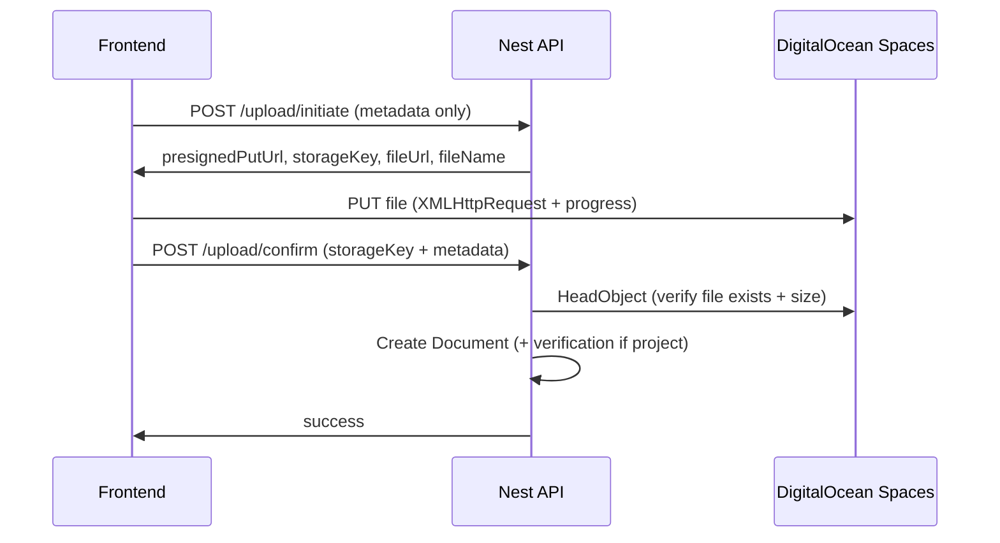

# Introduction Video Upload & Optimization

## Overview

Introduction videos are candidate profile videos used when a project requires them. They are stored in **DigitalOcean Spaces** (S3-compatible API) and linked in Postgres via the `documents` and `candidate_project_document_verifications` tables.

This document covers:

- where files are stored and how URLs are shaped,
- the optimized **presigned direct-to-Spaces** upload flow,
- list/query performance improvements,
- API endpoints and frontend integration,
- operational notes (lifecycle cleanup, deprecated routes).

---

## Storage (DigitalOcean Spaces)

Videos are **not** stored on AWS S3. The backend uses `@aws-sdk/client-s3` with the DigitalOcean Spaces endpoint configured via environment variables.

| Variable | Purpose |
|----------|---------|
| `DO_SPACES_BUCKET` | Bucket name |
| `DO_SPACES_ENDPOINT` | Spaces endpoint URL (e.g. `https://blr1.digitaloceanspaces.com`) |
| `DO_SPACES_REGION` | Region (e.g. `blr1`) |
| `DO_SPACES_KEY` / `DO_SPACES_SECRET` | Access credentials |
| `DO_SPACES_CDN_URL` | Optional CDN base URL for public file URLs |

**Object key pattern:**

```
candidates/introduction-videos/{candidateId}/{storageFileName}
```

**Example production URL:**

```
https://blr1.digitaloceanspaces.com/affiniks-rms-prod-ind1/candidates/introduction-videos/{candidateId}/bleson_intro_video_1716643200000_a1b2c3d4.mp4
```

- Files are uploaded with `public-read` ACL.
- When `DO_SPACES_CDN_URL` is set, public URLs use the CDN origin instead of the raw Spaces endpoint.
- The S3 client uses **path-style** addressing (`endpoint/bucket/key`).

### Browser CORS (required for direct presigned uploads)

Direct browser uploads use `PUT` from the frontend origin (for example `http://localhost:5173`) to the Spaces endpoint. The bucket **must** allow that origin in its CORS rules, otherwise the browser blocks the request before the file is sent.

**Symptom:**

```
Access to XMLHttpRequest at 'https://...digitaloceanspaces.com/...' from origin 'http://localhost:5173'
has been blocked by CORS policy
```

**Fix options:**

1. **Recommended for production** — configure CORS on the Spaces bucket (DigitalOcean control panel → Space → Settings → CORS, or apply `docs/digitalocean-spaces-cors.xml` with `s3cmd` / AWS CLI against the Spaces endpoint). Include every frontend origin that uploads videos.
2. **Local/dev helper** — set `DO_SPACES_SYNC_CORS=true` in backend `.env` to push `CORS_ORIGIN` to the bucket on API startup (requires Spaces credentials with bucket CORS permission).
3. **Local dev default** — set `VITE_INTRO_VIDEO_DIRECT_UPLOAD=false` in `web/.env` (default for localhost) to upload through the Nest API and avoid browser CORS console noise. Production builds should use direct upload once bucket CORS includes the deployed frontend origin (`true` or unset on non-localhost hosts).
4. **Automatic app fallback** — if direct Spaces upload is enabled but fails (typically CORS), the frontend retries through the Nest multipart upload endpoints.

### Friendly vs storage filenames

| Layer | Example | Notes |
|-------|---------|-------|
| **DB `fileName`** | `bleson_saudi_moh_intro_video.mp4` | Human-readable; shown in UI |
| **Spaces object key** | `bleson_saudi_moh_intro_video_1716643200000_a1b2c3d4.mp4` | Unique suffix (`timestamp` + 8-char hash) prevents accidental overwrites |

Implementation: `IntroductionVideosService.buildIntroductionVideoNames()` in  
`backend/src/introduction-videos/introduction-videos.service.ts`.

---

## Upload flows

### Current flow (optimized) — presigned direct upload

Large video files (up to 100 MB) no longer pass through the Nest API. The browser uploads directly to DigitalOcean Spaces using a presigned PUT URL.



**Why this is better:**

- No 100 MB buffer in Nest/Multer memory.
- Upload progress is visible in the UI.
- DB writes happen **after** `HeadObject` confirms the file exists in Spaces (reduces orphan DB rows without files).
- Unique storage keys avoid overwriting an existing Spaces object on re-upload.

### Legacy flow (deprecated) — multipart through API

The following routes still exist as a temporary fallback but are marked **deprecated** in Swagger:

| Route | Purpose |
|-------|---------|
| `POST /candidates/:id/introduction-videos/upload` | Library upload (multipart) |
| `POST /candidates/:id/projects/:projectId/introduction-video` | Project upload (multipart) |
| `POST /candidates/:id/projects/:projectId/introduction-video/reupload` | Project re-upload (multipart) |

The frontend has migrated to the presigned flow. These routes can be removed once production usage is confirmed at zero.

### Reuse flow (unchanged)

Linking an existing library or project video to another project does **not** re-upload the file:

```
POST /candidates/:id/projects/:projectId/introduction-video/reuse
```

Body: `{ "documentId": "..." }`

---

## Backend

### Key files

| File | Role |
|------|------|
| `backend/src/introduction-videos/introduction-videos.service.ts` | Business logic: list, upload, initiate, confirm, reuse |
| `backend/src/introduction-videos/introduction-videos.controller.ts` | HTTP routes |
| `backend/src/upload/upload.service.ts` | Spaces client, presigned PUT, HeadObject, delete |
| `backend/src/introduction-videos/dto/initiate-introduction-video-upload.dto.ts` | Initiate request validation |
| `backend/src/introduction-videos/dto/confirm-introduction-video-upload.dto.ts` | Confirm request validation |

### Presigned upload endpoints

#### 1. Initiate

```
POST /api/v1/candidates/:candidateId/introduction-videos/upload/initiate
```

**Permissions:** `write:candidates`, `write:documents`

**Body:**

```json
{
  "fileName": "my-intro.mp4",
  "mimeType": "video/mp4",
  "fileSize": 52428800,
  "remarks": "Optional notes",
  "projectId": "optional-project-id",
  "mode": "upload"
}
```

- `mode`: `"upload"` (default) or `"reupload"` when `projectId` is provided.
- Allowed MIME types: `video/mp4`, `video/webm`, `video/quicktime`, `video/x-msvideo`.
- Max size: 100 MB (105 MB request limit with buffer).

**Response:**

```json
{
  "success": true,
  "data": {
    "uploadUrl": "https://...presigned-put-url...",
    "storageKey": "candidates/introduction-videos/{candidateId}/{unique-name}.mp4",
    "fileUrl": "https://cdn-or-spaces-url/...",
    "fileName": "candidate_project_intro_video.mp4",
    "expiresIn": 3600
  }
}
```

#### 2. Confirm

```
POST /api/v1/candidates/:candidateId/introduction-videos/upload/confirm
```

**Body:**

```json
{
  "storageKey": "candidates/introduction-videos/{candidateId}/{unique-name}.mp4",
  "fileName": "candidate_project_intro_video.mp4",
  "mimeType": "video/mp4",
  "fileSize": 52428800,
  "remarks": "Optional notes",
  "projectId": "optional-project-id",
  "mode": "upload"
}
```

**Behavior:**

1. Validates `storageKey` belongs to the candidate prefix.
2. Calls `HeadObject` on Spaces and checks `contentLength === fileSize`.
3. Creates a `Document` row (and project verification in a transaction when `projectId` is set).
4. Publishes data-sync notification via outbox.

### List endpoints

#### Candidate introduction videos (by project + library)

```
GET /api/v1/candidates/:candidateId/introduction-videos
```

**Query params:**

| Param | Default | Description |
|-------|---------|-------------|
| `page` | 1 | Project-assignment list page |
| `limit` | 10 | Project-assignment page size (max 50) |
| `libraryPage` | 1 | Unlinked library page |
| `libraryLimit` | 10 | Library page size (max 50) |
| `projectId` | — | Filter by project |
| `roleCatalogId` | — | Filter by role |

**Response shape:**

- `data` — projects that have an uploaded video only (no empty rows).
- `library` — candidate-level videos not linked to any project.
- `pagination` — project list pagination.
- `libraryPagination` — library pagination.

**Performance:** single verification query with joins (no N+1 per assignment). Latest verification per assignment is deduplicated in memory before pagination.

#### Reusable videos (picker / reuse modal)

```
GET /api/v1/candidates/:candidateId/introduction-videos/reusable
```

Supports `search`, `excludeProjectId`, `page`, `limit`. Returns library and project-linked videos with `linkedProjects` metadata.

### UploadService helpers

| Method | Purpose |
|--------|---------|
| `createPresignedPutUrl(key, mimeType, expiresIn)` | Generates presigned PUT URL |
| `headObject(key)` | Verifies upload before DB write |
| `getIntroductionVideoStorageKey(candidateId, fileName)` | Builds full object key |
| `getPublicUrlForKey(key)` | CDN or Spaces public URL |
| `deleteFile(fileUrl)` | Deletes object by URL (rollback/cleanup) |

---

## Frontend

### Key files

| File | Role |
|------|------|
| `web/src/features/introduction-videos/api.ts` | RTK Query endpoints; presigned upload orchestration |
| `web/src/features/introduction-videos/uploadToSpaces.ts` | XHR PUT to presigned URL with progress |
| `web/src/components/molecules/IntroductionVideoUploadModal.tsx` | Upload/re-upload modal with remarks + progress bar |
| `web/src/features/candidates/components/CandidatesIntroductionVideos.tsx` | Candidate Documents tab — library + by-project tables |
| `web/src/features/recruiter-docs/components/ProjectIntroductionVideoSection.tsx` | Project-level upload, re-upload, reuse |

### Upload sequence (RTK Query)

All three upload mutations use the same presigned pipeline:

1. `POST .../upload/initiate`
2. `putFileToPresignedUrl(uploadUrl, file, mimeType, onProgress)` — XMLHttpRequest PUT to DigitalOcean Spaces
3. `POST .../upload/confirm`

Mutations:

- `useUploadCandidateIntroductionVideoMutation` — candidate library
- `useUploadIntroductionVideoMutation` — link to project (`mode: "upload"`)
- `useReuploadIntroductionVideoMutation` — replace project video (`mode: "reupload"`)

Optional `onProgress: (percent: number) => void` drives the modal progress bar.

### UI locations

- **Candidate Documents tab** — upload to library; paginated library table; project-linked videos with filters.
- **Recruiter docs detail page (Project Documents tab)** — introduction video row in the project documents table with **Add Existing** (`IntroductionVideoReuseModal`), **Upload**, and **Re-upload** (same presigned flow as other entry points).
- **Documentation team verification page** — introduction video row in the verification table with **Link** (`IntroductionVideoReuseModal`), **Upload**, **Re-upload**, plus verify/reject/resubmission actions (mirrors regular document rows).
- **Recruiter docs / project section component** — `ProjectIntroductionVideoSection` remains available as a reusable card component (upload, re-upload, reuse modals).
- **Remarks** — stored in `documents.notes`, exposed as `remarks` in API responses.

---

## Query & reliability optimizations (summary)

| Area | Before | After |
|------|--------|-------|
| Project list API | N+1 queries per assignment | Single verification query + dedupe |
| Latest verification lookup | `findMany` + `[0]` | `findFirst` with `orderBy` |
| Library in list API | All unlinked rows every call | Paginated (`libraryPage` / `libraryLimit`) |
| Storage filename | Friendly name only → overwrite risk | Unique storage key; friendly name in DB |
| Upload path | 100 MB through Nest API | Direct browser → Spaces |
| DB vs Spaces ordering | Spaces first → orphan files on DB failure | HeadObject first → then DB write |
| Upload UX | No progress | Progress bar during Spaces PUT |

---

## Operations

### Optional lifecycle cleanup

Unconfirmed presigned uploads (initiate without confirm) may leave temporary objects in Spaces. Configure a **DigitalOcean Spaces lifecycle rule** on prefix:

```
candidates/introduction-videos/
```

Suggested rule: delete objects older than **24 hours** that were never confirmed. This is configured in the DigitalOcean control panel, not in application code. See comment on `UploadService.getIntroductionVideoFolder()`.

### Manual verification checklist

1. Upload a 50–100 MB video from candidate library upload.
2. Confirm progress bar advances during upload.
3. Confirm object exists in Spaces bucket with unique key suffix.
4. Confirm document appears in candidate library list.
5. Reuse or upload to a project requiring introduction video.
6. Confirm project list shows only rows with an uploaded file.
7. Re-upload replaces verification/document without overwriting unrelated Spaces objects.

### Tests

| Suite | Location |
|-------|----------|
| Backend service | `backend/src/introduction-videos/__tests__/introduction-videos.service.spec.ts` |
| Spaces PUT helper | `web/src/features/introduction-videos/__tests__/uploadToSpaces.test.ts` |
| Upload modal | `web/src/components/molecules/IntroductionVideoUploadModal.test.tsx` |
| Candidate list UI | `web/src/features/candidates/__tests__/CandidatesIntroductionVideos.test.tsx` |
| Project section UI | `web/src/features/recruiter-docs/__tests__/ProjectIntroductionVideoSection.test.tsx` |

Run backend tests:

```bash
cd backend && npm test -- introduction-videos.service.spec.ts
```

Run frontend tests:

```bash
cd web && npx vitest run introduction-videos uploadToSpaces IntroductionVideoUploadModal CandidatesIntroductionVideos ProjectIntroductionVideoSection
```

---

## Out of scope

- Migrating to AWS S3 (Spaces remains the provider)
- Video transcoding or compression
- Resumable multipart uploads (only needed if max size grows beyond 100 MB)
- Private ACL + signed GET URLs (videos remain `public-read`)
