# 🎯 Mock Interview Coordination Feature - Implementation Plan

> **Document Version**: 1.0.0  
> **Created**: January 2025  
> **Status**: Planning Phase - Ready for Implementation  
> **Project**: Affiniks RMS

---

## 📋 Executive Summary

This document provides a comprehensive plan for implementing the **Mock Interview Coordination** feature in the Affiniks RMS system. This feature introduces a new role (Interview Coordinator) and a complete workflow for conducting mock interviews and candidate training/screening after document verification.

---

## 🎯 Feature Requirements

### Business Requirements

**Role**: Interview Coordinator

**Workflow**:

1. After candidate documents are verified for a project (status: `documents_verified`)
2. Recruiter can send candidate to mock interview
3. Interview Coordinator conducts mock interview
4. Records detailed feedback, remarks, checklist items, suggestions
5. Decides outcome:
   - ✅ **Ready for client interview** → Proceed to approval/interview stage
   - ❌ **Needs training** → Assign to screening/grooming training
6. If training assigned:
   - Candidate enters training/screening phase
   - Training details recorded (skills to improve, areas of focus)
   - After training completion, candidate can be reassessed
7. **Status changes** are tracked with full history
8. All actions are auditable and traceable

---

## 📊 Current System Analysis

### Current Interview System

**Existing Interview Model** (`backend/prisma/schema.prisma` lines 428-450):

```prisma
model Interview {
  id                    String             @id @default(cuid())
  scheduledTime         DateTime
  duration              Int                @default(60)
  type                  String             @default("technical") // technical, hr, managerial, final
  outcome               String?           // scheduled, completed, cancelled, passed, failed, no-show
  notes                 String?
  interviewer           String?
  interviewerEmail      String?
  meetingLink           String?
  mode                  String?            @default("video") // video, phone, in-person
  candidateProjectMapId String?
  projectId             String?
  createdAt             DateTime           @default(now())
  updatedAt             DateTime           @updatedAt

  candidateProjectMap   CandidateProjects? @relation(fields: [candidateProjectMapId], references: [id], onDelete: Cascade)
  project               Project?           @relation(fields: [projectId], references: [id], onDelete: Cascade)

  @@index([candidateProjectMapId])
  @@index([projectId])
  @@index([scheduledTime])
  @@map("interviews")
}
```

**Issues with Current Interview Model for Mock Interviews**:

- ❌ No distinction between client interviews and mock interviews
- ❌ No detailed feedback/checklist structure
- ❌ No training recommendation capability
- ❌ No comprehensive assessment data

### Current Status System

**New Status System** (`backend/prisma/schema.prisma` lines 1113-1150):

```prisma
model CandidateProjectMainStatus {
  id          String   @id @default(cuid())
  name        String   @unique
  label       String
  color       String?
  order       Int
  icon        String?
  description String?
  createdAt   DateTime @default(now())
  updatedAt   DateTime @updatedAt

  subStatuses       CandidateProjectSubStatus[]
  candidateProjects CandidateProjects[]
  statusHistory     CandidateProjectStatusHistory[]
}

model CandidateProjectSubStatus {
  id          String  @id @default(cuid())
  name        String  @unique
  label       String
  description String?
  color       String?
  order       Int
  icon        String?
  stageId     String
  stage       CandidateProjectMainStatus @relation(fields: [stageId], references: [id])

  createdAt DateTime @default(now())
  updatedAt DateTime @updatedAt

  candidateProjects CandidateProjects[]
  statusHistory     CandidateProjectStatusHistory[]
}
```

**Current Status Seeding** (`backend/prisma/seeds/seed-candidate-project-status.ts`):

**Main Stages**:

- nominated, documents, interview, selection, processing, final, rejected, withdrawn, on_hold

**Sub-Statuses under "interview" stage**:

- interview_scheduled, interview_rescheduled, interview_completed, interview_passed, interview_failed

**Missing Statuses**:

- ❌ No "mock_interview" stage
- ❌ No "training/screening" stage
- ❌ No sub-statuses for mock interview workflow

### Current Roles & Permissions

**Existing Roles** (`backend/prisma/seed.ts`):

- CEO, Director, Manager, Team Head, Team Lead, Recruiter, Documentation Executive, Processing Executive, CRE, System Admin

**Existing Interview Permissions**:

- `read:interviews`
- `write:interviews`
- `manage:interviews`
- `schedule:interviews`

**Missing**:

- ❌ No "Interview Coordinator" role
- ❌ No mock interview specific permissions
- ❌ No training management permissions

---

## 🏗️ Proposed Database Schema Changes

### 1. New Model: `MockInterviewChecklistTemplate`

**Purpose**: Store reusable evaluation criteria templates for each healthcare role.

**Important**: Uses `roleId` foreign key to `RoleCatalog` - **NO hardcoded role names!**

```prisma
/// Checklist templates for different healthcare roles
/// Interview Coordinators can create and manage these templates
model MockInterviewChecklistTemplate {
  id          String      @id @default(cuid())

  // ✅ Foreign key to RoleCatalog (NOT hardcoded string!)
  roleId      String
  role        RoleCatalog @relation(fields: [roleId], references: [id], onDelete: Cascade)

  // Evaluation details
  category    String      // technical_skills, communication, professionalism, etc.
  criterion   String      // Specific evaluation criterion
  order       Int         @default(0)
  isActive    Boolean     @default(true)

  createdAt   DateTime    @default(now())
  updatedAt   DateTime    @updatedAt

  @@unique([roleId, criterion]) // Prevent duplicate criteria for same role
  @@index([roleId])
  @@index([isActive])
  @@index([category])
  @@map("mock_interview_checklist_templates")
}
```

### 2. New Model: `MockInterview`

```prisma
/// Mock Interview tracking with detailed feedback
/// Separate from client interviews for better structure
/// OPTIONAL step - candidates can skip directly to client interview
model MockInterview {
  id                    String             @id @default(cuid())
  candidateProjectMapId String

  // Scheduling
  scheduledTime         DateTime
  duration              Int                @default(60) // minutes
  mode                  String             @default("video") // video, phone, in-person
  meetingLink           String?

  // Coordinator
  coordinatorId         String
  coordinator           User               @relation("MockInterviewCoordinator", fields: [coordinatorId], references: [id])

  // Status
  status                String             @default("scheduled") // scheduled, in_progress, completed, cancelled
  completedAt           DateTime?

  // Assessment Results
  overallRating         Int?               // 1-5 scale
  decision              String?            // approved, needs_training
  readyForClientInterview Boolean          @default(false)

  // Feedback
  strengths             String?            @db.Text
  weaknesses            String?            @db.Text
  recommendations       String?            @db.Text
  generalNotes          String?            @db.Text

  // Timestamps
  createdAt             DateTime           @default(now())
  updatedAt             DateTime           @updatedAt

  // Relations
  candidateProjectMap   CandidateProjects  @relation(fields: [candidateProjectMapId], references: [id], onDelete: Cascade)
  checklistItems        MockInterviewChecklistItem[]
  trainingAssignments   TrainingAssignment[] // If needs training

  @@index([candidateProjectMapId])
  @@index([coordinatorId])
  @@index([scheduledTime])
  @@index([status])
  @@map("mock_interviews")
}
```

### 3. New Model: `MockInterviewChecklistItem`

**Purpose**: Actual checklist items for a specific mock interview (populated from templates).

```prisma
/// Checklist items for mock interview assessment
/// Auto-created from templates when mock interview is scheduled
/// Can be customized per interview by coordinator
model MockInterviewChecklistItem {
  id              String        @id @default(cuid())
  mockInterviewId String

  // Checklist details (copied from template)
  category        String        // technical_skills, communication, professionalism, knowledge, etc.
  criterion       String        // Specific criterion being evaluated
  passed          Boolean       @default(false)
  rating          Int?          // 1-5 scale
  notes           String?       @db.Text

  // Order for display
  order           Int           @default(0)

  createdAt       DateTime      @default(now())
  updatedAt       DateTime      @updatedAt

  mockInterview   MockInterview @relation(fields: [mockInterviewId], references: [id], onDelete: Cascade)

  @@index([mockInterviewId])
  @@index([category])
  @@map("mock_interview_checklist_items")
}
```

### 4. New Model: `TrainingAssignment`

```prisma
/// Training/Screening/Grooming assignments for candidates
/// Assigned when mock interview shows need for improvement
model TrainingAssignment {
  id                    String        @id @default(cuid())
  candidateProjectMapId String
  mockInterviewId       String?       // Optional: Link to mock interview that triggered this

  // Assignment details
  assignedBy            String
  assignedByUser        User          @relation("TrainingAssigner", fields: [assignedBy], references: [id])

  trainingType          String        // screening, grooming, technical_training, soft_skills
  status                String        @default("assigned") // assigned, in_progress, completed, cancelled

  // Training focus
  focusAreas            Json          @default("[]") // Array of areas to improve
  skillsToImprove       Json          @default("[]") // Specific skills

  // Scheduling
  startDate             DateTime?
  endDate               DateTime?
  completedAt           DateTime?

  // Progress tracking
  progressNotes         String?       @db.Text
  completionNotes       String?       @db.Text

  // Outcome
  outcome               String?       // completed_successfully, dropped_out, reassessment_needed
  readyForReassessment  Boolean       @default(false)

  createdAt             DateTime      @default(now())
  updatedAt             DateTime      @updatedAt

  // Relations
  candidateProjectMap   CandidateProjects @relation(fields: [candidateProjectMapId], references: [id], onDelete: Cascade)
  mockInterview         MockInterview?    @relation(fields: [mockInterviewId], references: [id])
  sessions              TrainingSession[]

  @@index([candidateProjectMapId])
  @@index([assignedBy])
  @@index([status])
  @@index([mockInterviewId])
  @@map("training_assignments")
}
```

### 5. New Model: `TrainingSession`

```prisma
/// Individual training sessions within a training assignment
model TrainingSession {
  id                   String             @id @default(cuid())
  trainingAssignmentId String

  // Session details
  sessionDate          DateTime
  duration             Int                @default(60) // minutes
  topic                String
  conductedBy          String?            // Trainer/coordinator

  // Progress
  status               String             @default("scheduled") // scheduled, completed, cancelled
  completedAt          DateTime?

  // Feedback
  feedback             String?            @db.Text
  rating               Int?               // 1-5 scale

  createdAt            DateTime           @default(now())
  updatedAt            DateTime           @updatedAt

  trainingAssignment   TrainingAssignment @relation(fields: [trainingAssignmentId], references: [id], onDelete: Cascade)

  @@index([trainingAssignmentId])
  @@index([sessionDate])
  @@map("training_sessions")
}
```

### 6. Update `User` Model

Add relations for Interview Coordinator:

**Important Note**: These are **Prisma reverse relations** - they don't create database columns! They enable bidirectional querying.

```prisma
// Add to User model (line 57 in current schema)
model User {
  // ... existing fields ...

  // ✅ Reverse relations (NO database columns created - just for querying!)
  mockInterviewsAsCoordinator MockInterview[]      @relation("MockInterviewCoordinator")
  trainingAssignments         TrainingAssignment[] @relation("TrainingAssigner")

  // ... rest of model ...
}
```

**Why these relations exist:**

- Enable querying: `user.mockInterviewsAsCoordinator` to get coordinator's workload
- Enable querying: `user.trainingAssignments` to see who assigned what
- The actual foreign key is stored in `MockInterview.coordinatorId` and `TrainingAssignment.assignedBy`
- These are just convenience helpers for Prisma queries

### 7. Update `CandidateProjects` Model

Add relations for new features:

**Important Note**: These are also **Prisma reverse relations** for convenience.

```prisma
// Add to CandidateProjects model (line 377 in current schema)
model CandidateProjects {
  // ... existing fields ...

  // ✅ Reverse relations (NO database columns - just for querying!)
  mockInterviews      MockInterview[]
  trainingAssignments TrainingAssignment[]

  // ... rest of model ...
}
```

**Why these relations exist:**

- Enable querying: `candidateProject.mockInterviews` to show full timeline
- Enable querying: `candidateProject.trainingAssignments` to track training history
- The actual foreign key is stored in `MockInterview.candidateProjectMapId` and `TrainingAssignment.candidateProjectMapId`

### 8. Update `RoleCatalog` Model

Add relation to templates:

```prisma
model RoleCatalog {
  // ... existing fields ...

  // ✅ ADD THIS RELATION:
  mockInterviewTemplates MockInterviewChecklistTemplate[]

  // ... rest of model ...
}
```

---

## 🔄 Status System Updates

### New Main Status: "training"

Add to `CandidateProjectMainStatus`:

```typescript
{ name: "training", label: "Training", color: "indigo", order: 4 }
```

### New Sub-Statuses

**Under "interview" main stage** (add to existing):

```typescript
{ name: "mock_interview_scheduled", label: "Mock Interview Scheduled", order: 0.5, main: "interview" }
{ name: "mock_interview_completed", label: "Mock Interview Completed", order: 0.6, main: "interview" }
{ name: "mock_interview_passed", label: "Mock Interview Passed", order: 0.7, main: "interview" }
{ name: "mock_interview_failed", label: "Mock Interview Failed", order: 0.8, main: "interview" }
```

**Under "training" main stage** (new):

```typescript
{ name: "training_assigned", label: "Training Assigned", order: 1, main: "training" }
{ name: "training_in_progress", label: "Training In Progress", order: 2, main: "training" }
{ name: "training_completed", label: "Training Completed", order: 3, main: "training" }
{ name: "ready_for_reassessment", label: "Ready for Reassessment", order: 4, main: "training" }
```

### Updated Workflow Sequence

**⚠️ IMPORTANT: Mock Interview is OPTIONAL!**

Recruiters can choose to:

1. Send candidate to mock interview first (OPTION A)
2. Skip mock interview and approve directly (OPTION B)

```
documents_verified
  │
  ├─→ [OPTION A: MOCK INTERVIEW PATH]
  │   → mock_interview_scheduled
  │   → mock_interview_completed
  │   → [DECISION POINT]
  │      ├─→ mock_interview_passed → approved → interview_scheduled (client)
  │      └─→ mock_interview_failed → training_assigned
  │            → training_in_progress
  │            → training_completed
  │            → ready_for_reassessment
  │            → mock_interview_scheduled (retry) OR approved (skip retry)
  │
  └─→ [OPTION B: DIRECT PATH - SKIP MOCK INTERVIEW]
      → approved
      → interview_scheduled (client interview)
```

---

## 👥 New Role & Permissions

### New Role: Interview Coordinator

```typescript
{
  name: 'Interview Coordinator',
  description: 'Conducts mock interviews, manages templates, and oversees candidate training',
  permissions: [
    // General Access
    'read:candidates',
    'read:projects',
    'read:documents',
    'read:interviews',

    // Mock Interview Permissions
    'schedule:mock_interviews',
    'conduct:mock_interviews',
    'write:mock_interviews',
    'read:mock_interviews',

    // ✅ NEW: Template Management Permissions
    'read:interview_templates',
    'write:interview_templates',
    'manage:interview_templates',  // Create, update, delete templates

    // Training Permissions
    'assign:training',
    'manage:training',
    'read:training',
    'write:training',

    // Can approve candidates after mock interview
    'approve:candidates',

    // Can also schedule client interviews
    'schedule:interviews',

    // Status updates within their workflow
    'update:candidate_status',
  ],
}
```

### New Permissions to Add

```typescript
const newPermissions = [
  // Mock Interview Permissions
  "schedule:mock_interviews",
  "conduct:mock_interviews",
  "read:mock_interviews",
  "write:mock_interviews",
  "manage:mock_interviews",

  // ✅ NEW: Template Management Permissions
  "read:interview_templates",
  "write:interview_templates",
  "manage:interview_templates",

  // Training Permissions
  "assign:training",
  "read:training",
  "write:training",
  "manage:training",
];
```

### Update Existing Roles

**Recruiter** - Add permissions:

- `schedule:mock_interviews` - Can send candidate to mock interview
- `approve:candidates` - Can approve directly (skip mock interview)
- `read:mock_interviews`
- `read:training`
- `schedule:interviews` - Can schedule client interviews

**Team Head / Team Lead** - Add permissions:

- `read:mock_interviews`
- `read:interview_templates` - Can view templates
- `read:training`
- `manage:training`
- `approve:candidates`

---

## 🔔 Notification System Integration

### Current Notification Architecture

The system uses **Socket.io WebSockets** with **BullMQ** for real-time and async notifications:

1. **WebSocket Gateway**: `/notifications` namespace with JWT authentication
2. **Outbox Pattern**: Events published to `outbox_events` table
3. **BullMQ**: Background job processing with Redis
4. **Real-time**: `NotificationsGateway.emitToUser()` and `emitToUsers()`
5. **Storage**: Notifications stored in `notifications` table with idempotency

**Key Components**:

- `NotificationsService` - Creates notifications and emits via WebSocket
- `NotificationsGateway` - Socket.io server for real-time communication
- `OutboxService` - Publishes events to outbox for async processing
- `NotificationsProcessor` - Handles event types and creates notifications

### Mock Interview Notification Events

**Summary**: **3 notification events** are implemented for this feature.

| #   | Event                                 | Trigger                                                | Recipients                    | When                                                     |
| --- | ------------------------------------- | ------------------------------------------------------ | ----------------------------- | -------------------------------------------------------- |
| 1   | `CandidateSentToMockInterview`        | Recruiter sends candidate to mock interview            | **Selected Coordinator only** | When recruiter selects a coordinator and sends candidate |
| 2   | `CandidateApprovedForClientInterview` | Coordinator marks candidate as "good to go"            | Recruiter + Team Head         | When mock interview is passed                            |
| 3   | `CandidateFailedMockInterview`        | Coordinator marks candidate as "failed/needs training" | Recruiter + Team Head         | When mock interview is failed                            |

**Note**: No notifications for training completion, scheduling, or other intermediate steps.

---

#### 1. Candidate Sent to Mock Interview

**Event**: `CandidateSentToMockInterview`

**Recipients**: **Selected Interview Coordinator only** (recruiter selects specific coordinator)

**Trigger**: When recruiter sends candidate to mock interview and selects a coordinator

**Implementation**:

```typescript
// backend/src/notifications/outbox.service.ts

async publishCandidateSentToMockInterview(
  candidateProjectMapId: string,
  candidateId: string,
  projectId: string,
  coordinatorId: string, // ✅ Selected by recruiter
  sentBy: string,
): Promise<void> {
  await this.publishEvent('CandidateSentToMockInterview', {
    candidateProjectMapId,
    candidateId,
    projectId,
    coordinatorId,
    sentBy,
  });
}
```

```typescript
// backend/src/jobs/notifications.processor.ts

async handleCandidateSentToMockInterview(job: Job<NotificationJobData>) {
  const { payload } = job.data;
  const { candidateProjectMapId, candidateId, projectId, coordinatorId } = payload;

  // Get candidate and project details
  const candidateProject = await this.prisma.candidateProjects.findUnique({
    where: { id: candidateProjectMapId },
    include: {
      candidate: { select: { firstName: true, lastName: true } },
      project: { select: { title: true } },
      roleNeeded: { select: { designation: true } },
    },
  });

  // ✅ Send notification to ONLY the selected coordinator
  await this.notificationsService.createNotification({
    userId: coordinatorId,
    type: 'mock_interview_pending',
    title: 'New Mock Interview Assigned',
    message: `You have been assigned to conduct a mock interview for ${candidateProject.candidate.firstName} ${candidateProject.candidate.lastName} - ${candidateProject.project.title} (${candidateProject.roleNeeded.designation})`,
    link: `/candidate-projects/${candidateProjectMapId}`,
    meta: {
      candidateProjectMapId,
      candidateId,
      projectId,
    },
    idemKey: `mock-interview-pending:${candidateProjectMapId}:${coordinatorId}`,
  });

  return { success: true, notificationsSent: 1 };
}
```

#### 2. Candidate Approved for Client Interview

**Event**: `CandidateApprovedForClientInterview`

**Recipients**:

- Recruiter who assigned the candidate
- Team Head (if exists)

**Trigger**: When coordinator marks candidate as "good to go" after mock interview

**Implementation**:

```typescript
// backend/src/notifications/outbox.service.ts

async publishCandidateApprovedForClientInterview(
  candidateProjectMapId: string,
  candidateId: string,
  projectId: string,
  coordinatorId: string,
  recruiterId: string,
): Promise<void> {
  await this.publishEvent('CandidateApprovedForClientInterview', {
    candidateProjectMapId,
    candidateId,
    projectId,
    coordinatorId,
    recruiterId,
  });
}
```

```typescript
// backend/src/jobs/notifications.processor.ts

async handleCandidateApprovedForClientInterview(job: Job<NotificationJobData>) {
  const { payload } = job.data;
  const { candidateProjectMapId, candidateId, projectId, recruiterId } = payload;

  const candidateProject = await this.prisma.candidateProjects.findUnique({
    where: { id: candidateProjectMapId },
    include: {
      candidate: { select: { firstName: true, lastName: true } },
      project: {
        select: {
          title: true,
          teamHeadId: true
        }
      },
      roleNeeded: { select: { designation: true } },
    },
  });

  const recipients = [recruiterId];

  // Add Team Head if exists
  if (candidateProject.project.teamHeadId) {
    recipients.push(candidateProject.project.teamHeadId);
  }

  // Send notification to recruiter and team head
  for (const userId of recipients) {
    await this.notificationsService.createNotification({
      userId,
      type: 'candidate_approved_for_client_interview',
      title: 'Candidate Approved for Client Interview',
      message: `${candidateProject.candidate.firstName} ${candidateProject.candidate.lastName} has passed the mock interview and is ready for client interview - ${candidateProject.project.title} (${candidateProject.roleNeeded.designation})`,
      link: `/candidate-projects/${candidateProjectMapId}`,
      meta: {
        candidateProjectMapId,
        candidateId,
        projectId,
      },
      idemKey: `candidate-approved:${candidateProjectMapId}:${userId}`,
    });
  }

  return { success: true, notificationsSent: recipients.length };
}
```

#### 3. Candidate Failed Mock Interview

**Event**: `CandidateFailedMockInterview`

**Recipients**:

- Recruiter who assigned the candidate
- Team Head (if exists)

**Trigger**: When coordinator marks candidate as "failed" or "needs training" after mock interview

**Implementation**:

```typescript
// backend/src/notifications/outbox.service.ts

async publishCandidateFailedMockInterview(
  candidateProjectMapId: string,
  candidateId: string,
  projectId: string,
  coordinatorId: string,
  recruiterId: string,
  decision: string, // 'needs_training' or 'rejected'
): Promise<void> {
  await this.publishEvent('CandidateFailedMockInterview', {
    candidateProjectMapId,
    candidateId,
    projectId,
    coordinatorId,
    recruiterId,
    decision,
  });
}
```

```typescript
// backend/src/jobs/notifications.processor.ts

async handleCandidateFailedMockInterview(job: Job<NotificationJobData>) {
  const { payload } = job.data;
  const { candidateProjectMapId, candidateId, projectId, recruiterId, decision } = payload;

  const candidateProject = await this.prisma.candidateProjects.findUnique({
    where: { id: candidateProjectMapId },
    include: {
      candidate: { select: { firstName: true, lastName: true } },
      project: {
        select: {
          title: true,
          teamHeadId: true
        }
      },
      roleNeeded: { select: { designation: true } },
    },
  });

  const recipients = [recruiterId];

  // Add Team Head if exists
  if (candidateProject.project.teamHeadId) {
    recipients.push(candidateProject.project.teamHeadId);
  }

  // Determine message based on decision
  const actionMessage = decision === 'needs_training'
    ? 'has been assigned for training/screening'
    : 'did not pass the mock interview';

  // Send notification to recruiter and team head
  for (const userId of recipients) {
    await this.notificationsService.createNotification({
      userId,
      type: 'candidate_failed_mock_interview',
      title: 'Mock Interview Result - Action Required',
      message: `${candidateProject.candidate.firstName} ${candidateProject.candidate.lastName} ${actionMessage} - ${candidateProject.project.title} (${candidateProject.roleNeeded.designation})`,
      link: `/candidate-projects/${candidateProjectMapId}`,
      meta: {
        candidateProjectMapId,
        candidateId,
        projectId,
        decision,
      },
      idemKey: `candidate-failed-mock:${candidateProjectMapId}:${userId}`,
    });
  }

  return { success: true, notificationsSent: recipients.length };
}
```

### Notification Types

Add these to the notification system:

```typescript
// backend/src/common/constants/notification-types.ts

export const NOTIFICATION_TYPES = {
  // ... existing types ...

  // Mock Interview & Training Types
  MOCK_INTERVIEW_PENDING: "mock_interview_pending", // When coordinator is assigned
  CANDIDATE_APPROVED_FOR_CLIENT_INTERVIEW:
    "candidate_approved_for_client_interview", // When candidate passes mock interview
  CANDIDATE_FAILED_MOCK_INTERVIEW: "candidate_failed_mock_interview", // When candidate fails mock interview
} as const;
```

### Integration Points

#### 1. In `sendToMockInterview()` Method

```typescript
// backend/src/candidate-projects/candidate-projects.service.ts

async sendToMockInterview(
  candidateProjectMapId: string,
  coordinatorId: string, // ✅ Selected by recruiter
  userId: string,
): Promise<void> {
  // ... existing status update logic ...

  // ✅ Publish notification event to SELECTED coordinator
  await this.outboxService.publishCandidateSentToMockInterview(
    candidateProjectMapId,
    candidateProject.candidateId,
    candidateProject.projectId,
    coordinatorId, // ✅ Only this coordinator gets notified
    userId,
  );
}
```

#### 2. In `completeMockInterview()` Method

```typescript
// backend/src/mock-interviews/mock-interviews.service.ts

async completeMockInterview(id: string, dto: CompleteMockInterviewDto) {
  // ... existing logic ...

  // ✅ Publish notification based on decision
  if (dto.decision === 'approved') {
    // Notify when candidate PASSES
    await this.outboxService.publishCandidateApprovedForClientInterview(
      mockInterview.candidateProjectMapId,
      candidateProject.candidateId,
      candidateProject.projectId,
      mockInterview.coordinatorId,
      candidateProject.recruiterId,
    );
  } else if (dto.decision === 'needs_training' || dto.decision === 'rejected') {
    // ✅ NEW: Notify when candidate FAILS
    await this.outboxService.publishCandidateFailedMockInterview(
      mockInterview.candidateProjectMapId,
      candidateProject.candidateId,
      candidateProject.projectId,
      mockInterview.coordinatorId,
      candidateProject.recruiterId,
      dto.decision,
    );
  }

  return updated;
}
```

### Notification Flow Diagram

```
┌─────────────────────────────────────────────────────────────────┐
│           NOTIFICATION FLOW (3 Events)                           │
└─────────────────────────────────────────────────────────────────┘

ACTION                          EVENT                    RECIPIENTS
══════════════════════════════════════════════════════════════════

1️⃣ Recruiter sends to mock   →   CandidateSentToMock   →  SELECTED Interview
   interview + selects            Interview                 Coordinator ONLY
   coordinator                                              (via WebSocket + DB)

2️⃣ Mock interview PASSED     →   CandidateApproved      → • Recruiter
   (coordinator marks            ForClientInterview        • Team Head
   "good to go")                                            (via WebSocket + DB)

3️⃣ Mock interview FAILED     →   CandidateFailedMock    → • Recruiter
   (coordinator marks            Interview                 • Team Head
   "needs training/rejected")                               (via WebSocket + DB)

━━━━━━━━━━━━━━━━━━━━━━━━━━━━━━━━━━━━━━━━━━━━━━━━━━━━━━━━━━━━━━━

No notifications for:
  ❌ Training assignments (silent)
  ❌ Training completion (silent)
  ❌ Mock interview scheduling (silent)
```

### Frontend WebSocket Integration

**Current Implementation** (already exists):

```typescript
// web/src/services/socket.ts

import io from "socket.io-client";

const socket = io(`${API_URL}/notifications`, {
  auth: {
    token: getAccessToken(),
  },
});

socket.on("notification:new", (notification) => {
  // Show toast notification
  // Update notification badge
  // Play sound (optional)
});
```

**Update Notification Handlers**:

```typescript
// web/src/features/notifications/notificationSlice.ts

// Add handlers for new notification types
socket.on("notification:new", (notification) => {
  switch (notification.type) {
    case "mock_interview_pending":
      // For Interview Coordinators when assigned
      showNotification({
        title: notification.title,
        message: notification.message,
        variant: "info",
        action: {
          label: "View Details",
          href: notification.link,
        },
      });
      break;

    case "candidate_approved_for_client_interview":
      // For Recruiters/Team Heads when candidate is approved
      showNotification({
        title: notification.title,
        message: notification.message,
        variant: "success",
        action: {
          label: "Schedule Client Interview",
          href: notification.link,
        },
      });
      break;

    case "candidate_failed_mock_interview":
      // For Recruiters/Team Heads when candidate fails mock interview
      showNotification({
        title: notification.title,
        message: notification.message,
        variant: "warning",
        action: {
          label: "View Details",
          href: notification.link,
        },
      });
      break;

    // ... other types
  }
});
```

---

## 🔧 Backend Implementation Plan

### Phase 1: Database Migration

**Priority**: CRITICAL  
**Order**: 1

1. **Create Prisma Migration**:

   ```bash
   cd backend
   # Add new models to schema.prisma
   npx prisma migrate dev --name add_mock_interview_and_training
   ```

2. **Update Seeds**:

   - `backend/prisma/seeds/interview-coordinator-role.seed.ts` - New role
   - `backend/prisma/seeds/seed-candidate-project-status.ts` - New statuses
   - Update `backend/prisma/seed.ts` to include new seeds

3. **Verify Schema**:
   ```bash
   npx prisma validate
   npx prisma generate
   ```

### Phase 2: Backend Modules

**Priority**: HIGH  
**Order**: 2

#### 2.1 MockInterviewTemplates Module (NEW!)

**Location**: `backend/src/mock-interview-templates/`

**Files to Create**:

```
backend/src/mock-interview-templates/
├── mock-interview-templates.module.ts
├── mock-interview-templates.controller.ts
├── mock-interview-templates.service.ts
└── dto/
    ├── create-template.dto.ts
    ├── update-template.dto.ts
    └── query-templates.dto.ts
```

**Key Features**:

- Interview Coordinators can create/edit/delete templates
- Templates linked to RoleCatalog via foreign key
- Templates auto-populate checklist when mock interview scheduled
- Duplicate templates across roles
- Reorder templates for better flow

**Key API Endpoints**:

```
POST   /api/mock-interview-templates              - Create template
GET    /api/mock-interview-templates              - List all templates
GET    /api/mock-interview-templates/by-role/:id  - Get templates for role
GET    /api/mock-interview-templates/:id          - Get template by ID
PATCH  /api/mock-interview-templates/:id          - Update template
DELETE /api/mock-interview-templates/:id          - Delete template
POST   /api/mock-interview-templates/reorder      - Reorder templates
POST   /api/mock-interview-templates/:id/duplicate - Duplicate to another role
```

#### 2.2 MockInterviews Module

**Location**: `backend/src/mock-interviews/`

**Files to Create**:

```
backend/src/mock-interviews/
├── mock-interviews.module.ts
├── mock-interviews.controller.ts
├── mock-interviews.service.ts
└── dto/
    ├── create-mock-interview.dto.ts
    ├── update-mock-interview.dto.ts
    ├── complete-mock-interview.dto.ts
    ├── query-mock-interviews.dto.ts
    └── checklist-item.dto.ts
```

**Key Service Methods**:

```typescript
// mock-interviews.service.ts
@Injectable()
export class MockInterviewsService {
  constructor(private readonly prisma: PrismaService) {}

  // Schedule mock interview
  async scheduleMockInterview(dto: CreateMockInterviewDto, scheduledBy: string): Promise<MockInterview>

  // Get mock interviews for coordinator
  async findAllForCoordinator(coordinatorId: string, query: QueryMockInterviewsDto)

  // Get mock interviews for candidate-project
  async findBycandidate ProjectMap(candidateProjectMapId: string)

  // Start mock interview
  async startMockInterview(id: string, coordinatorId: string)

  // Complete mock interview with assessment
  async completeMockInterview(id: string, dto: CompleteMockInterviewDto, coordinatorId: string)

  // Add/update checklist items
  async updateChecklistItem(mockInterviewId: string, dto: ChecklistItemDto)

  // Get mock interview details
  async findOne(id: string)

  // Cancel mock interview
  async cancelMockInterview(id: string, reason: string)
}
```

**Status Change Integration**:

- When mock interview scheduled → Update `CandidateProjects` status to `mock_interview_scheduled`
- When completed with "approved" → Update to `mock_interview_passed`
- When completed with "needs_training" → Update to `mock_interview_failed` then `training_assigned`

#### 2.3 Training Module

**Location**: `backend/src/training/`

**Files to Create**:

```
backend/src/training/
├── training.module.ts
├── training.controller.ts
├── training.service.ts
└── dto/
    ├── create-training-assignment.dto.ts
    ├── update-training-assignment.dto.ts
    ├── complete-training.dto.ts
    ├── create-training-session.dto.ts
    └── query-training.dto.ts
```

**Key Service Methods**:

```typescript
// training.service.ts
@Injectable()
export class TrainingService {
  constructor(private readonly prisma: PrismaService) {}

  // Assign training (called from mock interview completion)
  async assignTraining(
    dto: CreateTrainingAssignmentDto,
    assignedBy: string
  ): Promise<TrainingAssignment>;

  // Get training assignments
  async findAll(query: QueryTrainingDto);

  // Get training for candidate-project
  async findByCandidateProjectMap(candidateProjectMapId: string);

  // Update training progress
  async updateProgress(id: string, progressNotes: string);

  // Complete training
  async completeTraining(id: string, dto: CompleteTrainingDto);

  // Create training session
  async createSession(trainingId: string, dto: CreateTrainingSessionDto);

  // Mark ready for reassessment
  async markReadyForReassessment(id: string);
}
```

#### 2.4 Update Candidate Projects Service

**Location**: `backend/src/candidate-projects/candidate-projects.service.ts`

**Add New Methods**:

```typescript
// Add to existing service

// ✅ OPTION A: Send to mock interview (OPTIONAL)
async sendToMockInterview(
  id: string,
  coordinatorId: string, // ✅ Recruiter selects coordinator
  userId: string
): Promise<CandidateProjects>

// ✅ OPTION B: Approve directly (SKIP mock interview)
async approveForClientInterview(id: string, userId: string, reason?: string): Promise<CandidateProjects>

// Check if mock interview is available/needed
async canSendToMockInterview(id: string): Promise<boolean>

// Get available workflow actions based on current status
async getWorkflowOptions(id: string): Promise<WorkflowOptions>
```

#### 2.5 Update Status Constants

**Location**: `backend/src/common/constants/statuses.ts`

**Add New Status Constants**:

```typescript
export const CANDIDATE_PROJECT_STATUS = {
  // ... existing statuses ...

  // Mock Interview Stage
  MOCK_INTERVIEW_SCHEDULED: "mock_interview_scheduled",
  MOCK_INTERVIEW_COMPLETED: "mock_interview_completed",
  MOCK_INTERVIEW_PASSED: "mock_interview_passed",
  MOCK_INTERVIEW_FAILED: "mock_interview_failed",

  // Training Stage
  TRAINING_ASSIGNED: "training_assigned",
  TRAINING_IN_PROGRESS: "training_in_progress",
  TRAINING_COMPLETED: "training_completed",
  READY_FOR_REASSESSMENT: "ready_for_reassessment",
} as const;

// Update transitions
export const CANDIDATE_PROJECT_STATUS_TRANSITIONS: Record<
  CandidateProjectStatus,
  CandidateProjectStatus[]
> = {
  // ... existing transitions ...

  [CANDIDATE_PROJECT_STATUS.DOCUMENTS_VERIFIED]: [
    CANDIDATE_PROJECT_STATUS.APPROVED, // ✅ OPTION B: Direct path (skip mock)
    CANDIDATE_PROJECT_STATUS.MOCK_INTERVIEW_SCHEDULED, // ✅ OPTION A: Mock interview path
    CANDIDATE_PROJECT_STATUS.REJECTED_DOCUMENTS,
  ],

  [CANDIDATE_PROJECT_STATUS.APPROVED]: [
    CANDIDATE_PROJECT_STATUS.INTERVIEW_SCHEDULED, // Schedule client interview
    CANDIDATE_PROJECT_STATUS.WITHDRAWN,
    CANDIDATE_PROJECT_STATUS.ON_HOLD,
  ],

  [CANDIDATE_PROJECT_STATUS.MOCK_INTERVIEW_SCHEDULED]: [
    CANDIDATE_PROJECT_STATUS.MOCK_INTERVIEW_COMPLETED,
    CANDIDATE_PROJECT_STATUS.WITHDRAWN,
  ],

  [CANDIDATE_PROJECT_STATUS.MOCK_INTERVIEW_COMPLETED]: [
    CANDIDATE_PROJECT_STATUS.MOCK_INTERVIEW_PASSED,
    CANDIDATE_PROJECT_STATUS.MOCK_INTERVIEW_FAILED,
  ],

  [CANDIDATE_PROJECT_STATUS.MOCK_INTERVIEW_PASSED]: [
    CANDIDATE_PROJECT_STATUS.APPROVED, // Go to approved first
    CANDIDATE_PROJECT_STATUS.INTERVIEW_SCHEDULED, // Or directly to client interview
  ],

  [CANDIDATE_PROJECT_STATUS.MOCK_INTERVIEW_FAILED]: [
    CANDIDATE_PROJECT_STATUS.TRAINING_ASSIGNED,
    CANDIDATE_PROJECT_STATUS.WITHDRAWN,
  ],

  [CANDIDATE_PROJECT_STATUS.TRAINING_ASSIGNED]: [
    CANDIDATE_PROJECT_STATUS.TRAINING_IN_PROGRESS,
    CANDIDATE_PROJECT_STATUS.WITHDRAWN,
  ],

  [CANDIDATE_PROJECT_STATUS.TRAINING_IN_PROGRESS]: [
    CANDIDATE_PROJECT_STATUS.TRAINING_COMPLETED,
    CANDIDATE_PROJECT_STATUS.WITHDRAWN,
  ],

  [CANDIDATE_PROJECT_STATUS.TRAINING_COMPLETED]: [
    CANDIDATE_PROJECT_STATUS.READY_FOR_REASSESSMENT,
  ],

  [CANDIDATE_PROJECT_STATUS.READY_FOR_REASSESSMENT]: [
    CANDIDATE_PROJECT_STATUS.MOCK_INTERVIEW_SCHEDULED, // Retry mock interview
    CANDIDATE_PROJECT_STATUS.APPROVED, // Or skip and approve directly
  ],
};
```

**Key Points:**

- ✅ Mock interview is **OPTIONAL** - two paths from `documents_verified`
- ✅ Recruiter chooses: mock interview first OR approve directly
- ✅ Interview Coordinator can also approve after mock interview
- ✅ Training can be skipped if candidate improves without retry

### Phase 3: API Endpoints

**Priority**: HIGH  
**Order**: 3

#### Mock Interview Templates Endpoints (NEW!)

```
POST   /api/mock-interview-templates                     - Create template
GET    /api/mock-interview-templates                     - List all templates
GET    /api/mock-interview-templates/by-role/:roleId     - Get templates for role
GET    /api/mock-interview-templates/:id                 - Get template by ID
PATCH  /api/mock-interview-templates/:id                 - Update template
DELETE /api/mock-interview-templates/:id                 - Delete template
DELETE /api/mock-interview-templates/:id/soft            - Soft delete (deactivate)
POST   /api/mock-interview-templates/reorder             - Reorder templates
POST   /api/mock-interview-templates/:id/duplicate       - Duplicate to another role
```

#### Mock Interviews Endpoints

```
POST   /api/mock-interviews                        - Schedule mock interview
GET    /api/mock-interviews                        - List mock interviews (with filters)
GET    /api/mock-interviews/:id                    - Get mock interview details
PATCH  /api/mock-interviews/:id                    - Update mock interview
PATCH  /api/mock-interviews/:id/start              - Start mock interview
PATCH  /api/mock-interviews/:id/complete           - Complete with assessment
DELETE /api/mock-interviews/:id                    - Cancel mock interview

POST   /api/mock-interviews/:id/checklist          - Add checklist item
PATCH  /api/mock-interviews/:id/checklist/:itemId  - Update checklist item
DELETE /api/mock-interviews/:id/checklist/:itemId  - Remove checklist item

GET    /api/mock-interviews/coordinator/:userId    - Get by coordinator
GET    /api/mock-interviews/candidate-project/:id  - Get by candidate-project
```

#### Training Endpoints

```
POST   /api/training                               - Assign training
GET    /api/training                               - List training assignments
GET    /api/training/:id                           - Get training details
PATCH  /api/training/:id                           - Update training
PATCH  /api/training/:id/progress                  - Update progress
PATCH  /api/training/:id/complete                  - Mark training complete
PATCH  /api/training/:id/ready-for-reassessment    - Mark ready

POST   /api/training/:id/sessions                  - Create training session
GET    /api/training/:id/sessions                  - List sessions
PATCH  /api/training/:id/sessions/:sessionId       - Update session

GET    /api/training/candidate-project/:id         - Get by candidate-project
```

#### Candidate Projects Endpoints (Updates)

```
PATCH  /api/candidate-projects/:id/send-to-mock-interview   - OPTION A: Send to mock interview
PATCH  /api/candidate-projects/:id/approve-for-interview    - OPTION B: Approve directly (skip mock)
GET    /api/candidate-projects/:id/workflow-options         - Get available actions
```

### Phase 4: Authorization & Guards

**Priority**: HIGH  
**Order**: 4

1. **Update RBAC Guards**:

   - Add new permissions to permission checks
   - Ensure Interview Coordinator can only access their assigned interviews
   - Restrict training management to authorized roles

2. **Add Permission Decorators**:

   ```typescript
   @Permissions('conduct:mock_interviews')
   @Permissions('assign:training')
   @Permissions('manage:training')
   ```

3. **Add Role-Based Filters**:
   - Coordinators see only their mock interviews
   - Recruiters see mock interviews for their candidates
   - Team Heads see all in their team

---

## 🎨 Frontend Implementation Plan

### Phase 1: State Management (RTK Query)

**Priority**: HIGH  
**Order**: 1

**Location**: `web/src/features/`

#### Create Mock Interview Templates API Slice (NEW!)

**File**: `web/src/features/mockInterviews/templatesApi.ts`

```typescript
import { api } from "@/services/api";

export const templatesApi = api.injectEndpoints({
  endpoints: (builder) => ({
    // Get all templates
    getTemplates: builder.query({
      query: (params) => ({
        url: "/mock-interview-templates",
        params,
      }),
      providesTags: ["InterviewTemplates"],
    }),

    // Get templates by role
    getTemplatesByRole: builder.query({
      query: (roleId) => `/mock-interview-templates/by-role/${roleId}`,
      providesTags: (result, error, roleId) => [
        { type: "InterviewTemplates", id: roleId },
      ],
    }),

    // Create template
    createTemplate: builder.mutation({
      query: (data) => ({
        url: "/mock-interview-templates",
        method: "POST",
        body: data,
      }),
      invalidatesTags: ["InterviewTemplates"],
    }),

    // Update template
    updateTemplate: builder.mutation({
      query: ({ id, ...data }) => ({
        url: `/mock-interview-templates/${id}`,
        method: "PATCH",
        body: data,
      }),
      invalidatesTags: ["InterviewTemplates"],
    }),

    // Delete template
    deleteTemplate: builder.mutation({
      query: (id) => ({
        url: `/mock-interview-templates/${id}`,
        method: "DELETE",
      }),
      invalidatesTags: ["InterviewTemplates"],
    }),

    // Reorder templates
    reorderTemplates: builder.mutation({
      query: (data) => ({
        url: "/mock-interview-templates/reorder",
        method: "POST",
        body: data,
      }),
      invalidatesTags: ["InterviewTemplates"],
    }),
  }),
});

export const {
  useGetTemplatesQuery,
  useGetTemplatesByRoleQuery,
  useCreateTemplateMutation,
  useUpdateTemplateMutation,
  useDeleteTemplateMutation,
  useReorderTemplatesMutation,
} = templatesApi;
```

#### Create Mock Interviews API Slice

**File**: `web/src/features/mockInterviews/mockInterviewsApi.ts`

```typescript
import { api } from "@/services/api";

export const mockInterviewsApi = api.injectEndpoints({
  endpoints: (builder) => ({
    // Schedule mock interview
    scheduleMockInterview: builder.mutation({
      query: (data) => ({
        url: "/mock-interviews",
        method: "POST",
        body: data,
      }),
      invalidatesTags: ["MockInterviews", "CandidateProjects"],
    }),

    // Get mock interviews
    getMockInterviews: builder.query({
      query: (params) => ({
        url: "/mock-interviews",
        params,
      }),
      providesTags: ["MockInterviews"],
    }),

    // Get mock interview by ID
    getMockInterviewById: builder.query({
      query: (id) => `/mock-interviews/${id}`,
      providesTags: (result, error, id) => [{ type: "MockInterviews", id }],
    }),

    // Complete mock interview
    completeMockInterview: builder.mutation({
      query: ({ id, ...data }) => ({
        url: `/mock-interviews/${id}/complete`,
        method: "PATCH",
        body: data,
      }),
      invalidatesTags: ["MockInterviews", "CandidateProjects", "Training"],
    }),

    // Update checklist
    updateChecklistItem: builder.mutation({
      query: ({ mockInterviewId, itemId, ...data }) => ({
        url: `/mock-interviews/${mockInterviewId}/checklist/${itemId || ""}`,
        method: itemId ? "PATCH" : "POST",
        body: data,
      }),
      invalidatesTags: (result, error, { mockInterviewId }) => [
        { type: "MockInterviews", id: mockInterviewId },
      ],
    }),
  }),
});

export const {
  useScheduleMockInterviewMutation,
  useGetMockInterviewsQuery,
  useGetMockInterviewByIdQuery,
  useCompleteMockInterviewMutation,
  useUpdateChecklistItemMutation,
} = mockInterviewsApi;
```

#### Create Training API Slice

**File**: `web/src/features/training/trainingApi.ts`

```typescript
import { api } from "@/services/api";

export const trainingApi = api.injectEndpoints({
  endpoints: (builder) => ({
    // Assign training
    assignTraining: builder.mutation({
      query: (data) => ({
        url: "/training",
        method: "POST",
        body: data,
      }),
      invalidatesTags: ["Training", "CandidateProjects"],
    }),

    // Get training assignments
    getTrainingAssignments: builder.query({
      query: (params) => ({
        url: "/training",
        params,
      }),
      providesTags: ["Training"],
    }),

    // Get training by ID
    getTrainingById: builder.query({
      query: (id) => `/training/${id}`,
      providesTags: (result, error, id) => [{ type: "Training", id }],
    }),

    // Update progress
    updateTrainingProgress: builder.mutation({
      query: ({ id, ...data }) => ({
        url: `/training/${id}/progress`,
        method: "PATCH",
        body: data,
      }),
      invalidatesTags: (result, error, { id }) => [{ type: "Training", id }],
    }),

    // Complete training
    completeTraining: builder.mutation({
      query: ({ id, ...data }) => ({
        url: `/training/${id}/complete`,
        method: "PATCH",
        body: data,
      }),
      invalidatesTags: ["Training", "CandidateProjects"],
    }),

    // Create training session
    createTrainingSession: builder.mutation({
      query: ({ trainingId, ...data }) => ({
        url: `/training/${trainingId}/sessions`,
        method: "POST",
        body: data,
      }),
      invalidatesTags: (result, error, { trainingId }) => [
        { type: "Training", id: trainingId },
      ],
    }),
  }),
});

export const {
  useAssignTrainingMutation,
  useGetTrainingAssignmentsQuery,
  useGetTrainingByIdQuery,
  useUpdateTrainingProgressMutation,
  useCompleteTrainingMutation,
  useCreateTrainingSessionMutation,
} = trainingApi;
```

### Phase 2: UI Components

**Priority**: HIGH  
**Order**: 2

**Location**: `web/src/components/`

#### Atomic Components

**Create**:

```
web/src/components/atoms/
├── StatusBadge.tsx              - Status display with colors
├── RatingStars.tsx              - 1-5 star rating input
├── ChecklistCheckbox.tsx        - Checklist item checkbox

web/src/components/molecules/
├── MockInterviewCard.tsx        - Interview summary card
├── TrainingCard.tsx             - Training assignment card
├── ChecklistItem.tsx            - Single checklist item
├── TrainingSessionCard.tsx      - Session summary
├── TemplateCard.tsx             - Template display card (NEW!)
├── WorkflowActionCard.tsx       - Action option card (NEW!)
```

#### Forms

**Create**:

```
web/src/components/organisms/
├── ScheduleMockInterviewForm.tsx    - Schedule interview form
├── MockInterviewAssessmentForm.tsx  - Complete assessment form
├── ChecklistForm.tsx                - Checklist management
├── AssignTrainingForm.tsx           - Training assignment form
├── TrainingProgressForm.tsx         - Update progress form
├── TrainingSessionForm.tsx          - Create session form
├── TemplateDialog.tsx               - Create/edit template dialog (NEW!)
├── WorkflowOptionsPanel.tsx         - Show available actions (NEW!)
```

**Example Form** (`ScheduleMockInterviewForm.tsx`):

```typescript
import { useForm } from "react-hook-form";
import { zodResolver } from "@hookform/resolvers/zod";
import { z } from "zod";
import { useScheduleMockInterviewMutation } from "@/features/mockInterviews/mockInterviewsApi";

const schema = z.object({
  candidateProjectMapId: z.string(),
  coordinatorId: z.string(),
  scheduledTime: z.string().datetime(),
  duration: z.number().min(15).max(240),
  mode: z.enum(["video", "phone", "in-person"]),
  meetingLink: z.string().url().optional(),
  notes: z.string().optional(),
});

type FormData = z.infer<typeof schema>;

export function ScheduleMockInterviewForm({
  candidateProjectMapId,
  onSuccess,
}: Props) {
  const [scheduleMockInterview, { isLoading }] =
    useScheduleMockInterviewMutation();

  const form = useForm<FormData>({
    resolver: zodResolver(schema),
    defaultValues: {
      candidateProjectMapId,
      duration: 60,
      mode: "video",
    },
  });

  const onSubmit = async (data: FormData) => {
    try {
      await scheduleMockInterview(data).unwrap();
      onSuccess?.();
    } catch (error) {
      // Handle error
    }
  };

  return (
    <Form {...form}>
      <form onSubmit={form.handleSubmit(onSubmit)}>{/* Form fields */}</form>
    </Form>
  );
}
```

### Phase 3: Feature Pages

**Priority**: HIGH  
**Order**: 3

**Location**: `web/src/pages/`

#### Interview Coordinator Dashboard

**File**: `web/src/pages/InterviewCoordinator/Dashboard.tsx`

**Features**:

- Upcoming mock interviews
- Completed interviews today
- Candidates in training
- Quick actions

#### Mock Interview Management

**Files**:

```
web/src/pages/InterviewCoordinator/
├── TemplateManagement.tsx           - Manage interview templates (NEW!)

web/src/pages/MockInterviews/
├── MockInterviewsList.tsx           - List all mock interviews
├── MockInterviewDetails.tsx         - Interview details
├── ConductMockInterview.tsx         - Conduct interview page
├── MockInterviewAssessment.tsx      - Complete assessment
```

#### Training Management

**Files**:

```
web/src/pages/Training/
├── TrainingList.tsx                 - List training assignments
├── TrainingDetails.tsx              - Training details
├── ManageTraining.tsx               - Update training
├── TrainingSessions.tsx             - Session management
```

### Phase 4: Role-Based Navigation

**Priority**: MEDIUM  
**Order**: 4

**Update**: `web/src/navigation/` or routing configuration

**Add Routes for Interview Coordinator**:

```typescript
// Add to router
const interviewCoordinatorRoutes = [
  {
    path: "/coordinator/dashboard",
    element: <InterviewCoordinatorDashboard />,
    permissions: ["conduct:mock_interviews"],
  },

  // ✅ NEW: Template Management
  {
    path: "/coordinator/templates",
    element: <TemplateManagement />,
    permissions: ["read:interview_templates"],
  },

  // Mock Interviews
  {
    path: "/mock-interviews",
    element: <MockInterviewsList />,
    permissions: ["read:mock_interviews"],
  },
  {
    path: "/mock-interviews/:id",
    element: <MockInterviewDetails />,
    permissions: ["read:mock_interviews"],
  },
  {
    path: "/mock-interviews/:id/conduct",
    element: <ConductMockInterview />,
    permissions: ["conduct:mock_interviews"],
  },

  // Training
  {
    path: "/training",
    element: <TrainingList />,
    permissions: ["read:training"],
  },
  {
    path: "/training/:id",
    element: <TrainingDetails />,
    permissions: ["read:training"],
  },
];
```

**Update Navigation Menu**:

- Add "Mock Interviews" menu item for Interview Coordinator
- Add "Template Management" menu item for Interview Coordinator
- Add "Training" submenu
- Show badge for pending assessments
- Show template count badge

### Phase 5: Integration with Existing Features

**Priority**: HIGH  
**Order**: 5

#### Update Candidate Project Details Page

**Location**: `web/src/pages/CandidateProjects/CandidateProjectDetails.tsx`

**Add**:

- **Workflow Options Panel** showing available actions:
  - "Send to Mock Interview" button (OPTION A)
  - "Approve for Client Interview" button (OPTION B - skip mock)
- Mock interview history section
- Training history section
- Timeline showing complete workflow
- Status badge showing current stage

#### Update Recruiter Dashboard

**Add**:

- Mock interview requests pending
- Candidates in training
- Mock interview completion notifications

#### Update Status Pipeline

**Location**: `web/src/components/StatusPipeline.tsx` or similar

**Add**:

- Mock interview stage visualization
- Training stage visualization
- Status badges for new statuses

---

## 🔄 Workflow Integration

### Complete End-to-End Flow

**Key Point**: Mock interview is **OPTIONAL** - recruiter/coordinator chooses the path

```mermaid
flowchart TD
    A[Documents Verified] --> B{Recruiter Decision}

    B -->|OPTION A: Mock Interview| C[Schedule Mock Interview]
    B -->|OPTION B: Skip Mock| H[Approved for Client Interview]

    C --> D[Auto-populate Checklist from Templates]
    D --> E[Coordinator Conducts Mock Interview]
    E --> F[Record Assessment & Checklist]
    F --> G{Mock Interview Result}

    G -->|Passed| H[Approved for Client Interview]
    G -->|Failed| I[Assign Training/Screening]

    I --> J[Candidate in Training]
    J --> K[Training Sessions]
    K --> L[Training Completed]
    L --> M[Ready for Reassessment]

    M --> N{Next Action}
    N -->|Retry Mock Interview| C
    N -->|Skip Retry - Approve| H

    H --> O[Schedule Client Interview]
    O --> P[Interview → Selection → Hired]
```



### Status Transition Logic

**Implemented in**: `backend/src/candidate-projects/candidate-projects.service.ts`

```typescript
/**
 * OPTION A: Send to mock interview (OPTIONAL path)
 * @param candidateProjectMapId - The candidate-project ID
 * @param coordinatorId - The selected Interview Coordinator
 * @param userId - The user performing the action (recruiter)
 */
async sendToMockInterview(
  candidateProjectMapId: string,
  coordinatorId: string, // ✅ Selected by recruiter
  userId: string
): Promise<void> {
  const candidateProject = await this.findOne(candidateProjectMapId);

  if (candidateProject.subStatus.name !== 'documents_verified') {
    throw new BadRequestException(
      'Can only send to mock interview after documents are verified'
    );
  }

  const subStatus = await this.prisma.candidateProjectSubStatus.findUnique({
    where: { name: 'mock_interview_scheduled' },
    include: { stage: true },
  });

  await this.updateStatus(
    candidateProjectMapId,
    {
      mainStatusId: subStatus.stage.id,
      subStatusId: subStatus.id,
      reason: 'Sent to mock interview',
      notes: 'Candidate requires internal assessment before client interview',
    },
    userId
  );
}

/**
 * OPTION B: Approve directly (SKIP mock interview)
 */
async approveForClientInterview(
  candidateProjectMapId: string,
  userId: string,
  reason?: string,
): Promise<void> {
  const candidateProject = await this.findOne(candidateProjectMapId);

  // Can approve from documents_verified OR mock_interview_passed
  const validStatuses = ['documents_verified', 'mock_interview_passed'];
  if (!validStatuses.includes(candidateProject.subStatus.name)) {
    throw new BadRequestException(
      'Can only approve from documents_verified or mock_interview_passed'
    );
  }

  const approvedStatus = await this.prisma.candidateProjectSubStatus.findUnique({
    where: { name: 'approved' },
    include: { stage: true },
  });

  await this.updateStatus(
    candidateProjectMapId,
    {
      mainStatusId: approvedStatus.stage.id,
      subStatusId: approvedStatus.id,
      reason: reason || 'Approved for client interview',
      notes: 'Ready for client interview scheduling',
    },
    userId
  );
}

/**
 * Get available workflow actions
 */
async getWorkflowOptions(candidateProjectMapId: string) {
  const candidateProject = await this.findOne(candidateProjectMapId);
  const currentStatus = candidateProject.subStatus.name;

  const options = [];

  if (currentStatus === 'documents_verified') {
    options.push({
      action: 'send_to_mock_interview',
      label: 'Send to Mock Interview',
      description: 'Conduct internal mock interview before client interview',
      icon: 'video',
      color: 'blue',
    });

    options.push({
      action: 'approve_directly',
      label: 'Approve for Client Interview',
      description: 'Skip mock interview and proceed directly',
      icon: 'check-circle',
      color: 'green',
    });
  }

  return {
    success: true,
    data: { currentStatus, availableActions: options },
  };
}
```

---

## 🛡️ Non-Breaking Changes Strategy

### Backward Compatibility

1. **Keep Existing Interview Model**:

   - ✅ Existing `Interview` model remains unchanged
   - ✅ Client interviews continue to work as before
   - ✅ New `MockInterview` model is separate

2. **Status System**:

   - ✅ Add new statuses without modifying existing ones
   - ✅ Existing workflow paths remain valid
   - ✅ New workflow is optional (can skip mock interview)

3. **Permissions**:

   - ✅ Add new permissions without modifying existing
   - ✅ Existing roles unchanged (only additions)
   - ✅ Backward compatible permission checks

4. **API Versioning**:
   - ✅ New endpoints for mock interviews and training
   - ✅ Existing endpoints untouched
   - ✅ No breaking changes to DTOs

### Migration Strategy

**Zero-Downtime Migration**:

1. Add new models to schema
2. Run migration (adds tables, doesn't modify existing)
3. Deploy backend with new endpoints
4. Seed new role and permissions
5. Deploy frontend with new features
6. Gradual rollout to users

**Rollback Plan**:

- Database migration is additive only
- Can disable new features via feature flags
- Existing workflows continue to work

---

## 🧪 Testing Strategy

### Backend Tests

**Location**: `backend/src/mock-interviews/__tests__/`

**Unit Tests**:

```typescript
// mock-interviews.service.spec.ts
describe("MockInterviewsService", () => {
  describe("scheduleMockInterview", () => {
    it("should schedule mock interview and update status", async () => {
      // Test implementation
    });

    it("should throw error if candidate not in correct status", async () => {
      // Test implementation
    });
  });

  describe("completeMockInterview", () => {
    it("should complete interview with approval decision", async () => {
      // Test implementation
    });

    it("should trigger training assignment on failure", async () => {
      // Test implementation
    });
  });
});
```

**Integration Tests**:

```typescript
// mock-interviews.integration.spec.ts
describe("MockInterviews (e2e)", () => {
  it("/POST mock-interviews (schedule)", () => {
    return request(app.getHttpServer())
      .post("/mock-interviews")
      .set("Authorization", `Bearer ${token}`)
      .send(mockInterviewData)
      .expect(201);
  });

  it("/PATCH mock-interviews/:id/complete (complete)", () => {
    // Test implementation
  });
});
```

### Frontend Tests

**Location**: `web/src/components/__tests__/`

**Component Tests**:

```typescript
// ScheduleMockInterviewForm.test.tsx
import { render, screen, fireEvent, waitFor } from "@testing-library/react";
import { ScheduleMockInterviewForm } from "../ScheduleMockInterviewForm";

describe("ScheduleMockInterviewForm", () => {
  it("renders form fields correctly", () => {
    render(<ScheduleMockInterviewForm candidateProjectMapId="123" />);
    expect(screen.getByLabelText(/scheduled time/i)).toBeInTheDocument();
  });

  it("submits form with valid data", async () => {
    const onSuccess = jest.fn();
    render(
      <ScheduleMockInterviewForm
        candidateProjectMapId="123"
        onSuccess={onSuccess}
      />
    );

    // Fill form
    fireEvent.change(screen.getByLabelText(/scheduled time/i), {
      target: { value: "2025-02-01T10:00:00Z" },
    });

    // Submit
    fireEvent.click(screen.getByRole("button", { name: /schedule/i }));

    await waitFor(() => {
      expect(onSuccess).toHaveBeenCalled();
    });
  });

  it("displays validation errors", async () => {
    render(<ScheduleMockInterviewForm candidateProjectMapId="123" />);

    // Submit without filling
    fireEvent.click(screen.getByRole("button", { name: /schedule/i }));

    await waitFor(() => {
      expect(
        screen.getByText(/scheduled time is required/i)
      ).toBeInTheDocument();
    });
  });
});
```

---

## 📋 Implementation Checklist

### Phase 1: Database & Backend Core (Week 1-2)

- [ ] Update `schema.prisma` with new models:
  - [ ] `MockInterviewChecklistTemplate` (with roleId FK to RoleCatalog)
  - [ ] `MockInterview`
  - [ ] `MockInterviewChecklistItem`
  - [ ] `TrainingAssignment`
  - [ ] `TrainingSession`
  - [ ] Add relations to `User`, `CandidateProjects`, `RoleCatalog`
- [ ] Create migration: `add_mock_interview_and_training_system`
- [ ] Update status seeds with new statuses
- [ ] Create Interview Coordinator role seed with all permissions
- [ ] **NEW**: Create mock interview templates seed
- [ ] Add new permissions to seed (including template management)
- [ ] Run migration and verify
- [ ] Generate Prisma client
- [ ] Update status constants file with optional workflow logic
- [ ] **NEW**: Create MockInterviewTemplates module
- [ ] Create MockInterviews module (service, controller, DTOs)
- [ ] Create Training module (service, controller, DTOs)
- [ ] Update CandidateProjects service with:
  - [ ] `sendToMockInterview()` method (with notification)
  - [ ] `approveForClientInterview()` method (with notification)
  - [ ] `getWorkflowOptions()` method
- [ ] **Notification System Integration**:
  - [ ] Add notification event publishers to OutboxService
  - [ ] Add notification handlers to NotificationsProcessor
  - [ ] Add notification types constants
  - [ ] Test notification delivery via WebSocket
- [ ] Add RBAC guards and permission decorators
- [ ] Write unit tests for all services
- [ ] Write integration tests for endpoints
- [ ] Test API endpoints with Swagger/Postman
- [ ] Test notification events end-to-end
- [ ] Update API documentation

### Phase 2: Frontend Foundation (Week 3)

- [ ] **NEW**: Create templatesApi slice
- [ ] Create mockInterviewsApi slice
- [ ] Create trainingApi slice
- [ ] Create atomic components:
  - [ ] StatusBadge, RatingStars, ChecklistCheckbox
- [ ] Create molecular components:
  - [ ] MockInterviewCard, TrainingCard
  - [ ] **NEW**: TemplateCard, WorkflowActionCard
- [ ] Create form components:
  - [ ] All mock interview forms
  - [ ] **NEW**: TemplateDialog
  - [ ] **NEW**: WorkflowOptionsPanel
- [ ] Add TypeScript types for new models
- [ ] Update routing configuration
- [ ] Add Interview Coordinator routes (including templates route)
- [ ] Write component unit tests

### Phase 3: Feature Pages (Week 4)

- [ ] Create Interview Coordinator Dashboard:
  - [ ] Show pending mock interviews
  - [ ] Show today's schedule
  - [ ] Show notification badge
- [ ] **NEW**: Create Template Management page
- [ ] Create Mock Interviews List page
- [ ] Create Mock Interview Details page
- [ ] Create Conduct Mock Interview page
- [ ] Create Training List page
- [ ] Create Training Details page
- [ ] Create Manage Training page
- [ ] Update Candidate Project Details page:
  - [ ] Add workflow options panel (two paths)
  - [ ] Show mock interview history
  - [ ] Show training history
- [ ] Update Recruiter Dashboard:
  - [ ] Show notification badge for mock interview results
- [ ] Update Status Pipeline component
- [ ] Add navigation menu items (including templates)
- [ ] **Notification UI**:
  - [ ] Update notification handler for new types
  - [ ] Add toast notifications for mock interview events
  - [ ] Add real-time badge updates
- [ ] Test role-based access for all pages
- [ ] Test real-time notifications across roles

### Phase 4: Integration & Testing (Week 5)

- [ ] Test complete end-to-end workflows:
  - [ ] Path A: documents_verified → mock → approved → client interview
  - [ ] Path B: documents_verified → approved (skip mock) → client interview
  - [ ] Training flow: mock failed → training → reassessment
- [ ] Test status transitions:
  - [ ] All valid transitions work
  - [ ] Invalid transitions blocked
- [ ] Test permissions and authorization:
  - [ ] Interview Coordinator: templates, mock interviews, training
  - [ ] Recruiter: send to mock OR approve directly
  - [ ] Team Head: view only
- [ ] **Test notifications end-to-end**:
  - [ ] Coordinator receives notification when candidate sent to mock
  - [ ] Recruiter receives notification when mock interview completed
  - [ ] Training notifications work correctly
  - [ ] WebSocket real-time delivery works
  - [ ] Notification badges update correctly
  - [ ] Click notifications navigate to correct pages
- [ ] Test history tracking:
  - [ ] All status changes logged
  - [ ] Mock interview records preserved
  - [ ] Training history visible
- [ ] Test with different roles:
  - [ ] Interview Coordinator workflow
  - [ ] Recruiter workflow (both paths)
  - [ ] Multi-user scenarios
- [ ] Performance testing:
  - [ ] Notification delivery latency
  - [ ] WebSocket connection stability
  - [ ] Template auto-population speed
- [ ] Load testing (if needed)
- [ ] Fix bugs and issues
- [ ] Code review

### Phase 5: Documentation & Deployment (Week 6)

- [ ] Update DATABASE_SCHEMA.md
- [ ] Update SYSTEM_WORKFLOW_OVERVIEW.md
- [ ] Create user guide for Interview Coordinators
- [ ] Update API documentation
- [ ] Create deployment runbook
- [ ] Deploy to staging environment
- [ ] User acceptance testing (UAT)
- [ ] Fix UAT issues
- [ ] Deploy to production
- [ ] Monitor and support

---

## 🎯 Success Criteria

### Functional Requirements

- ✅ Interview Coordinator role created and seeded
- ✅ Interview Coordinators can schedule mock interviews
- ✅ Detailed assessment form with checklist functionality
- ✅ Training assignment workflow working
- ✅ Status changes tracked in history
- ✅ All actions auditable
- ✅ Permissions enforced correctly
- ✅ Existing workflows not broken
- ✅ End-to-end flow working smoothly

### Performance Requirements

- ✅ Mock interview scheduling < 500ms
- ✅ Assessment form submission < 1s
- ✅ Dashboard loads < 2s
- ✅ No performance degradation on existing features

### Quality Requirements

- ✅ Test coverage > 80%
- ✅ No linter errors
- ✅ TypeScript strict mode passing
- ✅ Accessible components (WCAG 2.1 AA)
- ✅ Responsive design working
- ✅ All DTOs validated with Zod/class-validator

---

## 🚨 Risk Assessment

### Technical Risks

| Risk                            | Impact | Probability | Mitigation                                               |
| ------------------------------- | ------ | ----------- | -------------------------------------------------------- |
| Status system complexity        | High   | Medium      | Thorough testing of transitions, clear documentation     |
| Performance with large history  | Medium | Low         | Indexes on status fields, pagination                     |
| Schema migration fails          | High   | Low         | Test migration thoroughly in staging, have rollback plan |
| Breaking existing features      | High   | Low         | Comprehensive testing, backward compatibility checks     |
| Permission system conflicts     | Medium | Low         | Clear permission naming, test all role combinations      |
| **WebSocket connection issues** | Medium | Medium      | Connection retry logic, fallback to polling, monitoring  |
| **Notification delivery fails** | Medium | Low         | Outbox pattern ensures reliability, retry mechanism      |

### Business Risks

| Risk                      | Impact | Probability | Mitigation                                       |
| ------------------------- | ------ | ----------- | ------------------------------------------------ |
| User adoption slow        | Medium | Medium      | Training for coordinators, clear UI/UX           |
| Workflow too complex      | Medium | Low         | User feedback during UAT, iterative improvements |
| Coordinator workload high | Medium | Medium      | Monitor metrics, adjust workflow if needed       |

---

## 📊 Monitoring & Metrics

### Key Metrics to Track

1. **Mock Interviews**:

   - Number scheduled per day/week
   - Average completion time
   - Pass/fail ratio
   - Time from documents verified to mock interview

2. **Training**:

   - Number of training assignments
   - Average training duration
   - Training completion rate
   - Reassessment success rate

3. **System Performance**:

   - API response times
   - Database query performance
   - Error rates
   - User adoption rates
   - **WebSocket connection stability**
   - **Notification delivery latency**

4. **User Metrics**:

   - Active Interview Coordinators
   - Mock interviews per coordinator
   - Training assignments per coordinator

5. **Notification Metrics**:
   - Notification delivery success rate
   - Average delivery time
   - WebSocket connection drops
   - Notification read rates
   - Click-through rates on notification actions

---

## 📞 Support & Maintenance

### Post-Launch Support

1. **Week 1-2**: Daily monitoring and immediate bug fixes
2. **Week 3-4**: User feedback collection and minor improvements
3. **Month 2**: Feature enhancements based on usage patterns
4. **Ongoing**: Regular updates and maintenance

### Documentation Updates

- Update user guides as workflow evolves
- Keep API documentation in sync
- Document common issues and solutions
- Maintain this implementation plan

---

## ✅ Definition of Done

This feature is considered complete when:

- [ ] All database models created with proper foreign keys (no hardcoded values)
- [ ] Template management system fully functional for Interview Coordinators
- [ ] Optional mock interview workflow working (both paths)
- [ ] All backend endpoints implemented and tested
- [ ] All frontend pages and components created
- [ ] Complete end-to-end workflows tested:
  - [ ] Path A: documents_verified → mock → approved → client interview
  - [ ] Path B: documents_verified → approved → client interview (skip mock)
- [ ] All tests passing (>80% coverage)
- [ ] Documentation updated (including this plan)
- [ ] User acceptance testing completed
- [ ] Deployed to production
- [ ] No critical bugs
- [ ] User training completed for:
  - [ ] Interview Coordinators (template management + conducting interviews)
  - [ ] Recruiters (choosing between mock vs direct approval)
- [ ] Monitoring in place

---

**Document Status**: ✅ Ready for Implementation  
**Next Step**: Begin Phase 1 - Database & Backend Core  
**Estimated Timeline**: 6 weeks  
**Team Required**: 2-3 Full-stack developers

---

_This document serves as the complete reference for implementing the Mock Interview Coordination feature in Affiniks RMS. Update this document as implementation progresses._
