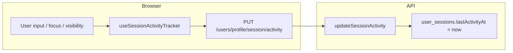
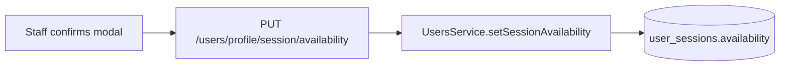
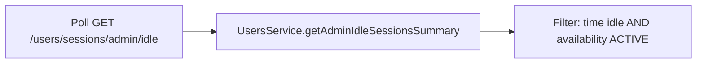

# Session availability, activity profiling, and idle — end-to-end reference

This document describes how **user session “profiling”** works in RMS: **last activity timestamps**, **idle detection**, and **break / on-call availability** that affects whether someone is counted as idle. Use it when extending the feature or re-implementing in another environment.

**Related:** [Login session tracking and JWT `sid`](./LOGIN_SESSION_IMPLEMENTATION.md) (how `UserSession` rows and `isCurrent` work).

---

## 1. Concepts (mental model)

| Concept | Meaning |
|--------|--------|
| **`lastActivityAt`** | Server-stored timestamp for the **current browser session**. Updated when the client pings activity (see §4). Falls back to `loginAt` when missing in calculations. |
| **Idle** | A session is **idle** when: it is still **active** in the DB, **`lastActivityAt` is older than 15 minutes**, and **availability is `ACTIVE`**. Break and on-call **opt out** of idle — you are not listed as “idle” while away from the desk or on a long call. |
| **`SessionAvailability`** | Per-session state: `ACTIVE` (default), `BREAK`, or `ON_CALL`. Stored on `user_sessions`. Does not replace `lastActivityAt`; it **gates** whether time-based idle applies. |
| **“Active” in admin UI** | In `getAdminSessions`, the API’s `isActive` field is **derived**: a row can be `isActive: true` in DB but returned as “not active” in the list if the user is considered **idle** for display (`isActive && !isIdle`). See `users.service.ts` — `getAdminSessions`. |

**Important:** Idle is computed **on the fly** from `lastActivityAt` + threshold + availability — there is no separate `isIdle` column in Postgres.

---

## 2. Constants (keep FE and BE aligned)

| Constant | Value | Where |
|----------|-------|--------|
| Idle threshold | **15 minutes** | `IDLE_THRESHOLD_MS = 15 * 60 * 1000` in `backend/src/users/users.service.ts` |
| Same threshold (client-side UX / pings) | **15 minutes** | `IDLE_THRESHOLD_MS` in `web/src/hooks/useSessionActivityTracker.ts` |
| Activity ping interval (min gap) | **2 minutes** | `ACTIVITY_PING_INTERVAL_MS` in `useSessionActivityTracker.ts` |
| Heartbeat check | **60 seconds** | `HEARTBEAT_CHECK_MS` in `useSessionActivityTracker.ts` |

If you change the threshold, update **both** server and client constants and any copy that says “15 minutes”.

---

## 3. Database (Prisma)

**Enum** (`backend/prisma/schema.prisma`):

```prisma
enum SessionAvailability {
  ACTIVE
  BREAK
  ON_CALL
}
```

**Model** `UserSession` (relevant fields):

| Field | Purpose |
|-------|--------|
| `lastActivityAt` | `DateTime @default(now())` — updated by `PUT .../session/activity` |
| `availability` | `SessionAvailability @default(ACTIVE)` |
| `availabilityUpdatedAt` | Optional — set when availability changes |

Migrations: apply Prisma migrations after schema changes; regenerate the client.

---

## 4. Backend implementation

### 4.1 Core service (`UsersService`)

**File:** `backend/src/users/users.service.ts`

- **`IDLE_THRESHOLD_MS`** — used for all idle math.
- **`setSessionAvailability(sessionId, userId, availability)`**  
  - Verifies the session belongs to the user.  
  - Updates `availability` and `availabilityUpdatedAt`.  
  - No-op if already that value.
- **`isSessionAvailabilityEligibleForIdle(availability)`**  
  - Returns `true` only for `ACTIVE`.  
  - `BREAK` and `ON_CALL` → user is **not** eligible to be counted as idle (even if `lastActivityAt` is old).
- **`updateSessionActivity(sessionId)`**  
  - Sets `lastActivityAt` to `new Date()`.
- **`getUserSessions(userId, currentSessionId?)`**  
  - Returns sessions for profile; includes `lastActivityAt`, `availability`, `availabilityUpdatedAt`, `isCurrent` (from JWT `sid` — see login session doc).
- **`getAdminSessions(query)`**  
  - Paginated session list for monitoring; computes `isIdle` per row and adjusts displayed `isActive`.
- **`getAdminIdleSessionsSummary(query)`**  
  - Deduplicates to **latest session per user**, filters to **idle** sessions only, returns `idleCount` + list (capped by `limit`, max 50).
- **`getLatestActiveSessionId(userId)`**  
  - Fallback when JWT has no `sid` (e.g. edge cases) for activity/availability endpoints.

### 4.2 HTTP API (`UsersController`)

**File:** `backend/src/users/users.controller.ts`

| Method | Path | Purpose |
|--------|------|--------|
| `GET` | `/users/profile/sessions` | Current user’s sessions (includes availability). |
| `PUT` | `/users/profile/session/activity` | Bump `lastActivityAt` for current session (`sid` or latest active). |
| `PUT` | `/users/profile/session/availability` | Body: `{ availability }` — `ACTIVE` \| `BREAK` \| `ON_CALL`. |
| `GET` | `/users/sessions/admin` | Permission `read:users` — monitor sessions. |
| `GET` | `/users/sessions/admin/idle` | Permission `read:users` — idle summary (`idleCount`, `sessions`). |

**DTO:** `SetSessionAvailabilityDto` — validates `availability` enum.

### 4.3 Auth / session creation

On login, **`createSession`** in `auth.service.ts` sets **`lastActivityAt: new Date()`** when the row is created so new sessions start “fresh”.

### 4.4 Tests

**File:** `backend/src/users/__tests__/users.service.spec.ts`  
Includes coverage for idle summary and **excluding** break/on-call from idle count.

---

## 5. Frontend implementation

### 5.1 Types

**File:** `web/src/shared/types/session-availability.ts`  
Mirrors Prisma: `"ACTIVE" | "BREAK" | "ON_CALL"`.

### 5.2 Activity “profiling” (ping loop)

**Hook:** `web/src/hooks/useSessionActivityTracker.ts`  
**Wiring:** `web/src/app/providers/auth-provider.tsx` calls:

```ts
useSessionActivityTracker(status === "authenticated");
```

**Behavior (summary):**

- Listens for pointer, keyboard, scroll, touch, tab visibility, window focus.
- On activity, updates a local ref and may call **`pingCurrentSessionActivity`** (RTK mutation).
- Pings are **throttled** (at least ~2 minutes between pings unless “returning from idle” forces one).
- **Heartbeat** every 60s: if there was recent activity within the idle window, ping again so the server stays fresh during continuous work.

**API mutation:** `pingCurrentSessionActivity` in `web/src/features/admin/api.ts` → **`PUT /users/profile/session/activity`**.

*Note:* The mutation lives under the admin API slice for historical reasons; any authenticated user with a session uses the same endpoint.

### 5.3 Profile and availability toggles

**API:** `web/src/features/profile/api.ts`

- `getSessions` → `GET /users/profile/sessions`
- `setSessionAvailability` → `PUT /users/profile/session/availability`

**UI:** `web/src/features/staff/components/SessionAvailabilityToggles.tsx`

- Rendered from `web/src/layout/Header.tsx`.
- **Hidden** for leadership roles: CEO, Director, Manager, System Admin (same pattern as other gated features).
- Staff sees **Break** and **On call** controls; state comes from the **current** session row (`isCurrent` + `availability`).
- **Confirmation modal** before applying change (copy for start/end break and on-call).

### 5.4 Admin: session monitoring and idle bell

**Session list:** `web/src/features/admin/views/SessionsMonitoringPage.tsx`  
Uses `getAdminSessions`; status badges can reflect **break** / **on-call** via `session.availability` in addition to idle/active semantics.

**Idle notification:** `web/src/features/admin/components/IdleUsersNotification.tsx`

- Visible for CEO, Director, Manager, System Admin.
- Polls **`GET /users/sessions/admin/idle`** (via `useGetAdminIdleSessionsSummaryQuery`, 30s interval in implementation).

**Dismiss / “mark read”:** `web/src/shared/hooks/useIdleSessionsDismissed.ts`

- Stores dismissed session IDs in **`localStorage`** per user: `rms:idleSessionsDismissed:<userId>`.
- **`syncPrune`** removes dismissed IDs that are no longer in the current idle list so storage stays consistent.

---

## 6. End-to-end flow diagrams

### 6.1 Staying “not idle” while working



### 6.2 Going on break or on-call



After this, even if the user stops moving, **`isSessionAvailabilityEligibleForIdle`** is false for `BREAK` / `ON_CALL`, so they **do not appear** in the idle summary.

### 6.3 Supervisor sees idle users



---

## 7. How to implement from scratch (checklist)

Use this when porting or rebuilding the feature.

### Database

1. Add `SessionAvailability` enum and `UserSession` columns (`lastActivityAt`, `availability`, `availabilityUpdatedAt` as needed).
2. Migrate and regenerate Prisma client.

### Backend

1. Add `IDLE_THRESHOLD_MS` and idle eligibility helper (`ACTIVE` only).
2. Implement `updateSessionActivity`, `setSessionAvailability`, `getUserSessions` (expose availability).
3. Implement `getAdminIdleSessionsSummary` (dedupe per user, filter idle, respect availability).
4. Wire JWT **`sid`** so “current session” resolves for profile and PUT routes (see login session doc).
5. Expose Swagger-documented routes with DTO validation.
6. Add Jest tests for idle inclusion/exclusion and availability.

### Frontend

1. Mirror types in TS; add RTK Query endpoints for sessions, activity ping, availability, admin idle summary.
2. Mount **`useSessionActivityTracker`** only when authenticated.
3. Add staff toggles + modals; gate by role if product requires it.
4. Add admin UI (monitoring page + optional idle bell) and polling as needed.
5. Add Vitest/RTL tests for toggles and hooks.

### Product / UX notes

- Align all user-facing “idle” copy with the real threshold (15 minutes).
- Decide who may change availability (current code: non-leadership staff in header).
- `localStorage` dismiss state is **per browser**, not synced across devices.

---

## 8. File index (quick lookup)

| Area | Files |
|------|--------|
| Schema | `backend/prisma/schema.prisma` |
| Idle + availability logic | `backend/src/users/users.service.ts` |
| Routes | `backend/src/users/users.controller.ts` |
| DTO | `backend/src/users/dto/set-session-availability.dto.ts` |
| Session create | `backend/src/auth/auth.service.ts` (`createSession`) |
| Activity ping hook | `web/src/hooks/useSessionActivityTracker.ts` |
| Auth provider | `web/src/app/providers/auth-provider.tsx` |
| Profile API | `web/src/features/profile/api.ts` |
| Staff toggles | `web/src/features/staff/components/SessionAvailabilityToggles.tsx` |
| Admin API (ping + idle) | `web/src/features/admin/api.ts` |
| Idle bell | `web/src/features/admin/components/IdleUsersNotification.tsx` |
| Dismissed IDs | `web/src/shared/hooks/useIdleSessionsDismissed.ts` |
| Monitoring UI | `web/src/features/admin/views/SessionsMonitoringPage.tsx` |

---

## 9. Changing behavior safely

| Change | What to touch |
|--------|----------------|
| Idle duration | `IDLE_THRESHOLD_MS` in BE + FE; copy in Swagger/UI |
| Who can set availability | `SessionAvailabilityToggles` role check; optionally backend guard |
| Ping frequency | `ACTIVITY_PING_INTERVAL_MS` / heartbeat in `useSessionActivityTracker.ts` |
| Idle API shape | `getAdminIdleSessionsSummary` + `AdminSession` types + consumers |

---

*Last aligned with codebase patterns: Affiniks RMS monorepo (NestJS + Prisma + React + RTK Query).*
